      
1. Les discrétisations

---

:::columns
:::{.column width="30%"}

### Discrétiser

La **discrétisation** est un mode de *simplification de l'information* (quantitative continue) pour la rendre intelligible.

:::
:::{.column width="70%"}
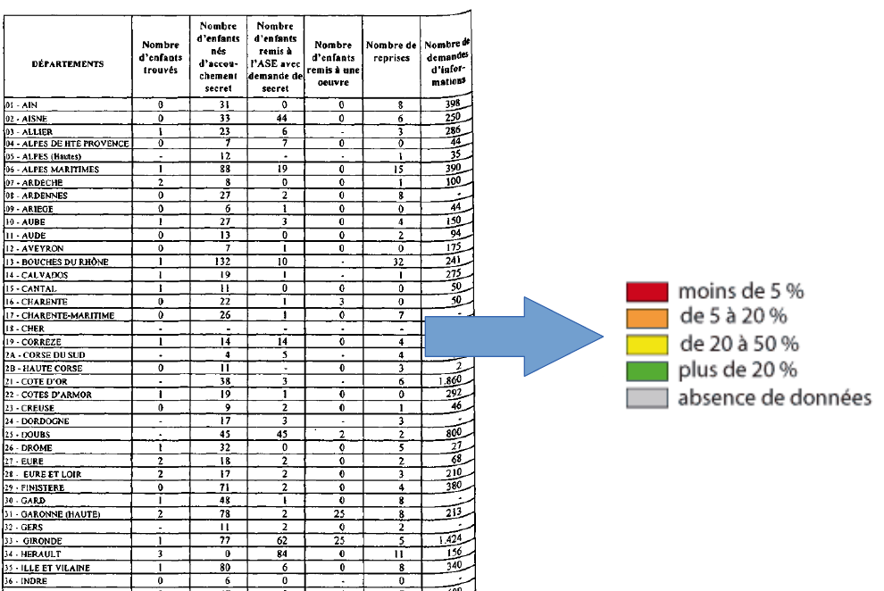
:::
:::

## Deux objectifs

:::columns
:::column
### Conserver l'essentiel de l'information

* **Regrouper les valeurs qui se ressemblent** et qui sont différentes des autres ; donner des **seuils** qui ont du sens

* Conserver l'ordre de grandeur, la dispersion, la forme de la distribution

* Rendre compte de la **structure interne** du jeu de données

:::
:::column

### Transmettre l'information

**Limiter le nombre de classes**

$$N(cl) = 1 + 3,3 \log10(N)$$

où $N$ est le nombre d'observations et $N(cl)$ le nombre de classes

**Faciliter la mémorisation**

On a coutume de dire que 10 classes est un maximum.

**Construire une carte qui "raconte" quelque-chose !**

:::
:::

## Quelques principes fondamentaux

* Les classes ne doivent **pas être vides**

* Les classes doivent couvrir l'**ensemble** de la distribution, et être **contiguës** (elles s'arrêtent là où une autre commence)

* Les classes doivent être  **distinctes** (les valeurs ne doivent pas se superposer)

* Les caractéristiques essentielles de la distribution de l'indicateur doivent être conservées, et permettre de perdre le moins d'information possible.

* Le nombre de classes doit être inférieur au nombre d'observations

---

:::columns
:::{.column width="30%"}
### Quel résultat sans discrétisation ?

:::
:::{.column width="70%"}
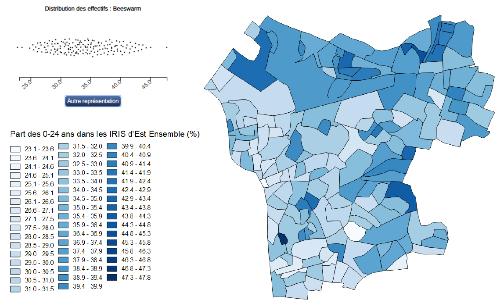
:::
:::

## Les méthodes de discrétisation

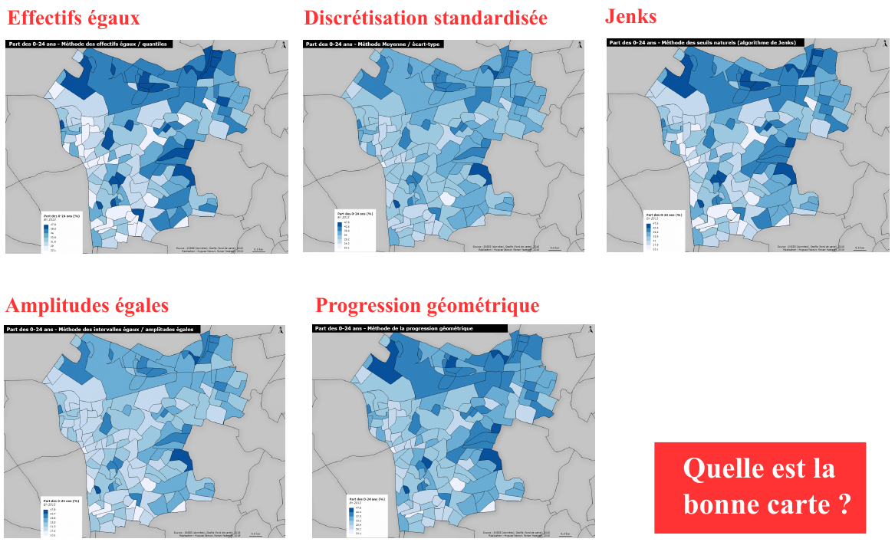

## Les caractéristiques statistiques à prendre en compte pour la discrétisation

:::columns
:::column

* Le **résumé statistique** : valeurs centrales (moyenne  / médiane), le minimum, le maximum

* Les **paramètres de dispersion** : l'écart-type (calcul intégrant les valeurs algébriques d'écart à la moyenne)

* La **forme de la distribution** des données : l'observation des concentrations d'individus

:::
:::column

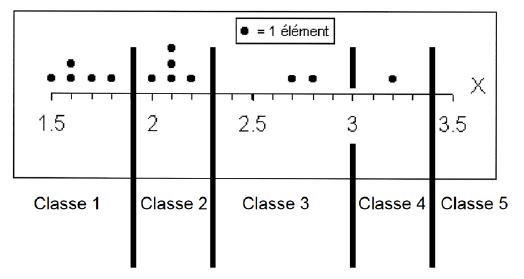

Discrétisation = Découpage en classes selon ces spécificités

:::
:::

## Les méthodes

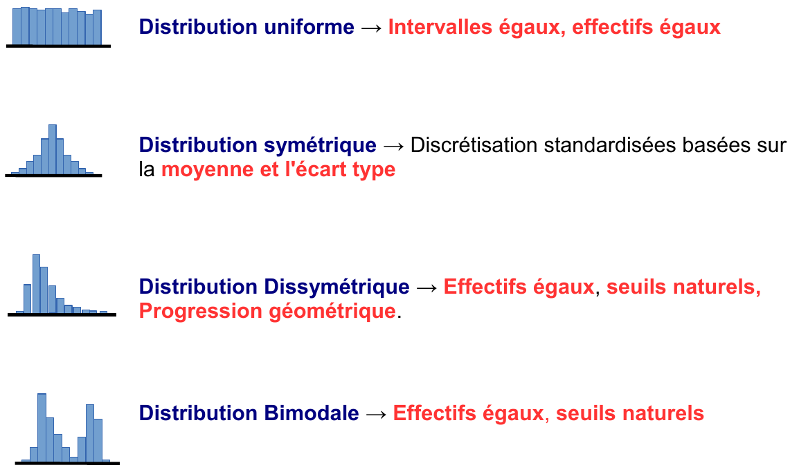

*La méthode de Jenks est la méthode passe-partout !*

---

### 1. Les effectifs égaux

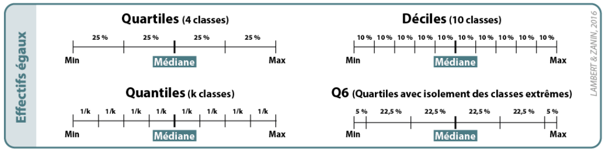

Une méthode adaptée pour **comparer les cartes entre elles** :

* *"Les 20% des valeurs les plus élevées sont..."*

* *"Les 20% des valeurs les plus faibles sont..."*

Cependant, peu adaptée pour mettre en évidence des **valeurs exceptionnelles**.

La **méthode Q6** est une variante qui consiste à isoler les bornes extrêmes de la distribution.

---

:::columns
:::{.column width="30%"}
**Méthode 1 Effectifs égaux / quantiles**

:::
:::{.column width="70%"}
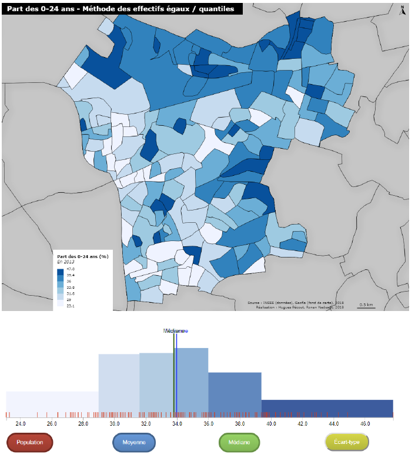
:::
:::

---

### 2. Amplitude égale

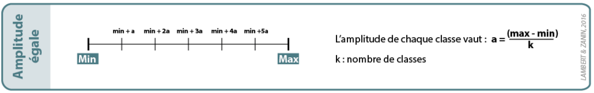

Une méthode adaptée pour des distributions **uniformes** ou **symétriques** :
elle produit généralement des seuils de classe simples et compréhensibles.

---

:::columns
:::{.column width="30%"}
**Méthode 2 Intervalles égaux / Amplitudes égales**

:::
:::{.column width="70%"}

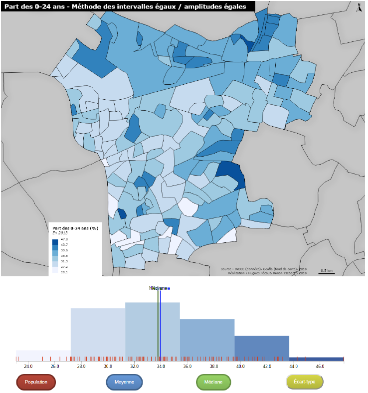
:::
:::

---

### 3. Moyenne et écart-type

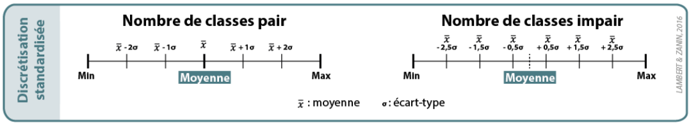

Une méthode idéale pour les **distributions symétriques** (normales, gaussiennes). \

Aussi appelée *discrétisation standardisée*.

Cette méthode met en évidence les **valeurs exceptionnelles** de la distribution.

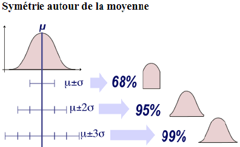

---

:::columns
:::{.column width="30%"}
**Méthode 3 Moyenne et écart-type**

:::
:::{.column width="70%"}

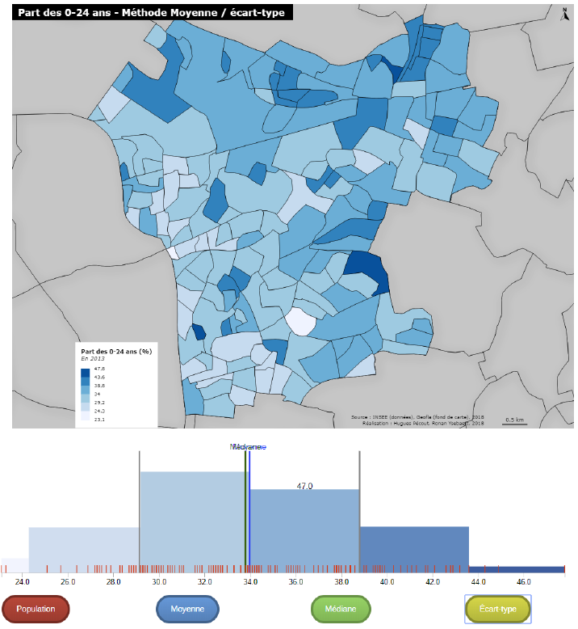

:::
:::

---

### 4. Seuils naturels

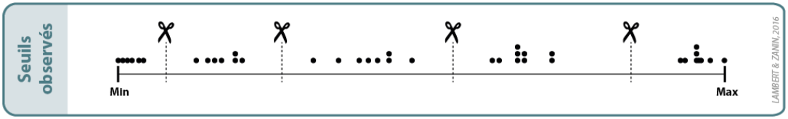

Une méthode adaptée lorsque des **seuils naturels** apparaissent dans la distribution. Assez subjective, elle nécessite une *bonne connaissance* des phénomènes étudiés.

La méthode dite **de Jenks** automatise ce procédé manuel. Elle repose sur un algorithme qui *minimise la variance intra-classes* en *maximisant la variance inter-classes*.

C'est une méthode **passe-partout**, mais elle ne permet pas de comparer les cartes entre elles !

---

:::columns
:::{.column width="30%"}
**Méthode 4 Jenks**

:::
:::{.column width="70%"}

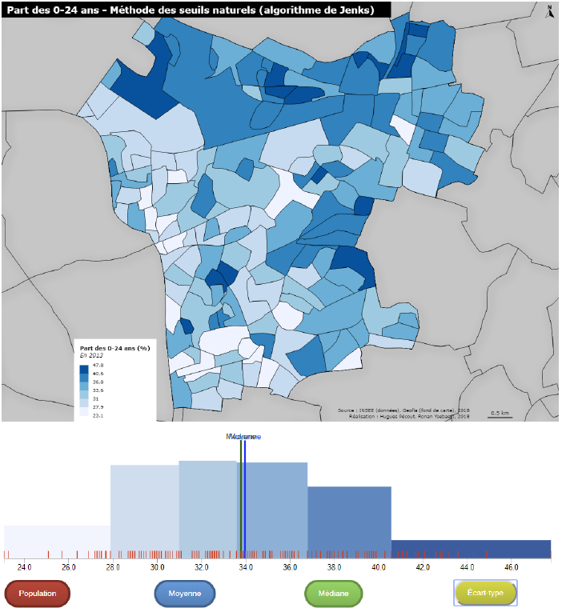

:::
:::

---

### 5. Progression géométrique

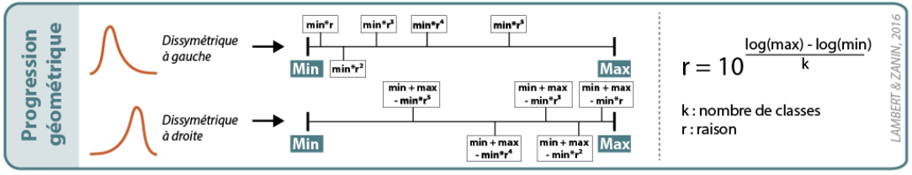

Une méthode adaptée pour des distributions **très dissymétriques**. Elle consiste à construire des classes dont l'étendue augmente (ou diminue) de plus en plus.

Il faut en définir la **raison** (coefficient multiplicateur) ; le minimum ne doit pas être égal à zéro.

---

:::columns
:::{.column width="30%"}
**Méthode 5 Progression géométrique**

:::
:::{.column width="70%"}

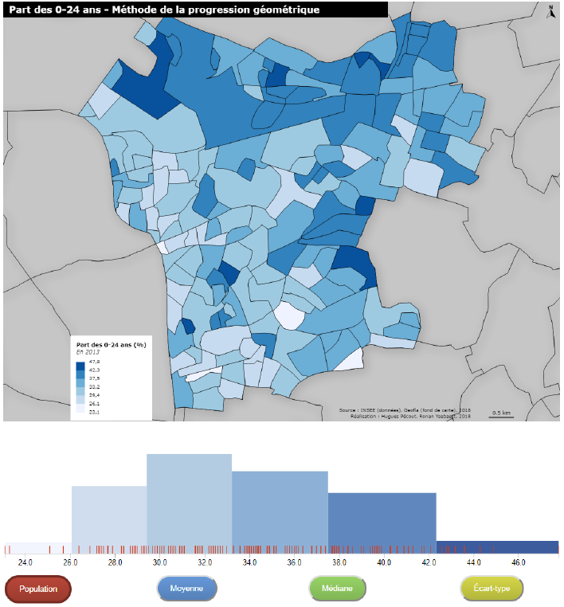
:::
:::

---

:::columns
:::{.column width="30%"}
En résumé...

:::
:::{.column width="70%"}
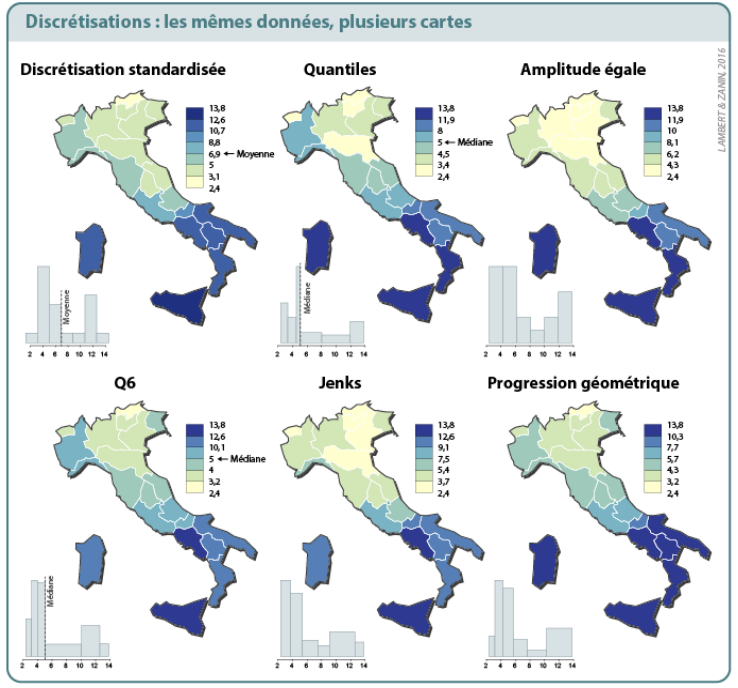
:::
:::

---

:::columns
:::column
   
2. Les variables visuelles

:::
:::column
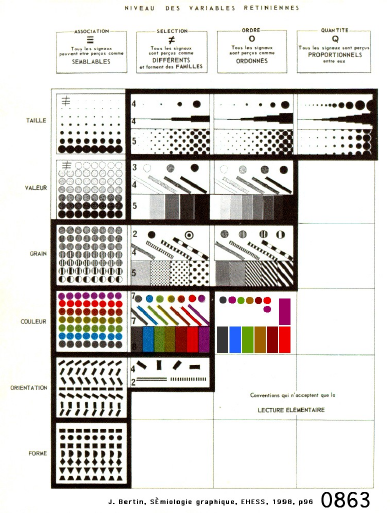
:::
:::

## Représenter les données quantitatives relatives

Retranscrire l'ordre sans la proportionnalité :

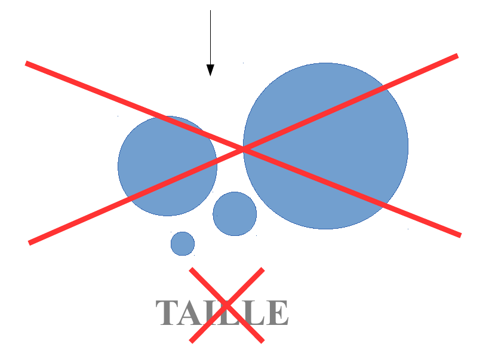{fig-align="center" width="40%"}

## Représenter les données quantitatives relatives

Retranscrire l'ordre sans la proportionnalité :
 

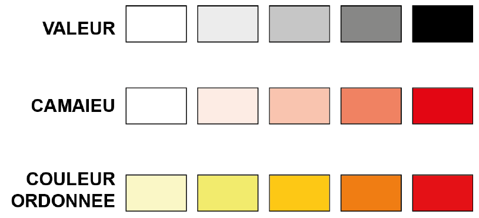

---

:::columns
:::{.column width="30%"}
### Valeur

**Rapport entre une quantité de noir et de blanc perçue sur une surface donnée.**
Il s'agit donc d'une gradation en niveaux de gris s'échelonnant du gris clair au noir, le blanc étant souvent réservé pour l'absence d'information.

:::
:::{.column width="70%"}
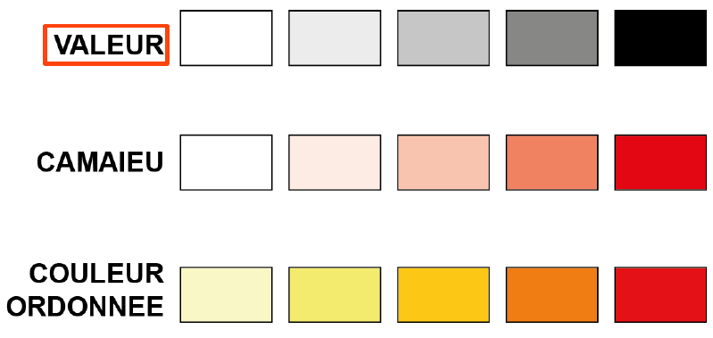
:::
:::

---

:::columns
:::{.column width="30%"}
### Camaïeu

Ce procédé est également applicable au cas d'une **couleur foncée progressivement par un gain en intensité**.
On parle alors d'un *camaïeu*, qui constitue en fait le résultat de l'association des variables visuelles de *valeur* et de *couleur*.

:::
:::{.column width="70%"}
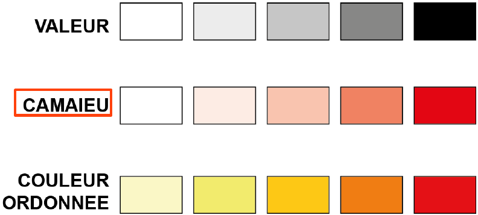
:::
:::

---

:::columns
:::{.column width="30%"}
### Couleur ordonnée

On utilise ici les **propriétés du spectre visible de la lumière** en en faisant varier, en plus de son intensité, la longueur d'onde de la couleur choisie. Cette longueur d'onde (du froid vers le chaud ou l'inverse) constitue elle aussi une variable visuelle ordonnée et continue. On parle aussi de **gradation harmonique**.

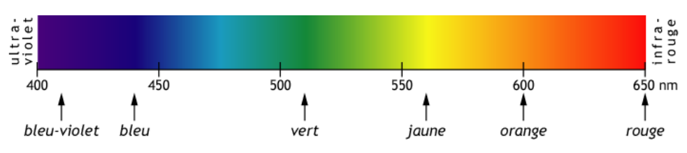

:::
:::{.column width="70%"}
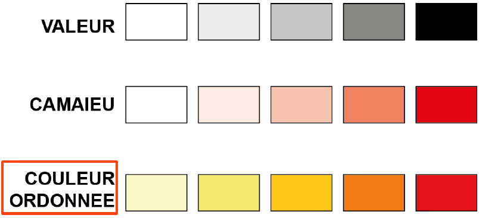
:::
:::

## Le choix des couleurs :

:::columns
:::column
### Perception des couleurs selon l'usage

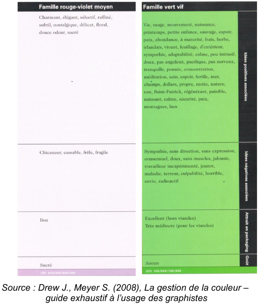

:::
:::column
### Perception "culturelle" (?) des couleurs

:::
:::

---

:::columns
:::{.column width="30%"}
### Une ressource utile : ColorBrewer

[http://colorbrewer2.org](http://colorbrewer2.org)

:::
:::{.column width="70%"}
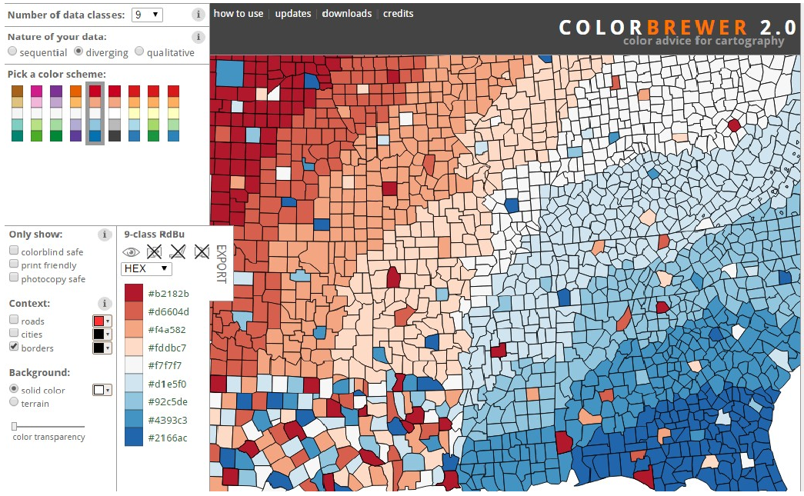
:::
:::

---

:::columns
:::{.column width="30%"}
### D'autres variables visuelles plus désuettes

Elles sont un peu "passées de mode", mais elles avaient l'avantage de bien se prêter à la superposition d'éléments.

:::
:::{.column width="70%"}

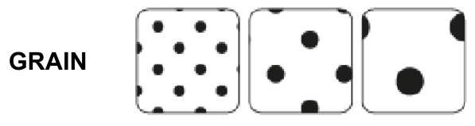

:::
:::

---

  

::: {.center}
{width=50%}
:::
  

3. Cartographie thématique avec Magrit Représenter les données quantitatives de taux

## Objectif :

*Représenter la part des 0-24 ans dans les IRIS d'Est Ensemble* (public cible des médiathèques)

NB : adaptez cet exemple à votre espace d'étude et à votre problématique !

## Les étapes :

1. Préparation des données et géométries

2. Import des géométries et des données, jointure et typage des données

3. Réalisation d'une carte de ratios et analyse des données

4. Discrétisation et choix des couleurs

5. Mise en page

6. Sauvegarde / Export

---

:::columns
:::{.column width="30%"}
### 1. Préparation des données et géométries

*Utilisez QGis et un tableur.*

* Quel indicateur choisir ?

* D'où vient l'information ?

* Quelle est la date de production de l'indicateur ?

* Les codes sont-ils les mêmes que dans le fichier de géométrie ?

:::
:::{.column width="70%"}
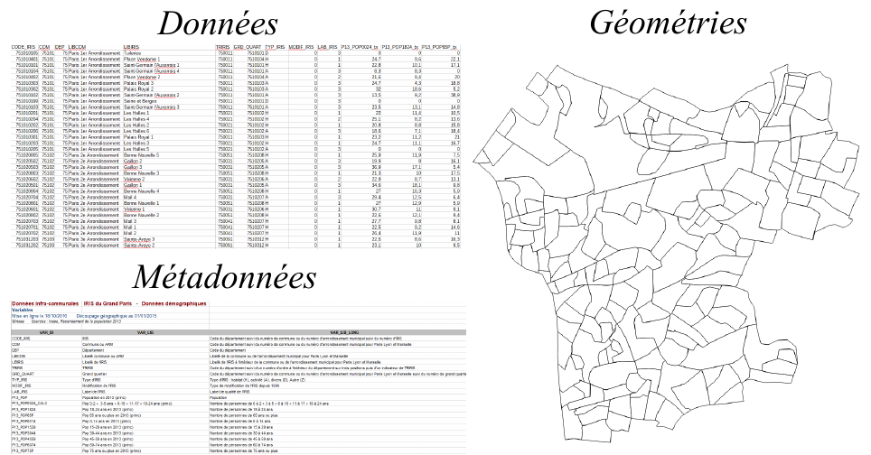
:::
:::

---

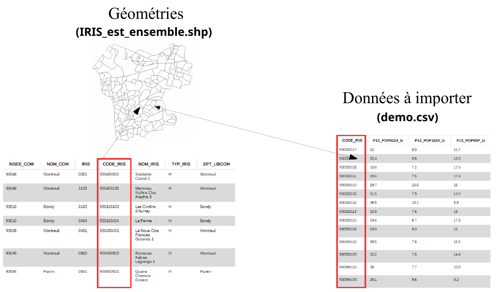

---

:::columns
:::{.column width="30%"}

### 2. Import, jointure et typage des données

:::
:::column
Vous pouvez charger le **fichier projet** réalisé lors de la séance précédente (carte de stock).
Cela permet :

* de conserver la mise en page réalisée et d'assurer ainsi une **harmonie graphique** entre vos cartes.

* de **gagner du temps** sur la mise en page.

Dans ce cas, il faut veiller à :

* ne pas modifier a posteriori la carte précédente (vous perdriez l'harmonie graphique) : police, couleur et épaisseur des bordures...
  
* **réorganiser vos couches géographiques** pour ne garder que ce dont vous avez besoin (panneaux *import des données* et *gestion des couches*)

:::
:::

---

:::columns
:::{.column width="30%"}
*Optionnel : import du fichier projet de la dernière fois*

:::
:::{.column width="70%"}

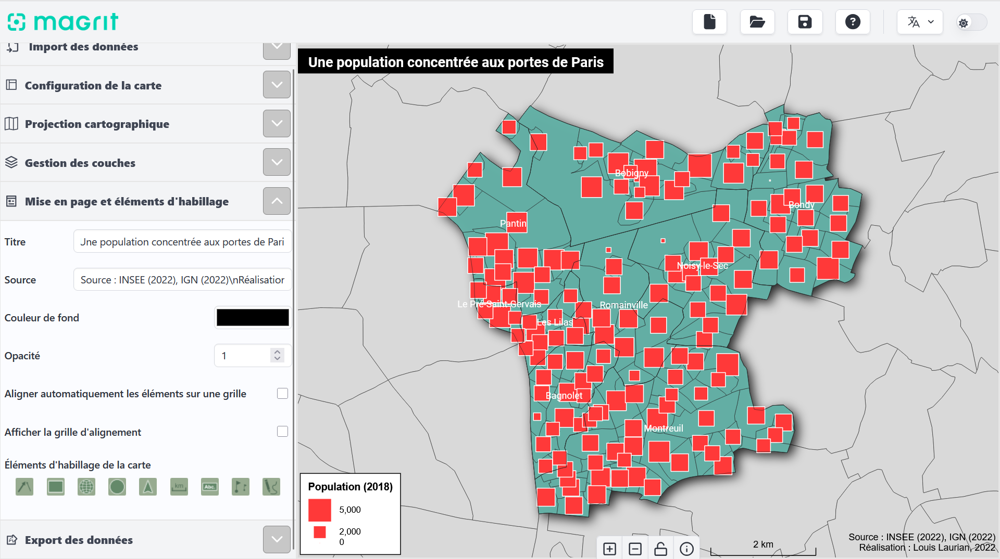

:::
:::

---

:::columns
:::{.column width="30%"}
*Import des géométries*
:::
:::{.column width="70%"}

:::
:::

---

:::columns
:::{.column width="30%"}
*Import des données et jointure avec le fond de carte*
:::
:::{.column width="70%"}

:::
:::

---

:::columns
:::{.column width="30%"}
*Import des données et jointure avec le fond de carte*
:::
:::{.column width="70%"}
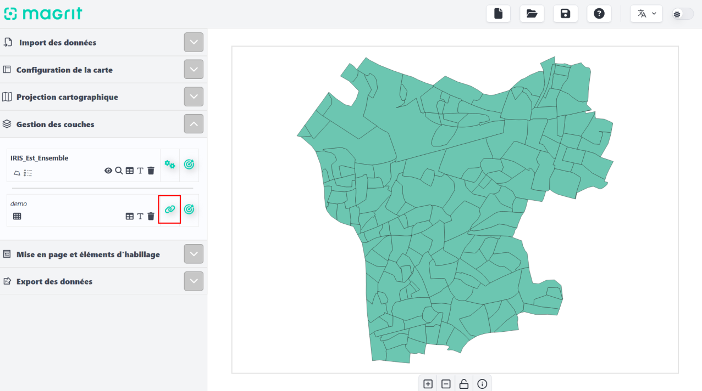
:::
:::

---

:::columns
:::{.column width="30%"}
*Sélection du champ de jointure*
:::
:::{.column width="70%"}

:::
:::

---

:::columns
:::{.column width="30%"}
*Typage des données*
:::
:::{.column width="70%"}
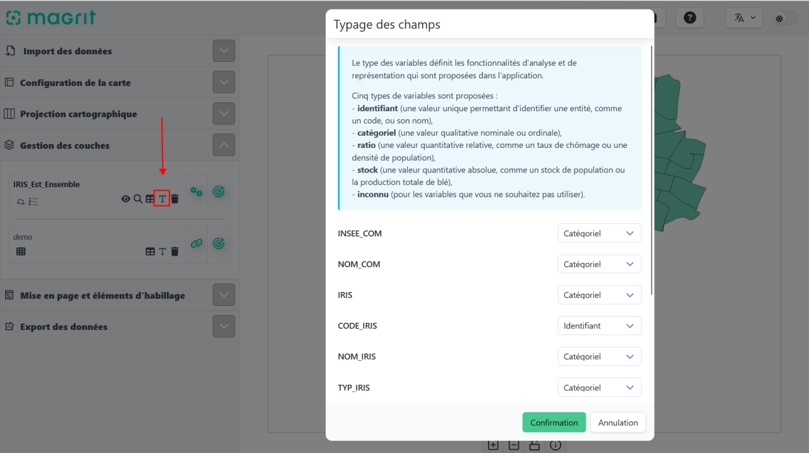
:::
:::

---

### 3. Réalisation de la carte et analyse des données

---

### 3. Réalisation de la carte et analyse des données

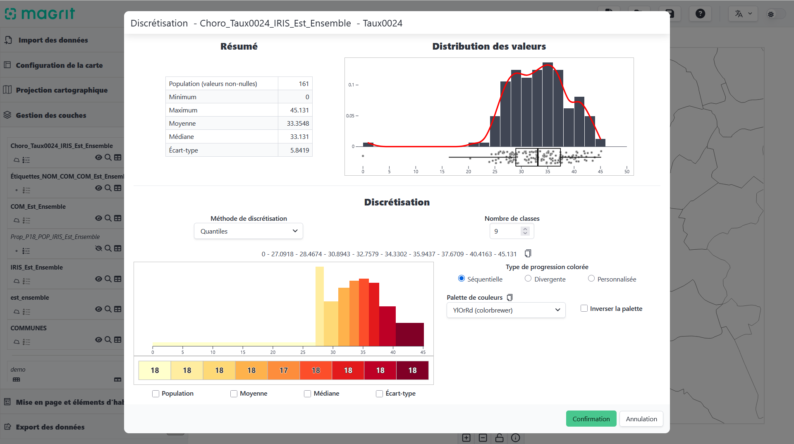

---

:::columns
:::column
### 4. Discrétisation & choix des couleurs

- Quelle forme de distribution ?

- Quel est le message que l'on souhaite transmettre ?

- Quel nombre de classes, quelles couleurs ?

- **C'est le moment de justifier vos choix !**

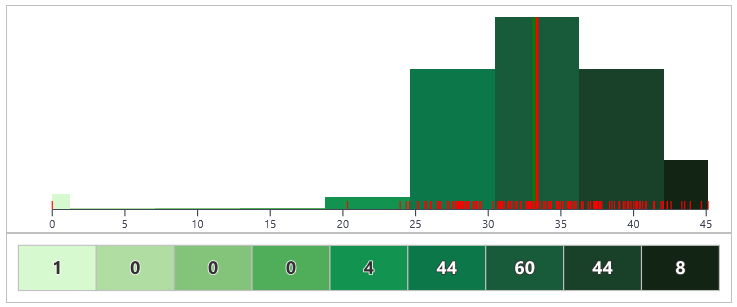

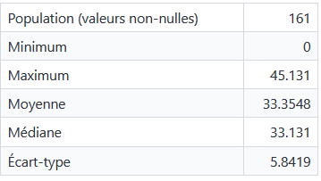

:::
:::column

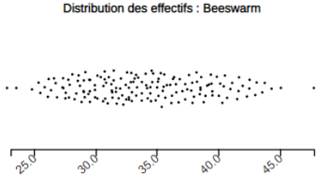

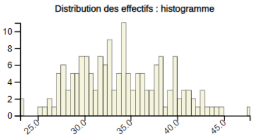

:::
:::

---

:::columns
:::{.column width="30%"}
**Quelle forme de distribution ?**

Plutôt symétrique (médiane = moyenne) : "Moyenne / Écart-type", avec valeur extrême : **Q6**

**Quel est le message que l'on souhaite transmettre ?**

-> Visualiser les IRIS dont la population jeune est au-dessus ou en-dessous de la moyenne.

**Quel nombre de classes ? Quelles couleurs ?**

- Résumer l'information essentielle : 6 classes.

- Rupture du rouge au bleu autour de la moyenne.

:::
:::{.column width="70%"}

:::
:::

---

:::columns
:::{.column width="30%"}
### 5. Mise en page

:::
:::{.column width="70%"}

:::
:::

---

:::columns
:::{.column width="30%"}
### 6. Sauvegarder, exporter

:::
:::{.column width="70%"}

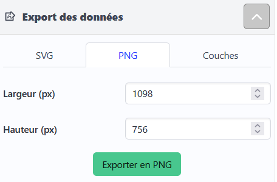
:::
:::

