```{r setup, include=FALSE}
options(htmltools.dir.version = FALSE, crayon.enabled = TRUE)
knitr::opts_chunk$set(cache = TRUE,
                      fig.align='center',
                      message = FALSE,
                      warning = TRUE)
# install.packages("devtools")
# devtools::install_github("gadenbuie/countdown")
# devtools::install_github("mitchelloharawild/icons")
library(countdown)
library(icons)
#download_fontawesome()
```


```{r xaringan-themer, include=FALSE, warning=FALSE}
library(xaringanthemer)
style_duo_accent(
  primary_color = "#1d3352",
  secondary_color = "#383838",
  inverse_header_color = "#ffae00"
)
```


# 1. Les données qualitatives

.big[
Elles correspondent aux variables dont les valeurs ne sont pas numériques.

Par exemple : votre *âge*, votre *taille* sont des variables quantitatives ; votre *couleur de cheveux*, des données qualitatives.]

--

.big[
Elles sont de deux types :

* Nominales
* Ordinales
]

---

# Nominales vs Ordinales

.pull-left[
### Qualitatives nominales :

.big[
Les valeurs possibles n'ont pas d'ordre

Par exemple : rouge, bleu, vert, jaune, violet...

Ou encore : langues officielles des pays européens
]
]

--

.pull-right[
### Qualitatives ordinales :

.big[
**L'ordre des valeurs possibles a un sens**

Par exemple : très peu, peu, moyen, beaucoup

Ou encore : hiérarchie urbaine, des centres au périurbain
]
]

---

.center[
## Un exemple de qualitatif nominal

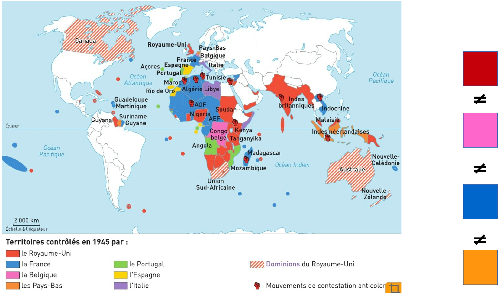
]

---

.center[
## Un exemple de qualitatif ordinal

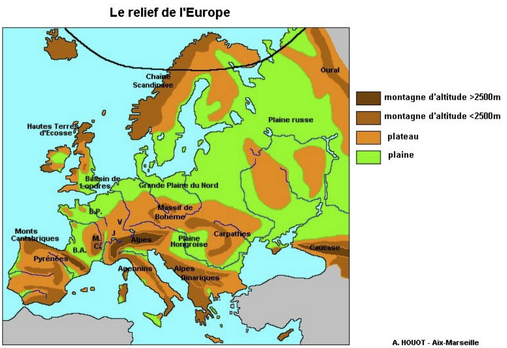
]

---

## Pour les représenter

.pull-left[
### Qualitatives nominales :

.big[
**Les valeurs possibles n'ont pas d'ordre**

La représentation cartographique doit permettre de bien les différencier.]

*Attention* : il faut que les formes/propriétés graphiques des symboles soient bien distinctes,
et éviter les ambiguïtés.
Mais trop de symboles rendent la lecture difficile.
]

.pull-right[
### Ordinales :

.big[
**L'ordre des valeurs possibles a un sens**

La représentation graphique doit permettre de rendre compte de l'ordre ou du classement utilisé.
]
]

---

## Attention avec le quali ordinal !

.pull-left[
### Des symboles ambigus :


]

.pull-right[
### Des symboles illisibles :

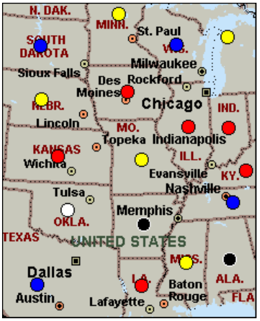
]

---

## En termes de variables visuelles :

.pull-left[
### Qualitatif nominal :
.big[
* Différence : **oui**
* Hiérarchie : non
* Proportionnalité : non

Il faut des variables visuelles qui retranscrivent la **similarité** et la **différence**.
]
]

.pull-right[
### Qualitatif ordinal :
.big[
* Différence : **oui**
* Hiérarchie : **oui**
* Proportionnalité : non

Il faut des variables visuelles qui retranscrivent un **ordre**.
]
]

---


# 2. Représenter les données qualitatives nominales

---

## 2.1 La couleur

.big[
La variable visuelle de la couleur est très utilisée en cartographie, car :

* elle permet de **différencier** facilement des objets ;

* elle s'utilise aussi bien pour des points, des lignes que des surfaces (implantations ponctuelles, linéaires, zonales) ;

* elle peut traduire des **relations différencielles qualitatives** et donc illustrer des *typologies*
]

.center[
]

---

## 2.2 La forme

.big[
La variable visuelle forme consiste à faire varier les contours géométriques d'un figuré. Elle inclut les *symboles*.

* elle ne permet que de **différencier** des objets
]

.center[
.pull-left[
### Formes  simples

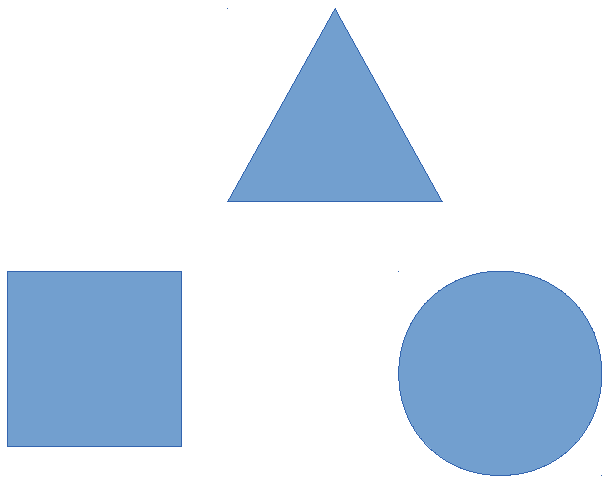
]

.pull-right[
### Symboles


]
]

---

## 2.3 L'orientation

.big[
La variable visuelle orientation correspond au procédé qui consiste à faire varier l'angle d'un figuré graphique avec l'horizontale.
]

* elle permet de rendre compte de **différences**

* bien qu'elle soit exprimée en degrés (de 0° à 359°), elle ne peut exprimer que des différences

  (pas d'usage pour une variable quanti ou quali ordinale)
  
* elle est quasi-uniquement utilisée pour les **implantations zonales**
  
* elle est un peu passée de mode, bien qu'elle soit utile pour les sorties monochromes...

.right[
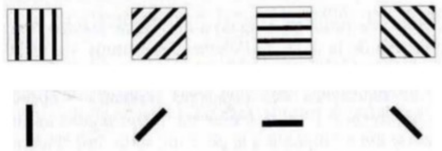
]

---


# 3. Représenterles donnés qualitatives ordinales

---

## 3.1 Valeurs, camaïeux ou couleurs ordonnées

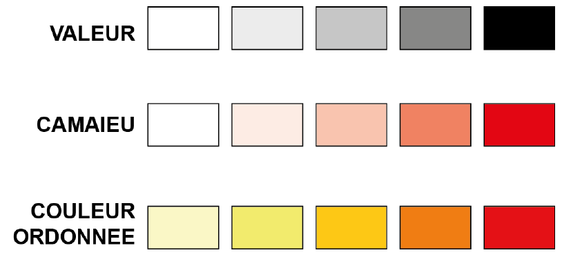

---

## 3.2 La texture

.big[
La variable visuelle *texture* combine des éléments graphiques pour construire une surface.

* elle peut traduire des **différences**, des **équivalences** ou un **ordre**.
* elle est surtout utilisée en **implantation zonale**
]

.pull-left[
### Différence nominale

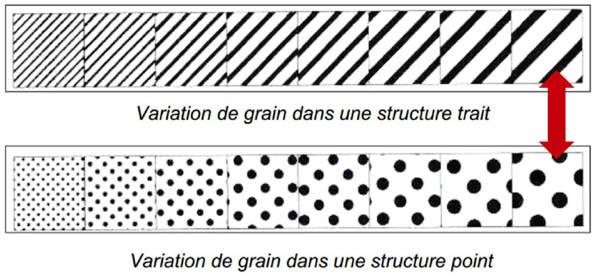
]

.pull-right[
### Différence ordinale

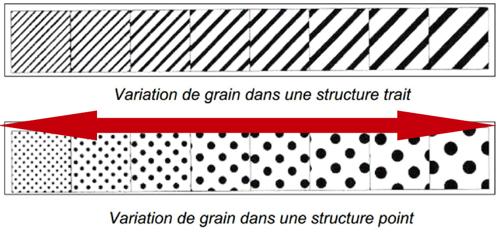
]

---

<br><br><br><br><br>

# 4. Les couleurs en cartographie des données qualitatives

---

## Les couleurs qui évoquent la réalité

.pull-left[
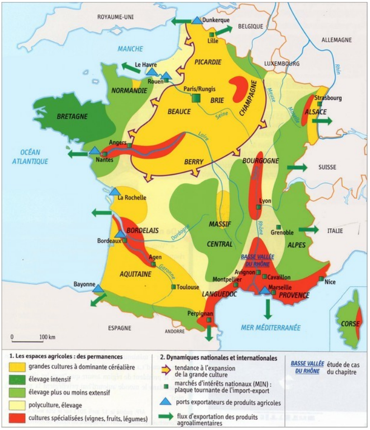
]

.pull-right[

]

---

## Les couleurs historiquement associées à des thématiques

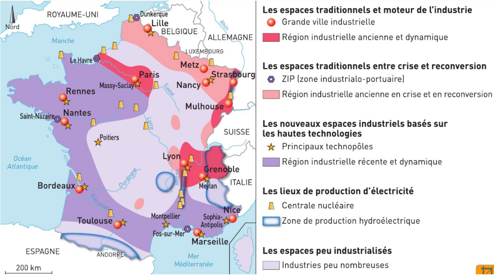

---

## Les couleurs historiquement associées à des thématiques

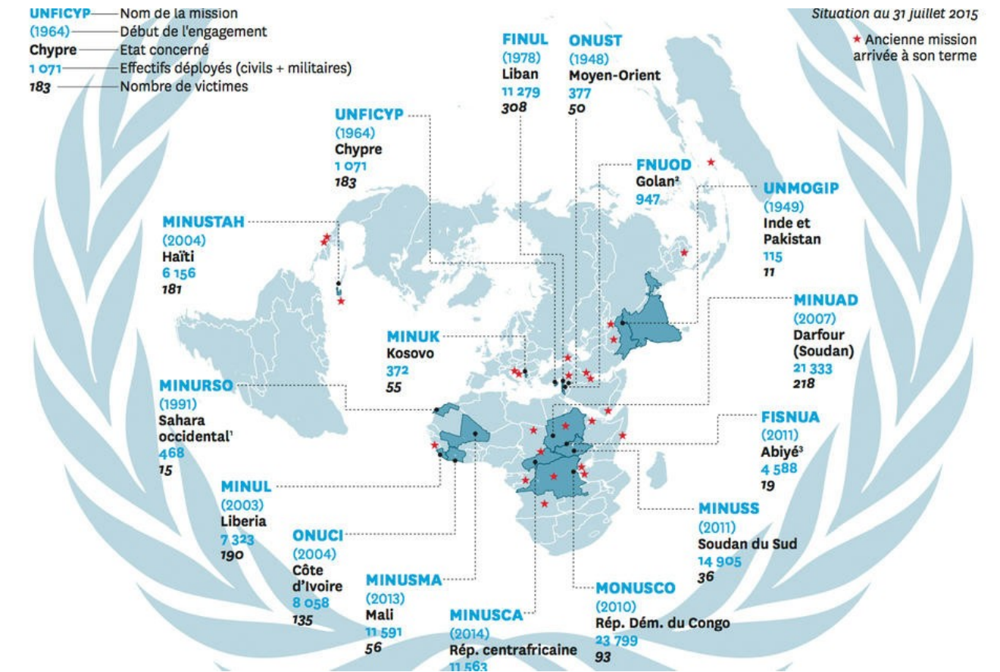

---

## Les couleurs conventionnelles

.pull-left[
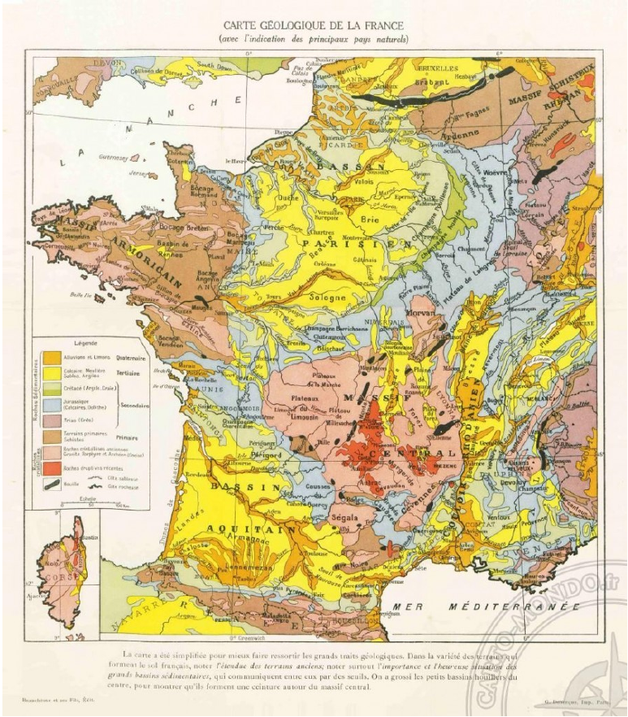
]

.pull-right[
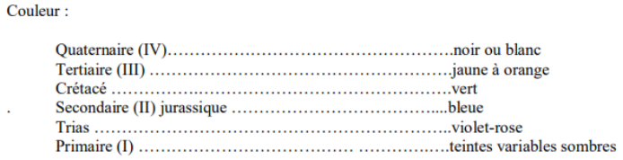
]

---

## Les couleurs opposées

.center[

]

---

### Opposition des couleurs chaudes et froides
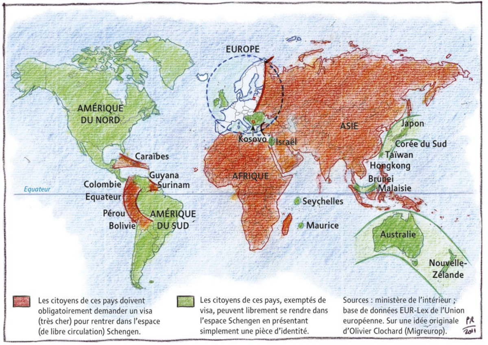

---


# 5. Représenter les données qualitatives avec Magrit

<br><br><br>

.big[
Votre objectif : représenter la localisation de votre terrain d'études au sein de la métropole du Grand Paris.
]

---

## Les étapes

.big[
1. **Consultation** des données disponibles, **import** des données complémentaires

2. **Réalisation** de la carte qualitative

3. **Choix des couleurs** (ordinal ou nominal ?)

4. **Mise en page**

5. **Sauvegarde** et export
]

---

.left-column[

## 5.1 Consultation et import

*Consultez les métadonnées, ouvrez les fichiers de données dans QGis, regardez la table attributaire...*

* quel indicateur ?

* quel producteur de données ?

* quelle date de production de l'indicateur ?

* quel code utiliser pour la cartographie ?
]

.right-column[
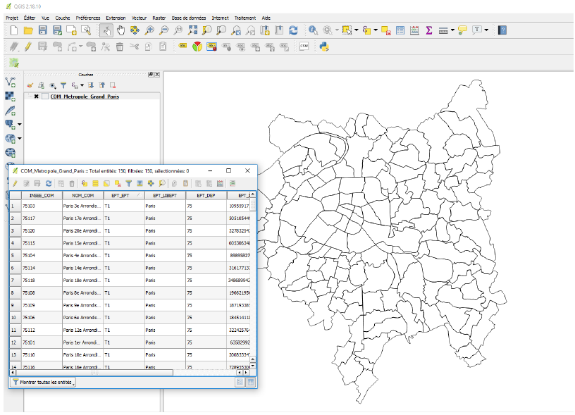
]

---

.left-column[
### Identification des codes]

.right-column[
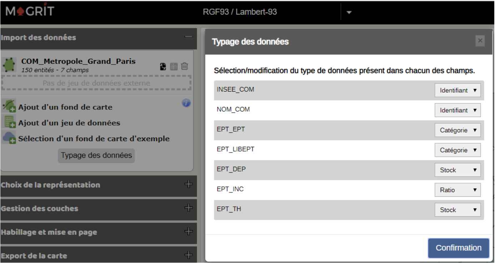
]

---

.left-column[
## 5.2 Réalisation

### Choix des options adéquates
]

.right-column[
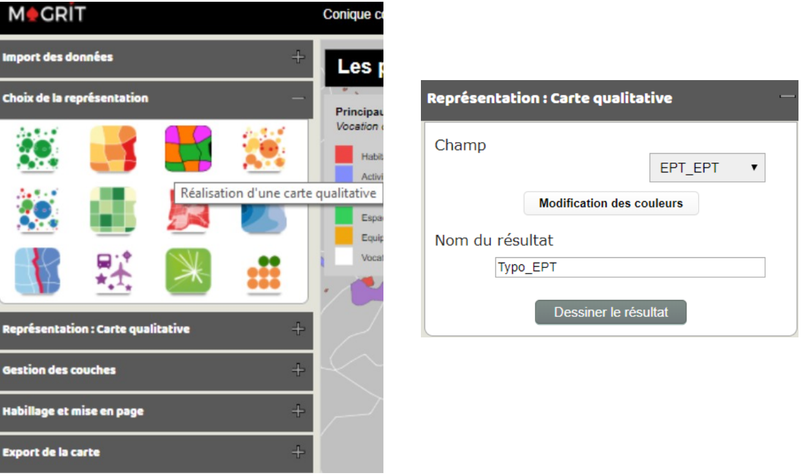
]

---

.left-column[
## 5.3 Choix des couleurs

* quelle couleur pour quelle modalité ?

* ordinal ou nominal ?

* quel ordre pour les modalités en légende ?
]

.right-column[
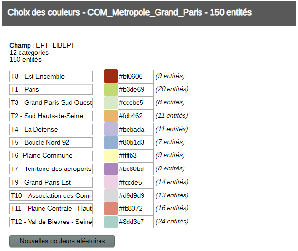
]

---

.left-column[
### Pour faire vos propres couleurs...


**Le rendu écran diffère toujours du rendu papier.**

En conditions réelles, il est utile de faire des tests d'impression ou d'opter pour des palettes réfléchies par des spécialistes.
]

.right-column[
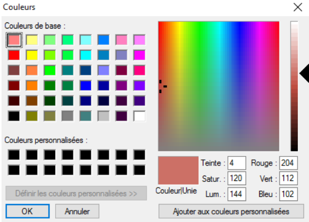
]

---

## 5.4 Mise en page

.big[
* N'oubliez pas tous les éléments d'**habillage** (sources, date, échelle, titre).
  Veillez à la cohérence avec les cartes que vous avez produites précédemment.
  
* Améliorez le **style graphique** de votre carte : vous pouvez jouer sur la *superposition des couches géographiques*,
  l'*épaisseur des lignes* administratives, ajouter des *couches d'habillage* pour aider à la localisation ou à la
  problématisation de votre carte...
  
* Adaptez l'**emprise géographique** de votre carte pour améliorer sa *lisibilité* et la *clarté du message* que vous souhaitez transmettre.

*Pour adapter l'emprise géographique dans Magrit, déverouiller la carte et zoomer.*
]

---

## 5.5 Sauvegarde et export

.big[
* Sauvegarder le projet au format `.json` pour continuer votre travail sur un autre terminal.

* Exporter la carte au format `.png` pour l'incorporer dans le dossier (attention à éviter la pixellisation !)
]

---

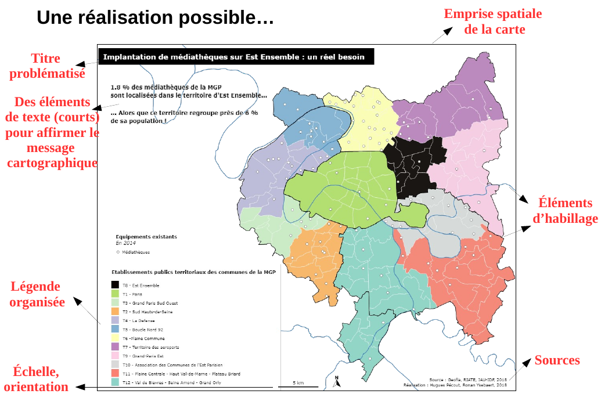

