1. Les données qualitatives

Elles correspondent aux variables dont les valeurs ne sont pas numériques.

Par exemple : votre *âge*, votre *taille* sont des variables quantitatives ; votre *couleur de cheveux*, des données qualitatives.

Elles sont de deux types :

* Nominales

* Ordinales

## Nominales vs Ordinales

:::columns
:::column
### Qualitatives nominales :

Les valeurs possibles n'ont pas d'ordre

Par exemple : rouge, bleu, vert, jaune, violet...

Ou encore : langues officielles des pays européens

:::
:::column
### Qualitatives ordinales :

**L'ordre des valeurs possibles a un sens**

Par exemple : très peu, peu, moyen, beaucoup

Ou encore : hiérarchie urbaine, des centres au périurbain
:::
:::

## Un exemple de qualitatif nominal

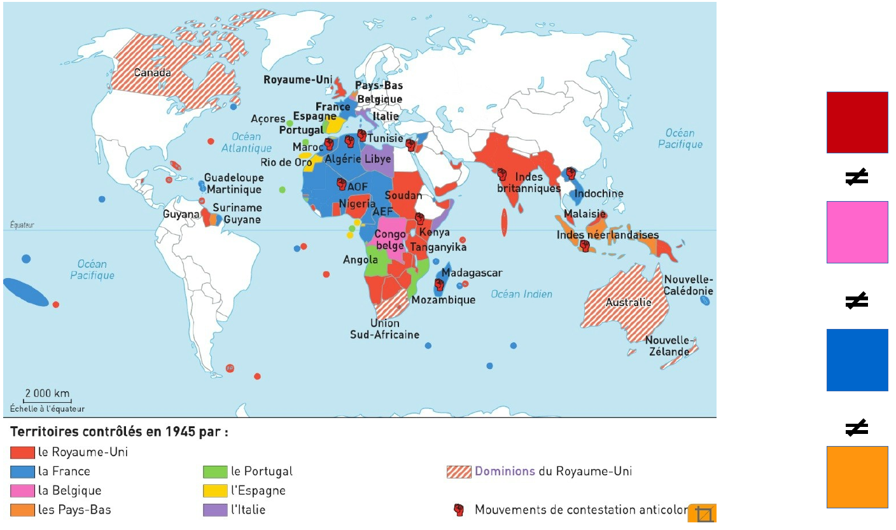

## Un exemple de qualitatif ordinal

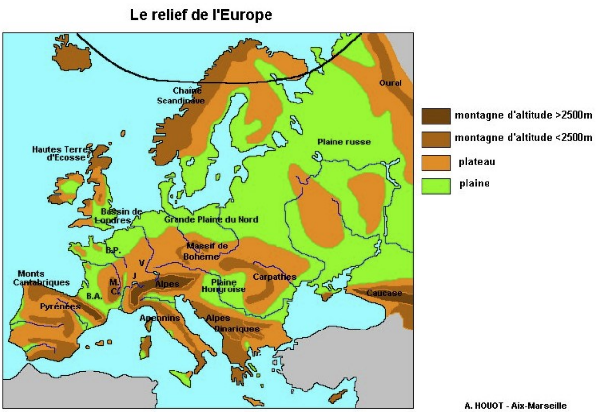

## Pour les représenter

:::columns
:::column
### Qualitatives nominales :

**Les valeurs possibles n'ont pas d'ordre**

La représentation cartographique doit permettre de bien les différencier.

*Attention* : il faut que les formes/propriétés graphiques des symboles soient bien distinctes, et éviter les ambiguïtés. Mais trop de symboles rendent la lecture difficile.

:::
:::column
### Ordinales :

**L'ordre des valeurs possibles a un sens**

La représentation graphique doit permettre de rendre compte de l'ordre ou du classement utilisé.
:::
:::

## Attention avec le quali ordinal !

:::columns
:::column
### Des symboles ambigus :

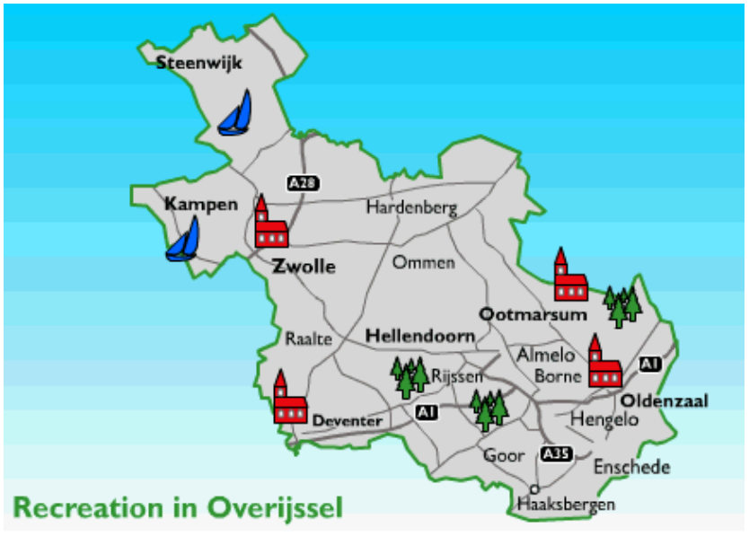

:::
:::column
### Des symboles illisibles :

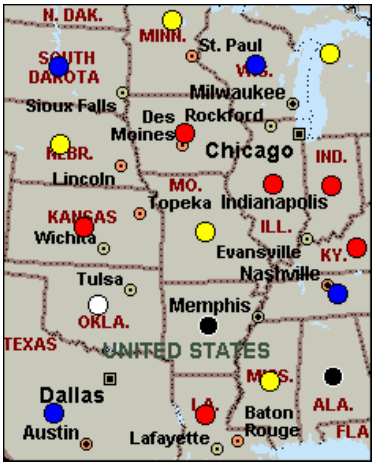
:::
:::

## En termes de variables visuelles :

:::columns
:::column
### Qualitatif nominal :

* Différence : **oui**

* Hiérarchie : non

* Proportionnalité : non

Il faut des variables visuelles qui retranscrivent la **similarité** et la **différence**.

:::
:::column
### Qualitatif ordinal :

* Différence : **oui**

* Hiérarchie : **oui**

* Proportionnalité : non

Il faut des variables visuelles qui retranscrivent un **ordre**.
:::
:::

---

2. Représenter les données qualitatives nominales

## 2.1 La couleur

La variable visuelle de la couleur est très utilisée en cartographie, car :

* elle permet de **différencier** facilement des objets ;

* elle s'utilise aussi bien pour des points, des lignes que des surfaces (implantations ponctuelles, linéaires, zonales) ;

* elle peut traduire des **relations différencielles qualitatives** et donc illustrer des *typologies*

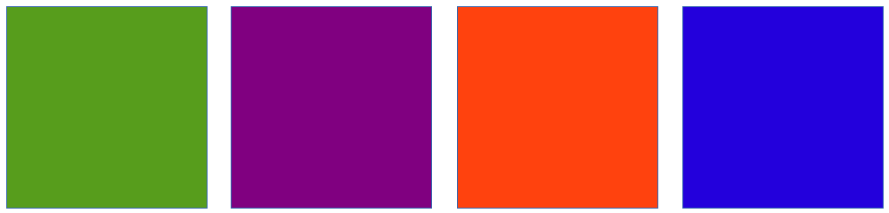

## 2.2 La forme

La variable visuelle forme consiste à faire varier les contours géométriques d'un figuré. Elle inclut les *symboles*.

* elle ne permet que de **différencier** des objets

:::columns
:::column

### Formes simples

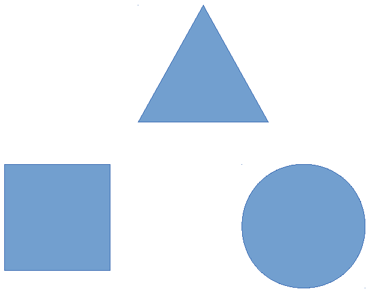

:::
:::column
### Symboles

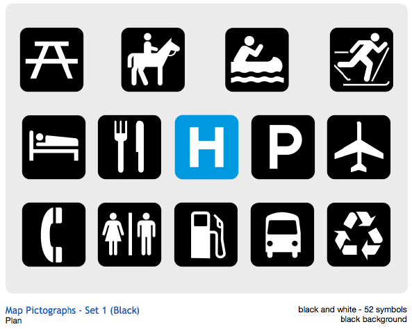
:::
:::

## 2.3 L'orientation

La variable visuelle orientation correspond au procédé qui consiste à faire varier l'angle d'un figuré graphique avec l'horizontale.

* elle permet de rendre compte de **différences**

* bien qu'elle soit exprimée en degrés (de 0° à 359°), elle ne peut exprimer que des différences (pas d'usage pour une variable quanti ou quali ordinale)
  
* elle est quasi-uniquement utilisée pour les **implantations zonales**
  
* elle est un peu passée de mode, bien qu'elle soit utile pour les sorties monochromes...

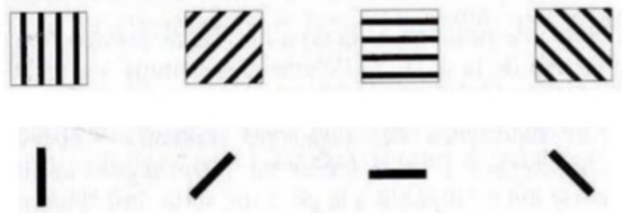

---

3. Représenter les donnés qualitatives ordinales

## 3.1 Valeurs, camaïeux ou couleurs ordonnées

## 3.2 La texture

La variable visuelle *texture* combine des éléments graphiques pour construire une surface.

* elle peut traduire des **différences**, des **équivalences** ou un **ordre**.

* elle est surtout utilisée en **implantation zonale**

:::columns
:::column
### Différence nominale

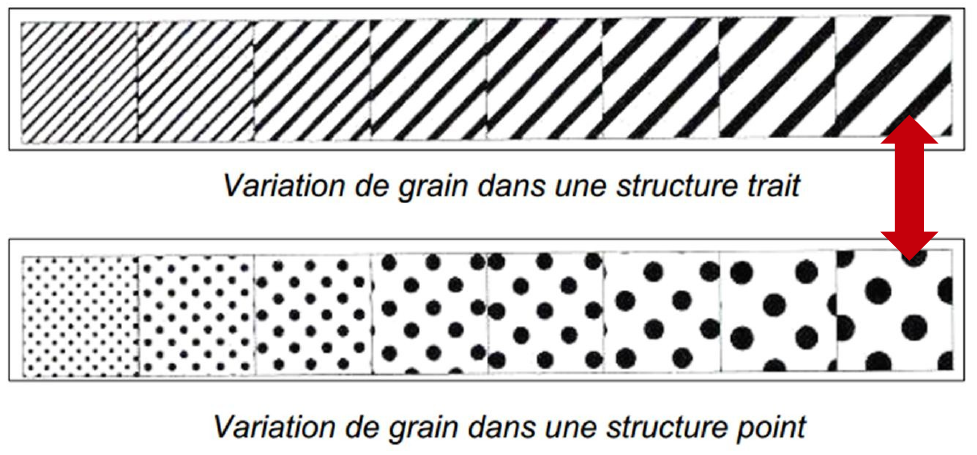

:::
:::column

### Différence ordinale

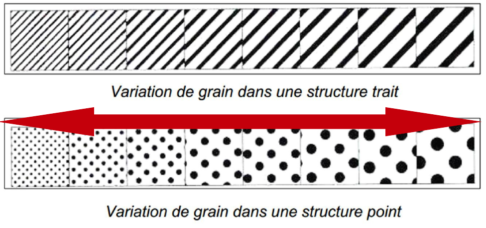
:::
:::

---

     

4. Les couleurs en cartographie des données qualitatives

## Les couleurs qui évoquent la réalité

:::columns
:::column

:::
:::column

:::
:::

## Les couleurs historiquement associées à des thématiques

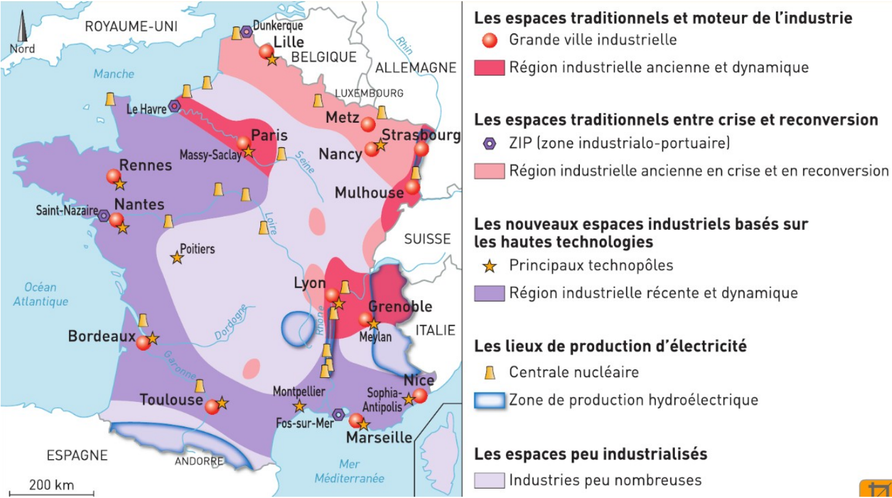

## Les couleurs historiquement associées à des thématiques

## Les couleurs conventionnelles

:::columns
:::column

:::
:::column

:::
:::

## Les couleurs opposées

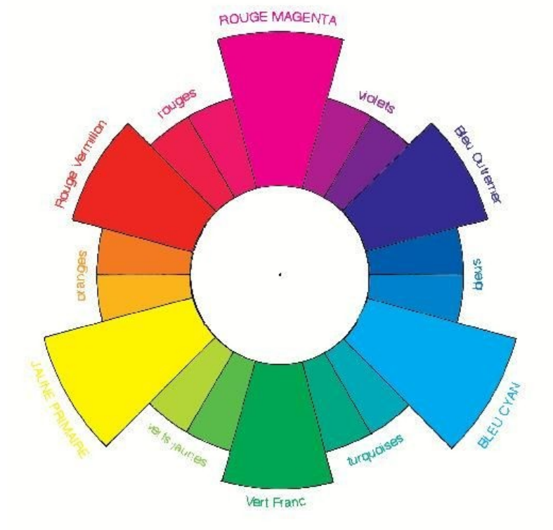

## Opposition des couleurs chaudes et froides

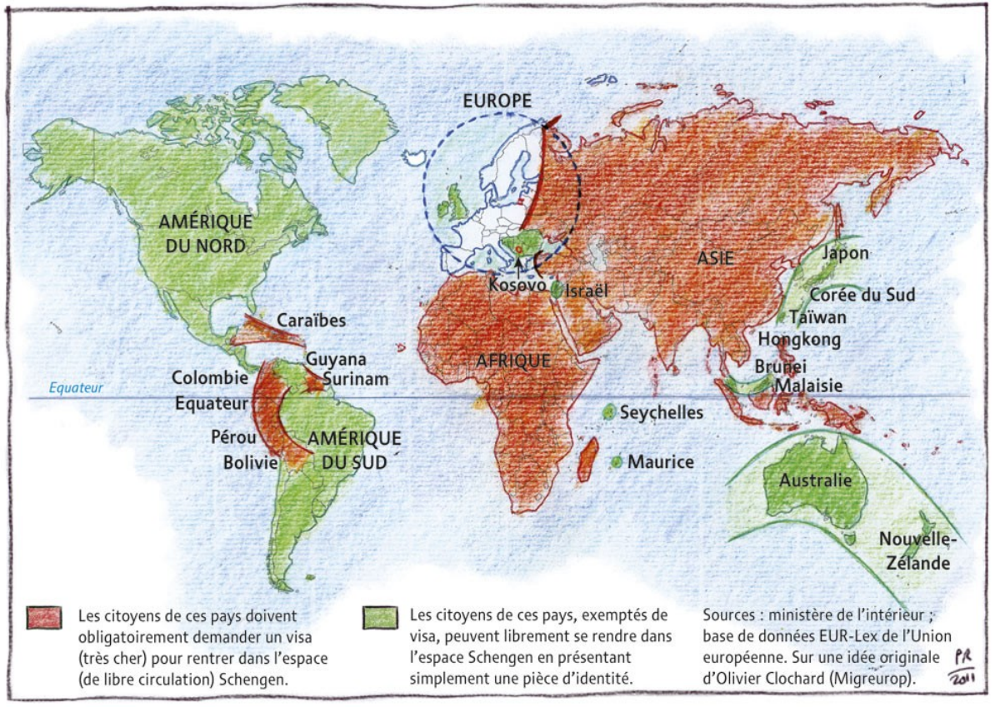

---

5. Représenter les données qualitatives avec Magrit

 

Votre objectif : représenter la localisation de votre terrain d'études au sein de la métropole du Grand Paris.

## Les étapes

1. **Consultation** des données disponibles, **import** des données complémentaires

2. **Réalisation** de la carte qualitative

3. **Choix des couleurs** (ordinal ou nominal ?)

4. **Mise en page**

5. **Sauvegarde** et export

---

:::columns
:::{.column width="30%"}

### 5.1 Consultation et import

*Consultez les métadonnées, ouvrez les fichiers de données dans QGis, regardez la table attributaire...*

* quel indicateur ?

* quel producteur de données ?

* quelle date de production de l'indicateur ?

* quel code utiliser pour la cartographie ?

:::
:::{.column width="70%"}

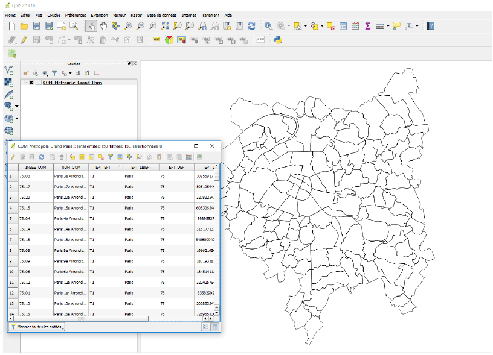
:::
:::

---

:::columns
:::{.column width="30%"}
### Identification des codes

:::
:::{.column width="70%"}

:::
:::

---

:::columns
:::{.column width="30%"}
### 5.2 Réalisation

Choix des options adéquates

:::
:::{.column width="70%"}
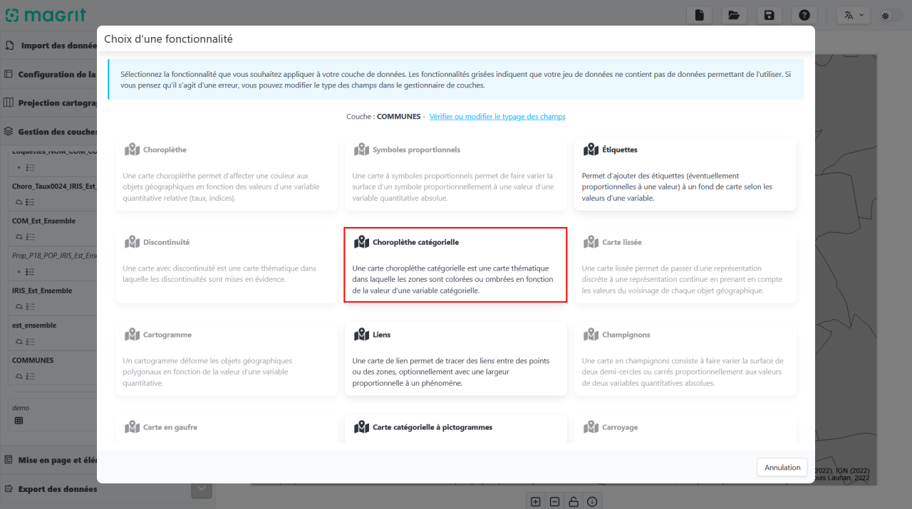
:::
:::

---

:::columns
:::{.column width="30%"}
### 5.3 Choix des couleurs

* quelle couleur pour quelle modalité ?

* ordinal ou nominal ?

* quel ordre pour les modalités en légende ?

:::
:::{.column width="70%"}

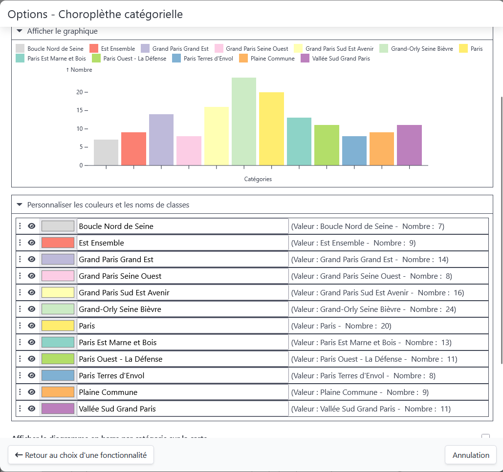

:::
:::

---

:::columns
:::{.column width="30%"}
### Pour faire vos propres couleurs...

**Le rendu écran diffère toujours du rendu papier.**

En conditions réelles, il est utile de faire des tests d'impression ou d'opter pour des palettes réfléchies par des spécialistes.

:::
:::{.column width="70%"}
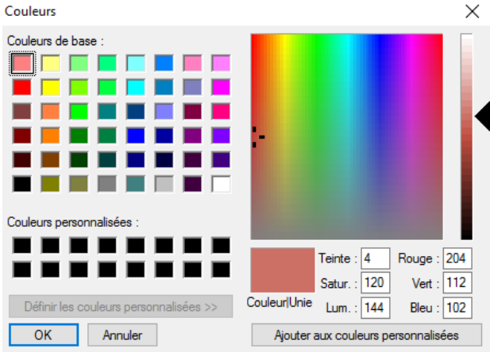
:::
:::

## 5.4 Mise en page

* N'oubliez pas tous les éléments d'**habillage** (sources, date, échelle, titre). Veillez à la cohérence avec les cartes que vous avez produites précédemment.
  
* Améliorez le **style graphique** de votre carte : vous pouvez jouer sur la *superposition des couches géographiques*, l'*épaisseur des lignes* administratives, ajouter des *couches d'habillage* pour aider à la localisation ou à la problématisation de votre carte...
  
* Adaptez l'**emprise géographique** de votre carte pour améliorer sa *lisibilité* et la *clarté du message* que vous souhaitez transmettre.

*Pour adapter l'emprise géographique dans Magrit, déverouiller la carte et zoomer.*

## 5.5 Sauvegarde et export

* Sauvegarder le projet au format `.json` pour continuer votre travail sur un autre terminal.

* Exporter la carte au format `.png` pour l'incorporer dans le dossier (attention à éviter la pixellisation !)

---

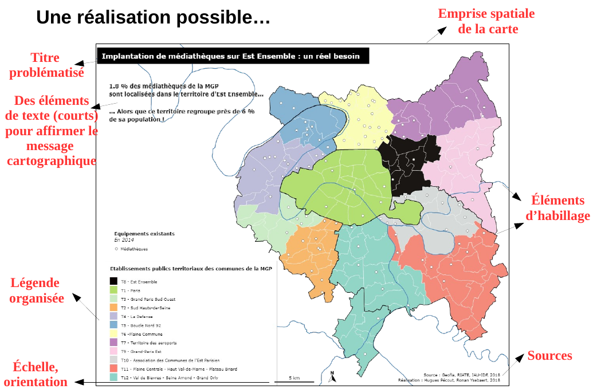

