```{r setup, include=FALSE}
options(htmltools.dir.version = FALSE, crayon.enabled = TRUE)
knitr::opts_chunk$set(cache = TRUE,
                      fig.align='center',
                      message = FALSE,
                      warning = TRUE)
# install.packages("devtools")
# devtools::install_github("gadenbuie/countdown")
# devtools::install_github("mitchelloharawild/icons")
library(countdown)
library(icons)
#download_fontawesome()
```

.center[
# Quelques révisions


]

---

## L'information géographique

.left-column[
.right[

]
]

.right-column[
.big[
"**Une information est dite géographique lorsqu'elle se rapporte à un ou plusieurs lieux de la surface terrestre**" (Beguin & Pumain, 2011).

C'est une information **localisée**, **repérée** ou **géocodée**.

Entre <span color="red" font-size="20pt">60 et 80%</span> de l'information que nous traitons possède une dimension géographique, selon S. Hahmann et D. Burghardt (2012, "<i>How much information is spatially georeferenced? Networks and cognition</i>).
]
]


---

.center[
## Les trois composantes de l'information géographique
]

.center[
```{r, echo = FALSE, out.width = "900px"}

library(DiagrammeR)

grViz("digraph dot {

  # a 'graph' statement
  graph [overlap = true]

  # several 'node' statements
  node [shape = rectangle, fontname = Helvetica, color='#9c2005', fontsize=13]
  d1

  node [shape = ellipse, fontname = Helvetica, color=black, fontsize = 9] // sets as circles
  d2; d3; d4
  
  d1 [label = 'Données géographiques'];
  d2 [label = 'Niveau sémantique'];
  d3 [label = 'Niveau géométrique'];
  d4 [label = 'Niveau topologique'];

  # several 'edge' statements
  d1->d2[arrowhead = none]
  d1->d3[arrowhead = none]
  d1->d4[arrowhead = none] 

}")
```
]

---

.center[
```{r, echo = FALSE, out.width = "900px", out.height="400px"}

library(DiagrammeR)

grViz("digraph dot {

  # a 'graph' statement
  graph [overlap = true]

  # several 'node' statements
  node [shape = rectangle, fontname = Helvetica, color='#9c2005', fontsize=13]
  d1

  node [shape = ellipse, fontname = Helvetica, color=black, fontsize = 9] // sets as circles
  d2; d3; d4
  
  d1 [label = 'Données géographiques'];
  d2 [label = 'Niveau sémantique', color = red];
  d3 [label = 'Niveau géométrique'];
  d4 [label = 'Niveau topologique'];

  # several 'edge' statements
  d1->d2[arrowhead = none]
  d1->d3[arrowhead = none]
  d1->d4[arrowhead = none] 

}")
```
]

Le niveau sémantique de l'information géographique décrit un objet par sa **nature** et ses **propriétés**.

Celles-ci constituent les **attributs** de l'objet : par exemple un numéro de parcelle cadastrale, le nom d'une
route, d'une rivière ou d'une commune, les données du recensement, une photo, etc.

Ce sont des données **alphanumériques**.

.right[
source : Afigeo
]


---

.center[
```{r, echo = FALSE, out.width = "900px"}

library(DiagrammeR)

grViz("digraph dot {

  # a 'graph' statement
  graph [overlap = true]

  # several 'node' statements
  node [shape = rectangle, fontname = Helvetica, color='#9c2005', fontsize=13]
  d1

  node [shape = ellipse, fontname = Helvetica, color=black, fontsize = 9] // sets as circles
  d2; d3; d4
  
  node [shape = rectangle, fontname = Helvetica, color=green, fontsize=12]
  d5
  
  node [shape = rectangle, fontname = Helvetica, color=grey, fontsize=9]
  d6; d7; d8; d9
  
  d1 [label = 'Données géographiques'];
  d2 [label = 'Niveau sémantique', color = red];
  d3 [label = 'Niveau géométrique'];
  d4 [label = 'Niveau topologique'];
  
  d5 [label = 'Variables', color=green, shape = rectangle]
  d6 [label = 'Quantitatives absolues']
  d7 [label = 'Quantitatives relatives']
  d8 [label = 'Qualitatives ordinales']
  d9 [label = 'Qualitatives nominales']

  # several 'edge' statements
  d1->d2[arrowhead = none]
  d1->d3[arrowhead = none]
  d1->d4[arrowhead = none] 
  d2->d5[arrowhead = none]
  d5->d6[arrowhead = none]
  d5->d7[arrowhead = none]
  d5->d8[arrowhead = none]
  d5->d9[arrowhead = none]
}")
```
]

---

.center[
```{r, echo = FALSE, out.width = "900px", out.height="400px"}

library(DiagrammeR)

grViz("digraph dot {

  # a 'graph' statement
  graph [overlap = true]

  # several 'node' statements
  node [shape = rectangle, fontname = Helvetica, color='#9c2005', fontsize=13]
  d1

  node [shape = ellipse, fontname = Helvetica, color=black, fontsize = 9] // sets as circles
  d2; d3; d4
  
  d1 [label = 'Données géographiques'];
  d2 [label = 'Niveau sémantique'];
  d3 [label = 'Niveau géométrique',  color = red];
  d4 [label = 'Niveau topologique'];

  # several 'edge' statements
  d1->d2[arrowhead = none]
  d1->d3[arrowhead = none]
  d1->d4[arrowhead = none] 

}")
```
]

Le niveau géométrique de l'information géographique décrit la **forme** et la **position** d'un objet sur la Terre :
par exemple, le tracé d'un réseau routier, les limites d'un maillage administratif, les pixels d'une image satellitaire...

Celles-ci peuvent être exprimées par un système de coordonnées explicite : par une latitude et une longitude,
par des coordonnées projetées par exemple en Lambert-93.

.right[
source : Afigeo
]


---

.center[
```{r, echo = FALSE, out.width = "900px"}

library(DiagrammeR)

grViz("digraph dot {

  # a 'graph' statement
  graph [overlap = true]

  # several 'node' statements
  node [shape = rectangle, fontname = Helvetica, color='#9c2005', fontsize=13]
  d1

  node [shape = ellipse, fontname = Helvetica, color=black, fontsize = 9] // sets as circles
  d2; d3; d4
  
  node [shape = rectangle, fontname = Helvetica, color=blue, fontsize=12]
  d5
  
  node [shape = rectangle, fontname = Helvetica, color=gray, fontsize=9]
  d6; d7
  
  d1 [label = 'Données géographiques'];
  d2 [label = 'Niveau sémantique'];
  d3 [label = 'Niveau géométrique',  color = red];
  d4 [label = 'Niveau topologique'];
  d5 [label = 'Logiciel de SIG']
  d6 [label = 'Vecteur']
  d7 [label = 'Raster']

  # several 'edge' statements
  d1->d2[arrowhead = none]
  d1->d3[arrowhead = none]
  d1->d4[arrowhead = none] 
  d3->d5[arrowhead = none]
  d5->d6[arrowhead = none]
  d5->d7[arrowhead = none]

}")
```
]


---

.center[
```{r, echo = FALSE, out.width = "900px", out.height="400px"}

library(DiagrammeR)

grViz("digraph dot {

  # a 'graph' statement
  graph [overlap = true]

  # several 'node' statements
  node [shape = rectangle, fontname = Helvetica, color='#9c2005', fontsize=13]
  d1

  node [shape = ellipse, fontname = Helvetica, color=black, fontsize = 9] // sets as circles
  d2; d3; d4
  
  d1 [label = 'Données géographiques'];
  d2 [label = 'Niveau sémantique'];
  d3 [label = 'Niveau géométrique'];
  d4 [label = 'Niveau topologique',  color = red];

  # several 'edge' statements
  d1->d2[arrowhead = none]
  d1->d3[arrowhead = none]
  d1->d4[arrowhead = none] 

}")
```
]

Le niveau topologique de l'information géographique décrit les **relations éventuelles** des objets
avec d'autres objets ou phénomènes, par exemple : la contiguïté entre deux communes, l'inclusion d'une
parcelle dans une commune, etc.

*Concrètement, cette partie de l'information est déduite du niveau géométrique (par les géotraitements).*

.right[
source : Afigeo
]


---


.center[

```{r, echo = FALSE, out.width = "900px"}

library(DiagrammeR)

grViz("digraph dot {

  # a 'graph' statement
  graph [overlap = true]

  # several 'node' statements
  node [shape = rectangle, fontname = Helvetica, color='#9c2005', fontsize=13]
  d1

  node [shape = ellipse, fontname = Helvetica, color=black, fontsize = 9] // sets as circles
  d2; d3; d4
  
  node [shape = rectange, fontname = Helvetica, backcolor=lightblue, fontsize=14]
  d5
  
  d1 [label = 'Données géographiques'];
  d2 [label = 'Niveau sémantique'];
  d3 [label = 'Niveau géométrique'];
  d4 [label = 'Niveau topologique'];
  d5 [label = 'Systèmes d information géographique = SIG']
  
  d1->d2[arrowhead = none]
  d1->d3[arrowhead = none]
  d1->d4[arrowhead = none] 
  d2->d5
  d3->d5
  d4->d5

}")
```
]

---

## Qu'est-ce qu'un SIG ?

.big[
.pull-left[
En France, le terme de "**SIG**" a un sens large. Il désigne à la fois le logiciel et les données manipulées.
]

.pull-right[
### Les grandes fonctions du SIG :

* abstraire et saisir

* gérer et stocker

* analyser

* représenter

...les données géographiques.
]
]

---

.left-column[
### Abstraire
.big[
Les couches d'information superposées sont une manière de représenter la réalité.]
]

.right-column[
.center[

]
]

---

.left-column[
### Saisir

Par exemple, la numérisation ou digitalisation...
]

.right-column[

]

---

.left-column[
### Gérer et stocker
]

.right-column[
.big[
* **des points** *(par exemple : une usine)*

* **des lignes** *(par exemple : une route, une rivière)*

* **des surfaces** *(par exemple : une commune, une zone protégée)*

* **des images** *(par exemple : une photo aérienne, un modèle numérique de terrain)*

* **des données statistiques** *(par exemple : des nombres d'habitant⋅es)*
]
]

---

.left-column[
### Analyser (géotraitement)
]

.right-column[

]

---

.left-column[
### Analyser (géotraitement<u>s</u>)
]

.right-column[

]

---

## La cartographie

.left-column[
.right[
Jacques Bertin <3 :


]
]

.right-column[
.big[
"La graphique utilise les propriétés de l'image visuelle pour faire apparaître des relations
de **différence**, d'**ordre** et de **proportionnalité** entre les données"
]
]

--


.right-column[
### Les variables visuelles

.big[
*Les variables visuelles (ou rétiniennes) sont les moyens graphiques par lesquels on transcrit
visuellement une information.*
]

]

---

.center[
### Déterminer la nature d'une variable


]

---

.left-column[
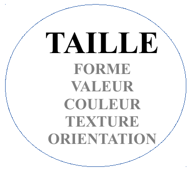
]

.right-column[
.big[
* Le plus souvent en implantation **ponctuelle** ou **linéaire**
* Traduit la **proportionnalité**
* Données **quantitatives absolues** (= de stock)
]

*Exemples : cartes en proportion, cartes de flux, cartes en barres*

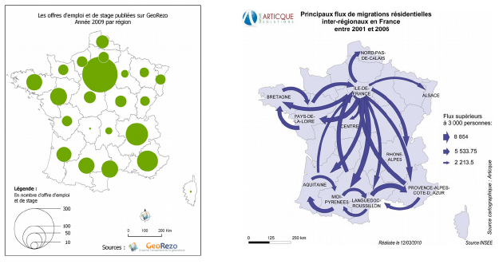
]

---

.left-column[
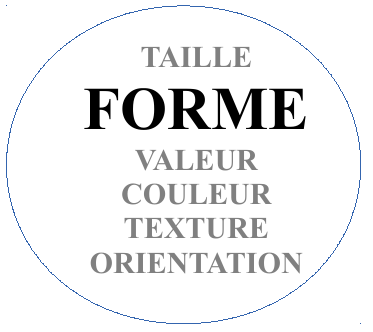
]

.right-column[
.big[
* Le plus souvent en implantation **ponctuelle**
* Traduit la **différence**
* Données **qualitatives nominales**
]

*Exemples : cartes de symboles*

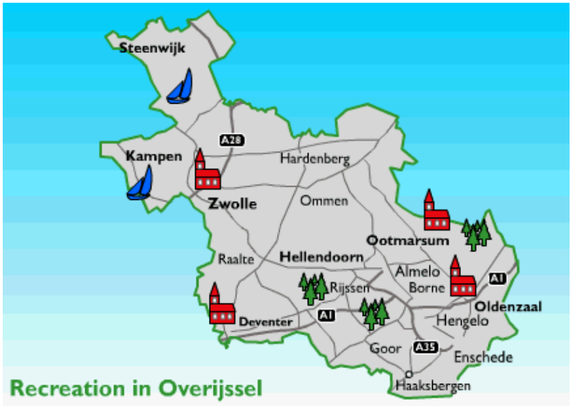
]

---

.left-column[
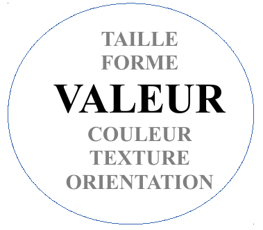
]

.right-column[
.big[
* Le plus souvent en implantation **zonale**
* Traduit un **ordre**
* Données **quantitatives relatives** ou **qualitatives ordonnées**
]

*Exemples : carte choroplète*


]

---

.left-column[
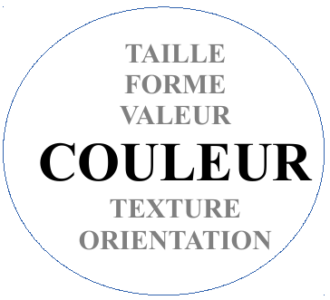
]

.right-column[
.big[
* En implantation **ponctuelle**, **linéaire** ou **zonale**
* Traduit la **différence**
* Données **qualitatives nominales**
]

*Exemples : typologie*

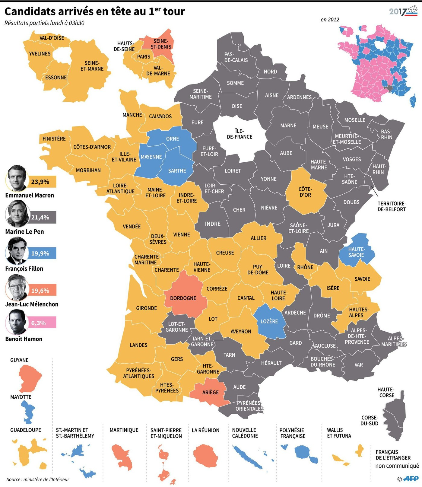
]

---

.left-column[
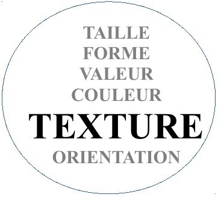
]

.right-column[
.big[
* Principalement en implantation **zonale**
* Peut traduire la **différence** (points vs hachures) : données **qualitatives nominales**
* Peut traduire l'**ordre** (densité des hachures) données **quantitatives relatives** ou **qualitatives ordonnées**
]

*Variable visuelle utile pour le noir-et-blanc monochrome et la superposition*

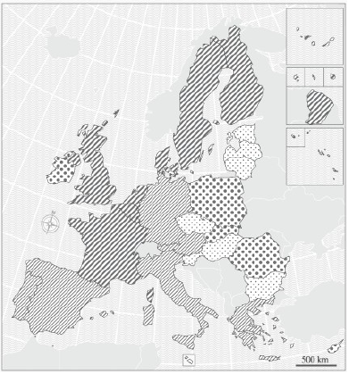
]

---

.left-column[
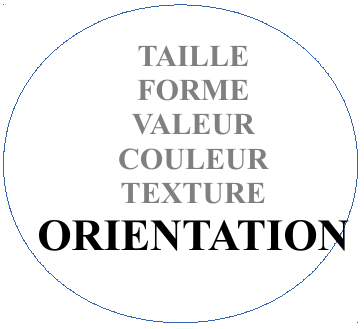
]

.right-column[
.big[
* Principalement en implantation **zonale**
* Peut traduire la **différence**
* Données **qualitatives nominales**
]   

*Variable visuelle utile pour le noir-et-blanc monochrome et la superposition.*

*Peu efficace, elle est rarement utilisée.*

  
]

---

### Des données aux variables visuelles


---

### Une autre synthèse


---

<br><br><br><br><br>

.center[
# Rappel des consignes
  

]

---

## L'évaluation du cours

.big[
* Un **dossier à composer** en binôme avec les différents exercices pratiques *(2/3 de la note)*

* Un **partiel** *(1/3 de la note)*
]

---

## Le dossier

.big[
Grille de notation :

* *13 points* sur la réflexion et le travail réalisé avec QGis

* *6 points* sur les cartes thématiques réalisées avec Magrit

* *1 point* de soin]

--

.big[


* *1 point retiré* par jour de retard !]

---

## Composition du dossier

1) **Courte introduction** présentant votre espace d'étude et l'équipement qu'il faut y implanter.
Expliquer en quoi l'implantation de ce nouvel équipement vous semble pertinente. *(1 point)*

2) **Présentation des critères d'implantation (4 min.)** choisis pour déterminer la localisation
optimale. Justifiez la pertinence de vos critères. N'hésitez pas à vous appuyer sur de la documentation.
*(3 points)*

3) **Restitution des étapes de traitement SIG** qui vous ont permis de déterminer la ou les zone(s)
optimale(s). Vous concluez cette partie par une carte de synthèse qui résume l'ensemble de la démarche
et la (ou les) zone(s) d'implantation proposée(s). *(5 points)*

4) **Illustration graphique** de la **chaîne de traitement** réalisée. *(2 points)*

5) **Conclusion**. Vous y proposez des critères d'implantation supplémentaires qui amélioreraient
la qualité de votre étude. *(2 points)*

---

## Figures

.big[
Votre rapport doit contenir **3 cartes thématiques** accompagnées d'un commentaire descriptif (réalisation
technique et interprétation thématique).

1) Une carte représentant des **données quantitatives absolues** *(2 points)*. *Ex. : nombre d'habitant⋅es par IRIS*

2) Une carte représentant des **données quantitatives relatives** *(2 points)*. *Ex. : part des moins de 25 ans par commune*

3) Une carte représentant des **données qualitatives** *(2 points)*. *Ex. : localisation et présentation de votre espace d'étude*
]

---

<br>
<br>
.big[
Dossier à envoyer par mail au plus tard le **mercredi 5 janvier 2021**
]

---

.pull-left[
## Le partiel

Devoir sur table sur les notions vues en cours.]

.pull-right[
.right[

]
]

.big[
- L'**information géographique** : définition, types de données, vecteur / raster, types d'objets géographiques et d'implantations

- La **géomatique**, les **SIG** : requêtes, géotraitements

- La **cartographie** : sémiologie graphique, variables visuelles, requis de mise en page et d'habillage]

---
.center[
# Bon courage et bonnes vacances !

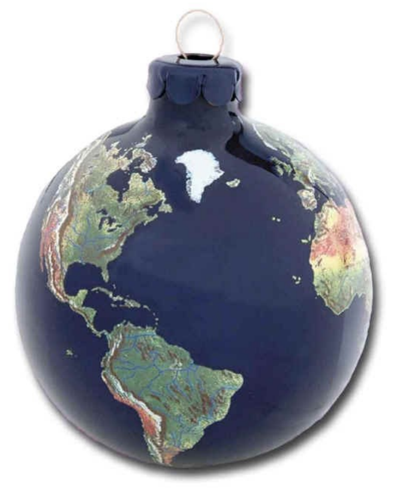

[ronan.ysebaert@cnrs.fr](mailto:ronan.ysebaert@cnrs.fr) - [maxime.guinepain@u-paris.fr](mailto:maxime.guinepain@u-paris.fr)
]