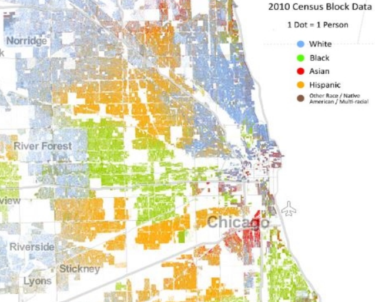
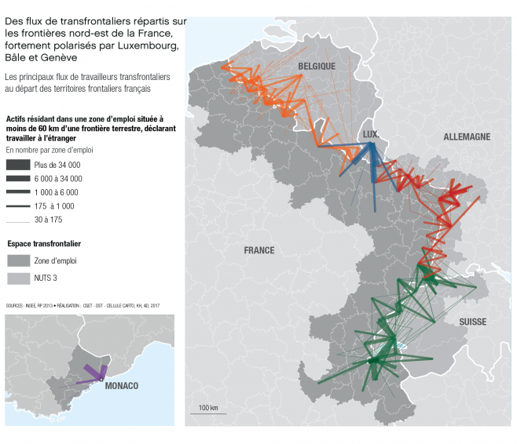

```{r setup, include=FALSE}
options(htmltools.dir.version = FALSE, crayon.enabled = TRUE)
knitr::opts_chunk$set(cache = TRUE,
                      fig.align='center',
                      message = FALSE,
                      warning = FALSE,
                      echo = FALSE)
# install.packages("devtools")
# devtools::install_github("gadenbuie/countdown")
# devtools::install_github("mitchelloharawild/icons")
library(countdown)
library(icons)
#download_fontawesome()
```

<br><br><br><br><br><br><br>
# 1. L'information géographique ?

---

## Définition

L'information géographique peut être définie comme «**l'ensemble de la description d'un objet et de sa position géographique à la surface de la Terre.**» (*Association Française pour l'Information Géographique*).

<br>

**Toute information contenant une référence à un lieu, qu’il s’agisse d’un point précis du territoire, d’une ligne** (route, frontière, cours d'eau) ou encore d’**une surface donnée** (aire protégée, zone d’emploi, commune...) **a une dimension géographique**.

<br>
Entre **60 et 80%** de l’information que nous traitons possède une dimension géographique. (*Hahmann S. et Burghardt D., 2012, « How much information is geospatially referenced? Networks and cognition »*).


---


## De l'information à l'information géographique ?

Pour qu'une information soit considérée comme géographique, **celle-ci doit précisément être localisée dans l'espace**.    

<br>

**Le procédé qui consiste à positionner un objet** (une entité géographique, une personne...) dans l'espace à l'aide de
coordonnées géographiques s'appelle  **le géoréférencement**.

Les techniques de géoréférencement diffèrent selon le type de données géographiques (image, adresse...).   


---

## Les composantes de l'IG

```{r, echo = FALSE, out.width = "900px"}

library(DiagrammeR)

grViz("digraph dot {

  # a 'graph' statement
  graph [overlap = true]

  # several 'node' statements
  node [shape = rectangle, fontname = Helvetica, color='#9c2005', fontsize=13]
  d1

  node [shape = ellipse, fontname = Helvetica, color=black, fontsize = 9] // sets as circles
  d2; d3; d4
  
  d1 [label = 'Données géographiques'];
  d2 [label = 'Niveau sémantique'];
  d3 [label = 'Niveau géométrique'];
  d4 [label = 'Niveau topologique'];

  # several 'edge' statements
  d1->d2[arrowhead = none]
  d1->d3[arrowhead = none]
  d1->d4[arrowhead = none] 

}")
```


---

## Niveau géométrique


Le **niveau géométrique** d'un objet géographique correspond à **sa forme et sa localisation** sur la surface terrestre, exprimés dans un **système de coordonnées** explicite.
   

```{r, echo = FALSE, out.width = "900px"}
knitr::include_graphics('figures/geom.png')
```


---


## Niveau géométrique

Pour stocker, manipuler, analyser et représenter de l'information géographique, on distingue généralement 2 types de données : le raster et le vecteur. 

.pull-left[


### Le raster  

**c'est une image** (plan scanné, photographie aérienne, image satellitaire...) **localisée dans l'espace**. 

L’information géographique est alors stockée dans des cellules (pixel) contigües généralement carrées. 

Chaque pixel **défini par une résolution** possède des valeurs qui peuvent être traitées et cartographiées. 

La manipulation des rasters est complexe et nécessite des outils très spécialisés.    
]

.pull-right[
<span style="color:#9c2005;font-weight:bold;">Raster</span>  

</div>

]

---

## Niveau géométrique

Pour stocker, manipuler, analyser et représenter de l'information géographique, on distingue généralement 2 types de données : le raster et le vecteur. 


### Le vecteur

.pull-left[
**Le format vectoriel** utilise le concept d'**objets géométriques (points, lignes, polygones) pour représenter (et stocker) des objets géographiques**. 

Ces objets géométriques sont **précisément localisés dans l'espace**.

Leur manipulation est simple et permet de puissants traitements.    

]


.pull-right[

<div class="centered">
<span style="color:#9c2005;font-weight:bold;">Vecteur</span>  

</div>
</div>

]


---


## Niveau géométrique

Pour stocker, manipuler, analyser et représenter de l'information géographique, on distingue généralement 2 types de données : le raster et le vecteur. 

```{r, echo = FALSE, out.width = "600px", fig.align='center'}
knitr::include_graphics('figures/raster_vecteur_2.png')
```

---


## Niveau topologique

Le niveau topologique  **d'un objet géographique se déduit du niveau géométrique**. Il correspond aux relations éventuelles avec d'autres objets ou phénomènes (ex : contiguïté entre deux batîments).


```{r, echo = FALSE, fig.align='center', out.width = "500px"}
knitr::include_graphics('figures/topologie.gif')
```


---


## Niveau sémantique

**Il s'agit de l'ensemble des informations relatives à un objet géographique, qui le décrivent et le caractérisent**. Elles sont souvent nommées données attributaires.
<br>

```{r, echo = FALSE, out.width = "800px", fig.align='center'}
knitr::include_graphics('figures/attribut.gif')
```

<span style="font-size:10pt;">Ex: le trafic associé à une route, le nombre de logements ou d'emplois dans une territoire, la composition chimique d'un prélèvement d'eau de rivière...</span>


---

## Niveau sémantique

**Il s'agit de l'ensemble des informations relatives à un objet géographique, qui le décrivent et le caractérisent**. Elles sont souvent nommées données attributaires.
<br>


```{r, echo = FALSE, out.width = "700px", fig.align='center'}
knitr::include_graphics('figures/attribut.png')
```


---
<br><br><br><br><br><br><br>
# 2. Méthodes d'acquisition

---

## Relevé de terrain

Le **levé topographique avec théodolite** permet de relever précisement l'étendue et la topographie d'un territoire.        
Le **relevé de point GPS** permet de collecter la localisation précise d'objet dans l'espace.</p>

```{r image_grobs, fig.show = "hold", out.width = "40%", fig.align = "default"}

knitr::include_graphics('figures/triangualtion.png')
knitr::include_graphics('figures/gps.jpg')
```


---

## Télédétection (image satellite)

**La télédétection comprend l’ensemble des procédés et techniques qui permettent d'acquérir à distance des informations sur les objets terrestres**, en utilisant les propriétés des ondes électromagnétiques émises ou réfléchies par ces objets. La collecte de données de télédétection est réalisée par des avions ou par des satellites. 

**Les informations géographiques collectées par télédétection sont stockées en format RASTER**. Le traitement de ce genre de données nécessite l'**utilisation de logiciels spécialisés (Envi, Erdas, Idrisi...).**.    


```{r, echo = FALSE, out.width = "830px",fig.align='center'}
knitr::include_graphics('figures/teledec.jpg')
```


---

## Photogrammétrie (photo aérienne) et LiDAR


**Ces deux technologies permettent de determiner la forme, les dimensions, la position dans l'espace d'un objet**. Elles sont trés utilisées pour les levés topographiques, mais aussi pour de nombreuses autres applications.


```{r, echo = FALSE, out.width = "800px",fig.align='center'}
knitr::include_graphics('figures/photogrametrie.jpg')
```

<p style="line-height:1.3;font-size:10pt;">La photogrammétrie est une technologie passive. Elle est basée sur des images transformées de la 2D en modèles cartométriques 3D. Elle utilise le même principe que les yeux humains pour établir une perception de profondeur. La limitation de la photogrammétrie est qu’elle ne peut générer que des points basés sur ce que le capteur de la caméra peut voir.</p>      

<p style="line-height:1.3;font-size:10pt;">LiDAR qui signifie Light Detection and Ranging est une technologie basée sur des faisceaux laser. Il tire au laser et mesure le temps qu’il faut pour que la lumière revienne. C’est ce qu’on appelle un capteur actif car il émet sa source d’énergie plutôt que de détecter l’énergie émise par les objets au sol.</p>


---

## Digitalisation


**La digitalisation consiste à numériser des points à partir d'un support visuel**, c'est à dire à attribuer à chaque point des coordonnées X et Y dans un système quelconque. Cela revient le plus souvent à **créer des objets géographiques vectoriels à partir d'information géographique en mode RASTER (ex : photo aérienne)**. 

```{r, echo = FALSE, out.width = "930px",fig.align='center'}
knitr::include_graphics('figures/digitalisation2.PNG')
```


---

## Les recensements et enquêtes 

**Les recensements de population et les enquêtes** contiennent la plupart du temps une dimension géographique. (ex : département de naissance, commune d'habitation, pays d'émigration...). Elles sont d'ailleurs **généralement diffusées par entités (objets) géographiques (IRIS, commune, département, région...)**.


.pull-left[

<div class="centered">

</div>

<p style="line-height:1.3;font-size:13pt;">Les données issues de recensements et d'enquêtes sont le plus souvent des données attributaires d'objets géographiques !</p>

]

.pull-right[

Cette carte représente des données issues du RGP 2006 et fournies à l'échelle des communes françaises. 

Il suffit de les mettre en relation avec les polygones des limites communales françaises pour les transformer en données attributaires d'objets géographiques.

]

---

## Et... le Geoweb !

Le mot **Geoweb désigne le mélange du Web 2.0 (ou web participatif) avec tout ce qui est lié à l'information géographique**.

Les **SIG grand public** (ex : OpenStreetMap), les **bases de données participatives** ayant une dimension géographique (ex : Le boin coin) et les **applications** utilisant la géolocalisation (ex : Twitter) sont des outils du Geoweb.

```{r image_grobs2, fig.show = "hold", out.width = "45%", fig.align = "default"}

knitr::include_graphics('figures/cat-map.png')
knitr::include_graphics('figures/gps2.jpg')

```

---

<br><br><br><br><br><br><br>
# 3.  Méthodes d'analyse et de représentation

---

## La statistique


Bien qu'elles possèdent une dimension spatiale, **on peut utiliser les méthodes et les indicateurs 'classiques' de la statistique pour analyser et explorer des données géographiques**.


```{r, echo = FALSE, out.width = "550px",fig.align='center'}
knitr::include_graphics('figures/stat.jpg')
```

---

## L'analyse spatiale

.pull-left[
**L'analyse spatiale a pour objet de comprendre les logiques, les causes et les conséquences de la localisation et des interactions des peuplements et des activités des humains**.

Elle part du postulat selon lequel l'espace est acteur organisé. L'espace n'est donc pas seulement considéré comme un simple support mais comme un élément décisif d'une organisation sociale.  
]


.pull-right[

```{r, echo = FALSE, out.width = "500px",fig.align='center'}

```
]


---

## L'analyse spatiale

.pull-left[
Depuis la généralisation de l'usage des systèmes d'information géographiques (SIG), l'analyse spatiale dispose de **nombreux outils** pour interroger et faire émerger les **configurations spatiales** observées, ou proposer des **simulations d'organisation spatiale.**
]

.pull-right[
```{r, echo = FALSE, out.width = "500px",fig.align='center'}

```

<p style="text-align:center;font-size:10pt;">Source : Dynamiques de l'emploi transfrontalier en France et en Europe, Observatoire des territoires, 2017*.</p>  
]

---

## La cartographie

**La cartographie est une discipline académique à part entière, composante de la géomatique**. Elle n’a pas pour objectif la reproduction exacte et fidèle de la réalité, mais plutôt **la représentation concise et efficace, la simplification de phénomènes complexes (politiques, économiques, sociaux, etc.) à l'œuvre sur l'espace représenté afin de permettre au public une compréhension rapide et pertinente.** 


```{r, echo = FALSE, out.width = "680px",fig.align='center'}
knitr::include_graphics('figures/old_map.jpg')
```

<p style="text-align:center;font-size:10pt;">Konrad Miller’s 1929 re-creation of al-Idrisi's famous Tabula Rogeriana from 1154</p> 

---

## La cartographie

```{r, echo = FALSE, out.width = "600px",fig.align='center'}
knitr::include_graphics('figures/carte_morts_classique.png')
```

<p style="text-align:center;font-size:10pt;">Source: N. Lambert, UMS RIATE, Migreurop, 2018 (https://neocarto.hypotheses.org)</p> 


---

# Les outils


## Logiciels d'analyse de données

Comme pour des données sans aucune dimension spatiale, **les logiciels d'analyse de données permettent de traiter, explorer et analyser les données disposant d'une dimension géographique.** 


```{r, echo = FALSE, out.width = "590px", fig.align='center'}
knitr::include_graphics('figures/rstudio.png')
```

---


## Système d'Information Géographique (SIG)

Les SIG sont l'ensemble des outils informatiques permettant de **collecter, stocker, gérer, manipuler, analyser, modéliser et représenter de l’information géographique**. 

.pull-left[

]


.pull-right[

Les SIG sont apparus et ont évolué avec le développement de l'informatique. Depuis les année 1990/2000, et l'apparition de SIG bureautique légers ou d'application SIG sur le Web, ces outils se sont largement démocratisés et diffusés dans de trés nombreux domaines. Les principaux logiciels SIG de bureautique sont : ArcGIS, MapInfo, et **Quantum GIS**.

]

---

## Logiciel de cartographie

Bien que les SIG permettent la réalisation de représentations cartographiques, il ne s'agit pas de sa principale fonctionnalité et réaliser une carte peut s'avérer fastidieux... Si l'on souhaite rapidement réaliser une carte qui respecte l'ensemble des règles de la cartographie, **il est plus simple d'utiliser un logiciel spécialisé**.


```{r, echo = FALSE, out.width = "500px",fig.align='center'}
knitr::include_graphics('figures/Magrit.png')
```

---

<br><br><br><br><br><br><br>

# Des questions ?

