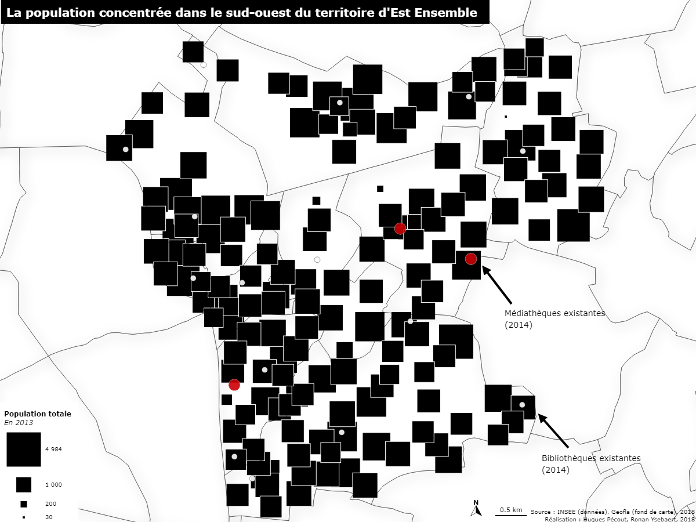
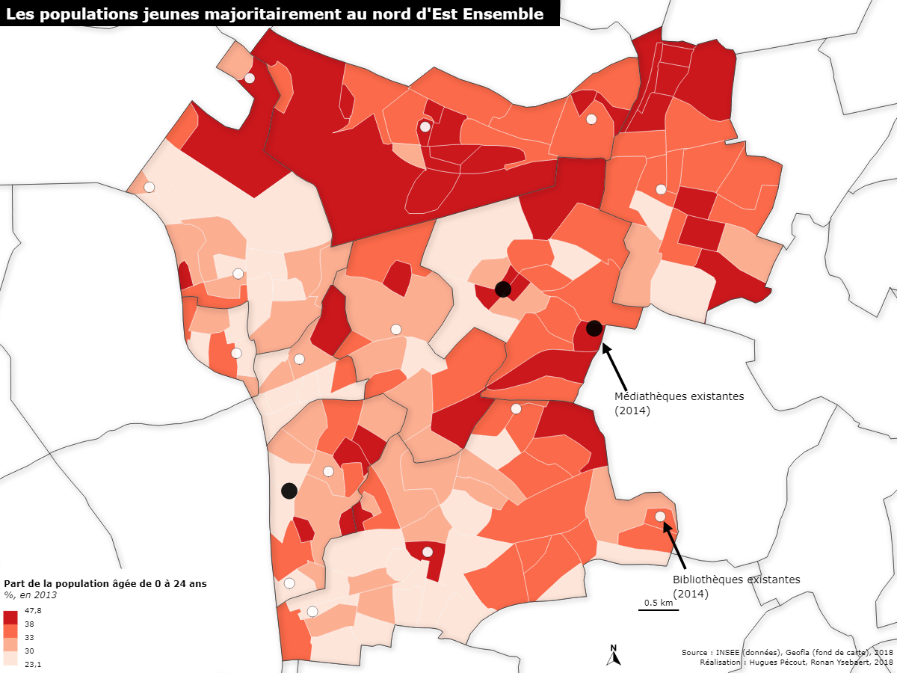
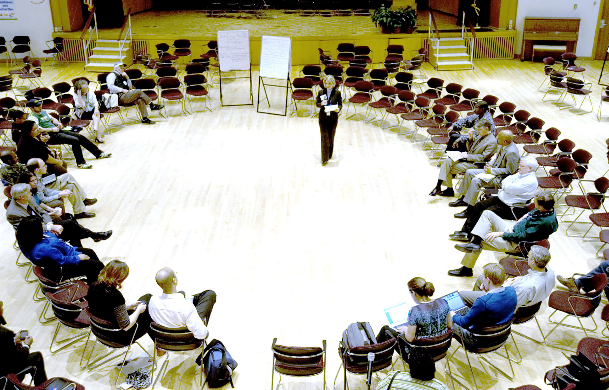

```{r setup, include=FALSE}
options(htmltools.dir.version = FALSE, crayon.enabled = TRUE)
knitr::opts_chunk$set(cache = TRUE,
                      fig.align='center',
                      message = FALSE,
                      warning = TRUE)
# install.packages("devtools")
# devtools::install_github("gadenbuie/countdown")
#
#devtools::install_github("mitchelloharawild/icons")
library(countdown)
library(icons)
#download_fontawesome()
```

#  Objectifs ?

.pull-left[
## Pourquoi cet enseignement ?

**L’information géographique favorise la connaissance, l’analyse et le suivi des territoires, ainsi que leur aménagement**. 

.medium[
De nombreux secteurs professionnels la mobilise : *Agriculture, aménagement, automobile, assurance et banque, bâtiment et travaux publics, défense, eau et assainissement, électricité, enseignement, environnement, épidémiologie, géologie, géomarketing, immobilier, ingénierie logistique, ressources naturelles, santé, services d’urgence, télécommunications, tourisme, urbanisme...*
]

Quelque soit le secteur professionnel dans lequel vous évoluerez, vous pouvez être amenés à **consulter, utiliser, analyser, représenter ou produire de l'information géographique**. 
]


.pull-right[
## --> Apprendre à...

- **Identifier**, **définir** et **caractériser** l'information géographique    

- **Manipuler** de l'information géographique dans un environnement SIG (initiation au logiciel QGIS).

- **Cartographier** de l'information géographique (initiation au logiciel de cartographie thématique Magrit).  
   
- Tendre vers l'**autonomie**, savoir poser les **bonnes questions** et identifier les **outils et méthodes adéquats** pour manipuler l'information géographique.    
]

---

## Calendrier et modalités d'évaluation

.pull-left[

- **8 séances de 2h30 (salles 375-377)** (Septembre - Décembre)
- **Dossier** à composer en binôme : **2/3 de la note** finale
- **Examen terminal**, épreuve écrite : **1/3 de la note** finale
]


.pull-right[
```{r, echo = FALSE, out.width = "400px", fig.align='center'}
knitr::include_graphics('figures/examen.jpeg')
```
- **Session de rattrapage** : épreuve écrite

]


---

# Le dossier... 


- Est un travail **à réaliser en binôme**. 

- Comptera pour **2/3 de la note finale**.

- Rendu attendu au plus tard le **mercredi 5 janvier 2023**, au format papier en bureau 707 (ODG), ou par envoi par mail au format .pdf (accusé réception faisant foi).


Vous aurez l'occasion de **travailler et d'avancer sur votre dossier durant de nombreuses séances. Profitez-en !**

---

## Mise en situation

Vous êtes membre d'un **bureau d'étude** chargé de réaliser une pré-étude pour l'**implantation d'un nouveau équipement** public dans une des communautés d’agglomération de la Métropole du Grand Paris.

L'objectif de cette pré-étude est de **proposer une zone d'implantation** pour ce nouvel équipement, en vous basant sur **plusieurs critères** que vous aurez préalablement déterminé et justifié.

Vous devez livrer un document qui résume l'ensemble de vos **choix**, de votre **démarche** et de vos **traitements** qui vous ont permis de déterminer une (ou plusieurs) zone.s d'implantation optimale.s

---
.pull-left[
## L'heure du choix

<span style="font-size:18pt;">**1) Choisissez une des communautés d'agglomérations** de la MGP </span>

```{r, echo = FALSE, out.width = "600px", fig.align='center'}
knitr::include_graphics('figures/carte_projet.png')
```
]


.pull-right[
<span style="font-size:19pt;">**2) Choisissez un équipement** parmi ces propositions :</span>

- Médiathèque 

- Conservatoire de musique

- Salle de cinéma

- Mission locale pour l’emploi

- Équipement sportif

- Maison de retraite

- Nouvelles ruches

- Hôtels à insectes

- Abris d'écoute à oiseaux

La localisation de ces équipements a préalablement été collectée par vos enseignants. Vous êtes libres de choisir d'autres équipements, mais il faudra récupérer vous-même ces données. 
]

---

# Rapport à rendre

## SIG et réflexion = 14 points

1) **Introduisez** votre espace d'étude et l'équipement que vous souhaitez implanter. Expliquer pourquoi l'implantation de ce nouvel équipement vous semble pertinent. (1 point).

2) Présentez les **critères** d'implantation (4 minimum) choisis pour déterminer la localisation optimale. Justifiez la pertinence de vos critères. N'hésitez pas à vous appuyer sur de la documentation ! (3.5 points).

3) Restituez **étapes de traitement SIG** qui vous ont permis de déterminer la ou les zone.s optimale.s (3 points). Concluez cette partie par une **carte de synthèse** résumant l'ensemble de la démarche et la (ou les) zone.s d'implantation proposée.s  (2.5 points).

4) Illustrez graphiquement la **chaîne de traitement** mise en oeuvre. (2 points)

5) Proposez des **critères d'implémentation supplémentaires** qui pourraient améliorer la qualité votre étude (2 points).  

---

## Cartographie thématique : 6 points

Votre rapport devra contenir **3 cartes thématiques** :

1) Une carte représentant des données **quantitatives absolues** (2 points)
*Ex : Nombre d'habitants par commune*.

2) Une carte représentant des données **quantitatives relatives** (2 points)   
*Ex : Part des moins de 25 ans par commune*. 

3) Une carte représentant des données **qualitatives** (2 points)    
*Ex : Carte de localisation et présentation de votre espace d'étude.*

---

# Pour vous guider...


.pull-left[
## Un exemple type

Pour vous guider dans votre projet et vous initier à QGIS et MAGRIT, **tous les tutoriels et démonstrations seront réalisés à partir du même exemple** : **L'implantation d'une médiathèque** au sein de la CA **Est-Ensemble**.

> A la racine de l'archive *infogeo-data*, le document TP-SIG présente dans le détail les attendus de ce projet, ainsi que les données que vous pouvez mobiliser pour votre projet. 

---
]

.pull-right[


 
 <br>
Vous ne pouvez pas choisir cet exemple pour votre projet !
 ]

---


# Déroulé

## Séance 1 : Introduction


### Cours    

- **Information géographique** : Définition, sources, méthodes et outils.       
- **Projet SIG : problématique**, consignes et données mises à disposition.     


### Atelier

- **Rechercher des données géographiques** depuis des portails dédiés.   


---


## Séance 2 : SIG (1)

.pull-left[

### Cours 

- Information géographique : **Coordonnées géographiques** & **projection cartographique**.
- Information géographique : **Introduction aux SIG**.


### Atelier

- **Présentation de QGIS**.
- **Importer de l'information géographique**. 
- Gestion des **projections cartographiques**.  
- Gestion des **styles graphiques**.  

]

.pull-right[


<br>
<span style="font-size:12pt;">*Import de l'espace d'étude (polygones) et des équipements existants (points)*</span> 
]

---

## Séance 3 : SIG (2)

.pull-left[

### Cours - Atelier

- **Import de données statistiques**.  
- **Jointure** de données.   
- **Sélection** d'entités **par attribut** ou par **localisation**.      
- Enregistrement d'une sélection.   

]

.pull-right[

<br>
<span style="font-size:12pt;">*Sélection des entités caractérisées par une valeur supérieure à... pour tel indicateur *</span> 
]

---
 
## Séance 4 : SIG (3)

.pull-left[

### Cours - Atelier

- **Géotraitements**.
- **Formalisation graphique d'une chaîne de traitement**.

]

.pull-right[

<br>
<span style="font-size:12pt;">*Sélection des espaces à plus de xx mètres de xx points *</span> 
]

---

## Séance 5 : SIG (4)

.pull-left[
### Cours - Atelier

-  **Définir son implantation optimale**.   
-  **Gestionnaire de mise en page**.  
]

.pull-right[


]

---

## Séance 6 : Cartographie thématique (1)

.pull-left[

### Cours

- Introduction à la **cartographie thématique**.
- Spécificités des données **quantitatives absolues**.


### Atelier

- **Présentation** du logiciel **Magrit**.   
- **Cartographier des données quantitatives absolues**.  
- **Mettre en page sa carte**.  
]

.pull-right[


]

---

## Séance 7 : Cartographie thématique (2)

.pull-left[

### Cours

- Spécificité des données **quantitatives relatives** (discrétisation) et **qualitatives**.


### Atelier

- **Cartographier ces données avec Magrit**.

]

.pull-right[

]
 
---

## Séance 8 : Conclusion

<center>

Séance de travail collective sur votre projet.

<br><br>



</center>


---

# Accéder aux cours

### Moodle Université de Paris


<center> 

Cours : ME1AY040 - Initiation aux SIG et à la cartographie thématique.      

<br><br>

```{r, echo = FALSE, out.width = "850px"}
knitr::include_graphics('figures/moodle.png')
```

</center>

---

## Des questions ?

<br><br><br><br>

<p style="font-weight: bold; font-size: 18pt;text-align:center;">mguinepain@outlook.fr</p>
<p style="font-weight: bold; font-size: 18pt;text-align:center;">ronan.ysebaert@cnrs.fr</p>

