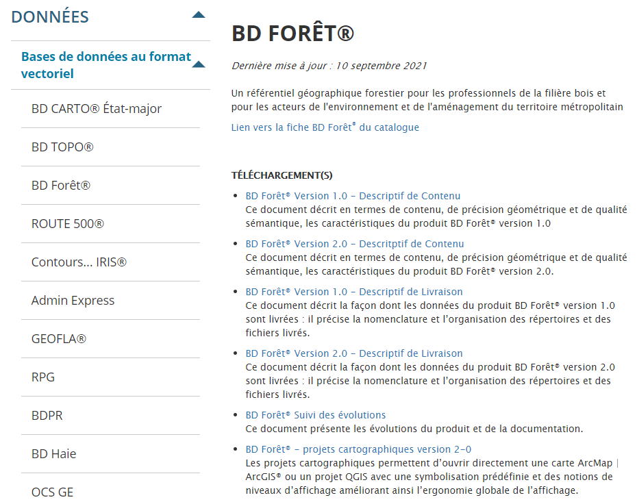

```{r setup, include=FALSE}
options(htmltools.dir.version = FALSE, crayon.enabled = TRUE)
knitr::opts_chunk$set(cache = TRUE,
                      fig.align='center',
                      message = FALSE,
                      warning = FALSE,
                      echo = FALSE)
# install.packages("devtools")
# devtools::install_github("gadenbuie/countdown")
# devtools::install_github("mitchelloharawild/icons")
library(countdown)
library(icons)
#download_fontawesome()
```


<br><br><br><br><br><br><br>
# 1. Données publiques & ouvertes

---

## Données publiques

La **donnée publique** couvre l’ensemble des données qui sont ou devraient être (légalement ou volontairement) **publiées ou tenues à disposition du public**, et qui sont **produites ou collectées par un État, une collectivité territoriale, un organe parapublic**, dans le cadre de leurs activités de **service public**.

**L'accessibilité de la donnée publique** (qui implique aussi la liberté d'accès aux documents administratifs) **est un des éléments de la transparence d'une gouvernance**. 

Cette information a d'autant plus de valeur pédagogique, historique, sociale, culturelle ou économique qu'elle est fiable, catégorisée, organisée, diffusée et réutilisable. 

---

## Données publiques

**De nouveaux outils informatiques, parfois collaboratifs, permettent de mieux l'organiser et la valoriser dans la sphère du Web** (ex : [GéoCatalogue](http://www.geocatalogue.fr/)). </p>

```{r, echo = FALSE, out.width = "980px",fig.align='center'}
knitr::include_graphics('figures/geocatalogue.png')
```

---

## Open Data

Une **donnée ouverte** est une donnée numérique d'origine publique ou privée. Elle peut être produite par une collectivité, un service public (éventuellement délégué) ou une entreprise.

Elle est diffusée de **manière structurée** selon une méthodologie et **une licence ouverte garantissant son libre accès et sa réutilisation par tous, sans restriction technique, juridique ou financière mais selon certains devoirs pour l'utilisateur**.

**L'ouverture des données (dit « Open Data ») représente à la fois un mouvement, une philosophie d'accès à l'information et une pratique de publication de données librement accessibles et exploitables**.

**Ce mouvement** (initié dans les années 90 par des chercheurs) **pour l'accès libre et gratuit aux données scientifiques s'est élargi depuis au domaine des données publiques**.


```{r, echo = FALSE, out.width = "400px",fig.align='center'}
knitr::include_graphics('figures/odata.jpg')
```

---


## L'importance des métadonnées

.pull-left[

Avec la massification des données mises à disposition, **la documentation structurée** des données est essentielle. Elle facilite l'accès au contenu informationnel d'une ressource informatique. 

**Une métadonnée est littéralement une donnée sur une donnée. C'est un ensemble structuré d'informations décrivant une ressource** (pas spécifique à l'information géographique).

Les métadonnées synthétisent des informations élémentaires et facilitent la compréhension et l'utilisation des données : **Auteur, date de création/modification, technique de collecte, qualité, taille du fichier, unité de mesure, droits d'utilisation...**.

]

.pull-right[
```{r, echo = FALSE, out.width = "700px",fig.align='center'}
knitr::include_graphics('figures/meta.png')
```

Consulter attentivement les métadonnées associées aux données géographiques est primordial.
]

---


<br><br><br><br><br><br><br>
# 2. Où trouver de l'information géographique ?


---

## Les fournisseurs d'IG (en France)  

### Un incontournable : l'Institut Géographique National

- [Géoservices de l'IGN](https://geoservices.ign.fr/telechargement)  
- [Géoportail (portail nationnal d’accès à l’information géographique de référence)](https://www.geoportail.gouv.fr/)    
-

### Les organismes publics et les collectivités territoriales

- [Bureau de Recherches Géologiques et Minières (BRGM)](http://infoterre.brgm.fr)          
- [Agence de l'Environnement et de la Maîtrise de l'Energie (ADEME)](https://data.ademe.fr/)          
- [Office national des forêts](https://www.onf.fr/onf/connaitre-lonf/+/35::open-data-pour-mieux-partager-les-donnees-forestieres.html)
- [Institut d'aménagement et d'urbanisme de la région Île-de-France (IAU-idf)](http://data.iau-idf.fr/)             
- [Portail Open Data de la région Ile-de-France](https://data.iledefrance.fr/pages/home/)     
- [Mairie de Paris (Paris Data)](https://opendata.paris.fr)           
- ...


---

## Les fournisseurs d'IG (au niveau international)  

- [Eurostat - GISCO](https://ec.europa.eu/eurostat/web/gisco/geodata/reference-data)
- [Copernicus](https://land.copernicus.eu/)
- [Natural Earth](https://www.naturalearthdata.com/)
- [World Pop](https://www.worldpop.org/)
- [OpenStreetMap (OSM)](https://www.openstreetmap.fr/), données accessibles via des API comme [Overpass-turbo](http://overpass-turbo.eu/)
- [Global Administrative Boundaries (GADM)](https://gadm.org/)

---

## L’IGN

L’Institut National de l'Information Géographique et Forestière assure la production, l'entretien et la diffusion de **l'information géographique française de référence**. 


.pull-left[
<p style="line-height:1.2;font-size:11pt;font-style:italic;">L'IGN met à disposition une masse de données géographiques très importante. Il propose par exemple des données complètes sur le réseau hydrographique, le réseau routier, la topographie ou les différents découpages administratifs et statistiques français, ainsi qu'un certain nombre de référentiels. L'IGN propose des données en format vectoriel et raster. Un portail permet également de visualiser toutes les données :</p>

]

.pull-right[

]


---

## Organismes publics et collectivités territoriales

De nombreux instituts d'aménagement et d'urbanisme, observatoires, fédérations, agences spatiales et collectivités territoriales mettent à disposition de l'information géographiques. Dans le cadre d'une politique d'ouverture des données publiques, **nombre de ces ressources sont centralisées sur des portails de diffusion**.


.pull-left[


<p style="line-height:1.3;font-size:11pt;font-style:italic;">Portail national ([data.gouv.fr](https://www.data.gouv.fr/fr/))</p>
]

.pull-right[

<p style="line-height:1.3;font-size:11pt;font-style:italic;">Portail régional ([data.iledefrance.fr](https://data.iledefrance.fr))</p>
]


---

## OSM, la plateforme collaborative de l’IG libre

**OpenStreetMap (OSM) est un projet de cartographie** lancé en 2004 qui a pour but de **constituer une base de données géographiques libre du monde** (permettant par exemple de créer des cartes sous licence libre), en utilisant le système GPS et d'autres données libres. **Tout le monde peut y contribuer et/ou utiliser les données**.

```{r, echo = FALSE, out.width = "960px",fig.align='center'}
knitr::include_graphics('figures/osm.png')
```


---

## OSM, la plateforme collaborative de l’IG libre

```{r, echo = FALSE, out.width = "800px",fig.align='center'}
knitr::include_graphics('figures/barsOSM.png')
```

<p style="line-height:1.3;font-size:11pt;font-style:italic;text-align:center;">Densité des bars à Paris avec des données OSM ([T.Giraud, R Geomatic](https://rgeomatic.hypotheses.org/1244)) </p>


---

##  Fournisseurs de données attributaires

<br><br>


De nombreuses sources fournissent des données/statistiques qui disposent de référentiels géographiques, qui peuvent facilement être mises en relation à des géométries de référence : 

- **Institut national de la statistique et des études économiques** [(INSEE)](https://www.insee.fr/fr/accueil)</span>

- **Les organismes publics et les collectivités territoriales**.

- **Les plateformes collaboratives & coproduction de contenus**, comme [Wikipédia](https://fr.wikipedia.org/wiki/Wikip%C3%A9dia:Accueil_principal)
 

---

## L'INSEE


**L'institut national de la statistique et des études économiques est chargée de la production, de l'analyse et de la publication des statistiques officielles en France**. Il organise et exploite les recensements de la population, mène des enquêtes, mesure les principaux indicateurs... **Il est LE producteur des données statistiques de référence en France**.

L'INSEE encourage la diffusion large de ses productions et bases de données. **Il autorise la réutilisation des données, y compris à des fins commerciales**. Cette réutilisation est, selon les cas, soumise ou non à la signature d'une licence.

**Beaucoup des indicateurs sont fournis par entités géographiques (IRIS, quartier, commune, département...) qu'il suffit d'associer aux fonds de carte géréférencés de l'IGN** pour obtenir de l'information géographique de qualité.


```{r, echo = FALSE, out.width = "960px",fig.align='center'}
knitr::include_graphics('figures/insee.png')
```


---

## Questions centrales pour rechercher de l'IG

- **Quel est mon espace d'étude ?** *Monde ? Europe ? France ? Ile-de-France ? ...*<br>

- **Quel est l'objet géographique sur lequel je travaille ?** *Pays ? Régions ? Communes ? Parcs naturels ? Rivières ? ...* <br>

- **Quelle est la thématique que je souhaite explorer ?** *Environnement ? Démographie ? Transport? ...* <br>

- **Quel est le format de données que je recherche ?** *Géométries ? Données statistiques à joindre à mes couches géographiques ?* <br>

- **Données conventionnelles ou non ? Quelle période ?**

</br>

D'un point de vue général, privilégiez l'usage de ressources gérées et maintenues par des **institutions**. 

---

<br><br><br><br><br><br><br>

# 3. Créer de l'information géographique


---

## Créer de l'information géographique

En dehors de l'information géographique mise à disposition par des institutions-organisations, on peut recourir à divers outils pour créer de l'information géographique et répondre à des **problématiques spécifiques** à son projet. **Le développement des technologies (GPS, smartphone, SIG grand public en ligne) permet aujourd'hui au plus grand nombre de créer de l'information géographique**. Les trois méthodes les plus répandues sont :


- **Géolocalisation par GPS**  : l'utilisation de smartphones, GPS grand public et objets connectés pour localiser des objets (ou trajet) géographiques.
- **Le Géocodage**:  cette technique consiste à déterminer la localisation (latitude, longitude) précise d'un point à partir d'une adresse. C'est **une des techniques de géoréférencement**.
- **La Numérisation/Digitalisation** : consiste à numériser des points à partir d’un support visuel, **est une des première fonctionnalité des SIG**. 


---
### Géolocalisation / GPS

Un exemple d'une application de suivi de bouquetins mis en oeuvre par le [Parc National du Mercantour](https://bouquetin.mercantour-parcnational.fr).

```{r, echo = FALSE, out.width = "900px",fig.align='center'}
knitr::include_graphics('figures/bouquetins.PNG')
```


---

## Géocodage

De **nombreux outils de géocodage sont utilisables gratuitement sur le Web**. Ces outils reposent sur une base de données d'adresse géoréférencées et déterminent une localisation géographique précise en latitude/longitude. Ex : Le géocodeur [datagouv.fr](https://adresse.data.gouv.fr/tools) </p>

```{r, echo = FALSE, out.width = "800px",fig.align='center'}
knitr::include_graphics('figures/geocode.png')
```

---


## Numérisation / Digitalisation

**Les SIG ont toujours permis de digitaliser de l'information géographique**. Mais aujourd'hui, **des outils grand public sont apparus** et permettent la digitalisation de données sans avoir de connaissances approfondies en SIG.

```{r, echo = FALSE, out.width = "800px",fig.align='center'}
knitr::include_graphics('figures/geoportail_num.png')
```

---

## Numérisation / Digitalisation

Par exemple, **uMap** est un logiciel libre grand public qui permet de positionner aisément des informations sur une carte et des les partager.

```{r, echo = FALSE, out.width = "800px",fig.align='center'}
knitr::include_graphics('figures/umap_canada.PNG')
```

<p style="text-align:center;font-size:10pt;">*Exemple d'organisation de vacances collectives via uMap*</p> 


---

<br><br><br><br><br><br><br>
# 4. Les formats

---

## Format de stockage de données vectorielles

Il existe **plusieurs formats de stockage de l'information géographique**. Les plus connus sont :</p>


- **Keyhole Markup Language (.kml)** : peut se traduire par « langage à base de balises géolocales », est un **langage fondé sur le formalisme XML et destiné à la gestion de l'affichage de données géospatiales** dans les logiciels de SIG. Depuis 2008, le format est normalisé par l'Open Geospatial Consortium. Il s'agit, avec le .gpx, du format classique de données produites par GPS. 

- **Geographic JSON (.geojson)** : **C'est un format ouvert d'encodage d'ensemble de données géospatiales simples** utilisant la norme JSON (JavaScript Object Notation). **Il permet de décrire des données de type point, ligne, chaîne de caractères, polygone, ainsi que des ensembles et sous-ensembles de ces types de données et d'y ajouter des attributs d'information qui ne sont pas spatiales**. Le format GeoJSON, contrairement à la majorité des standards de systèmes d'informations géographiques, n'est pas écrit par l'Open Geospatial Consortium, mais par un groupe de travail de développeurs au travers d'internet. 

- **Shapefile (.shp)** : ou « fichier de couches » **est un format de fichier pour les systèmes d'informations géographiques (SIG)**. Initialement développé par ESRI pour ses logiciels commerciaux, **ce format est désormais devenu un standard de facto, et est utilisé par un grand nombre de logiciels libres**.</p>

---


## Le shapefile


Son extension est classiquement **.shp**, mais il est toujours accompagné de deux autres fichiers de même nom, mais aux extensions suivantes :


.pull-left[
- <span style="font-size:13pt;line-height:1.3;color:#9c2005;">**.dbf**</span><span style="font-size:13pt;line-height:1.3;"> : fichier qui contient les données attributaires.</span> 
- <span style="font-size:13pt;line-height:1.3;color:#9c2005;">**.shx**</span><span style="font-size:13pt;line-height:1.3;"> : fichier qui stocke l'index de la géométrie.</span>   


<p style="font-size:13pt;line-height:1.3;">D'autres fichiers peuvent être également fournis :</p>   
- <span style="font-size:12pt;line-height:1.3;color:#9c2005;">**.sbn et .sbx**</span><span style="font-size:13pt;line-height:1.3;"> : index spatial des formes.</span> 
- <span style="font-size:13pt;line-height:1.3;color:#9c2005;">**.prj**</span><span style="font-size:13pt;line-height:1.3;"> : information sur le système de coordonnées.</span> 
- <span style="font-size:13pt;line-height:1.3;color:#9c2005;">**.shp.xml**</span><span style="font-size:13pt;line-height:1.3;"> : métadonnées du shapefile.</span> 
- <span style="font-size:13pt;line-height:1.3;">Et bien d'autres encore : .sbn, .sbx, .fbn,.fbx, .cpg, .atx... </span> 
]


.pull-right[

]


---

## Format de stockage des données attributaires

**Les données attributaires peuvent être stockées dans des formats très différents**. Les SIG acceptent d'ailleurs de nombreux formats (.txt, .csv, .dbf, .xls, .xlsx, .ods, ...) en entrée pour importer des données attributaires. Ce n'est pas l'aspect le plus important.

**L'identifiant géographique est en revanche primordial**. Il permet de faire le lien avec les géométries, et ainsi les enrichir.


```{r, echo = FALSE, out.width = "635px",fig.align='center'}
knitr::include_graphics('figures/jointure.png')
```

<p style="font-size:12pt;line-height:1.3;font-style:italic;">Dans le cas ci-dessus, on utilise l'attribut (identifiant) NomC pour joindre la couche géographique (fichier shapefile) et la table d'attributs (fichier csv par exemple).</p>


---


## Données attributaires fournies par l'INSEE


L'INSEE et l'IGN utilisent des identifiants identiques pour qualifier les objets géographiques de référence du territoire français. 


.pull-left[

]

.pull-right[

]

<p style="font-size:10pt;line-height:1.3;font-style:italic;">Dans les fichiers de données INSEE (à gauche) l'attribut qui sert d'identifiant unique pour les communes est nommé CODGEO (code INSEE des communes). La couche géographique des communes fournies par l'IGN (à droite), comportent le même identifiant unique nommé INSEE_COM** </p>


---


<br><br><br><br><br><br><br>
# Des questions ?


---

# Atelier

Organisez-vous en groupe et partez en quête d'informations géographiques ! Nous tentons de retrouver des couches géographiques 

Objectifs :

- La **dernière version "officielle" du découpage administratif** du territoire français (IGN). 
- La liste des données en **Open Data mises à disposition par l'ONF**. 
- Extraire les **parcs et jardins** de Paris avec **OpenStreetMap** et l'API [overpass-turbo](http://overpass-turbo.eu/). 
- Identifier les couches géographiques de **couverture du sol** mises à disposition pour les **villes Européennes** par l'institut **Copernicus**. 


Indice : pensez à spécifier dans votre recherche des mots-clés relatifs :

- Au format des données souhaité (shapefiles)
- A la couverture géographique désirée (France)
- A l'objet géographique recherché.
- A la source de données désirée.


---

## Atelier / Solution (1)


.pull-left[

[La dernière version "officielle" du découpage administratif du territoire français](https://geoservices.ign.fr/adminexpress) : Admin express est dédié à cela. Pour cela il faut passer un peu de temps dans l'outil d'accès aux géoservices de l'IGN pour s'y retrouver ! 

Cette ressource permet d'accéder à tous les découpages géographiques officiels, depuis la commune à la région, et à différentes versions de découpage géographique.
]

.pull-right[
```{r, echo = FALSE, out.width = "800px",fig.align='center'}
knitr::include_graphics('figures/admin_express.PNG')
```
]

---

## Atelier / Solution (2)

L'ONF répertorie [les ressources géographiques utiles](https://www.onf.fr/onf/connaitre-lonf/+/35::open-data-pour-mieux-partager-les-donnees-forestieres.html) pour la gestion forestière. Il s'agit de données produites par l'ONF, mais pas exlcusivement. Un bon réflexe consiste à regarder ce qui est aussi disponible du côté de l'[IGN](https://geoservices.ign.fr/documentation/donnees/vecteur/bdforet).

.pull-left[


]

.pull-right[

]


---

## Atelier / Solution (3)

Il est au préalable important de définir la clé-valeur de l'objet OpenStreetMap désiré grâce au [wiki OpenSteetMap](https://wiki.openstreetmap.org/wiki/Tag:leisure%3Dpark). Ensuite d'effectuer la requête de l'objet désiré via l'API overpass-turbo. 

.pull-left[


]

.pull-right[

]

---

## Atelier / Solution (3)

On peut ensuite exporter les résultats qui répondent à cette requête. 

```{r, echo = FALSE, out.width = "800px",fig.align='center'}
knitr::include_graphics('figures/osm_3.PNG')
```


---

## Atelier / Solution (4)

L'institut Copernicus [met à disposition](https://land.copernicus.eu/local/urban-atlas) des couches géographiques pour 788 villes européennes (en 2018) de couverture du sol. On peut retracer l'évolution des modifications d'occupation du sol entre 2006 et 2018. Il faut se créer un compte pour accéder aux données.

```{r, echo = FALSE, out.width = "800px",fig.align='center'}
knitr::include_graphics('figures/copernicus.PNG')
```


