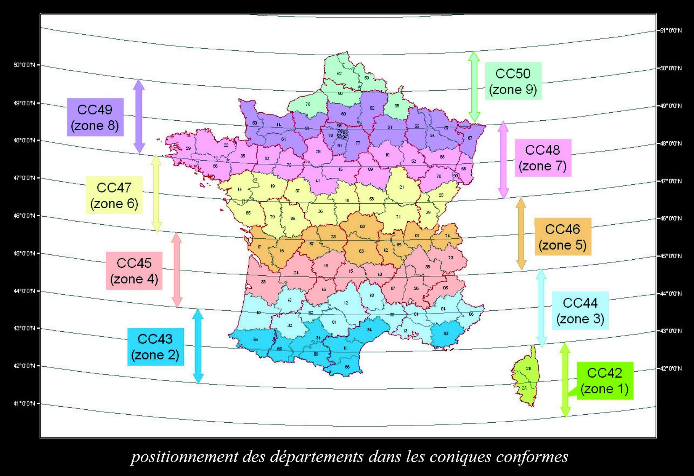

```{r setup, include=FALSE}
knitr::opts_chunk$set(echo = FALSE)
```

<script src="https://ajax.googleapis.com/ajax/libs/jquery/1.12.2/jquery.min.js"></script>

<script>
    $(document).ready(function() {
      $('slide:not(.title-slide, .backdrop, .segue)').append('<footer label=\"Coordonnées géographiques & projections cartographiques\"></footer>');    
    })
</script>


## Coordonnées géographiques & projections

Une information géographique est forcément décrite par **une position et une forme sur la surface de la Terre**.

<br>

> - **Sur** <span style="color:#9c2005;">**quel référentiel** </span>**se base-t-on pour localiser un objet** sur Terre ?

> - **Comment détermine-t-on **<span style="color:#9c2005;">**les coordonnées géographiques**</span> d'un objet ?   

> - **Qu'est-ce qu'une **<span style="color:#9c2005;">**projection cartographique**</span> ?  

<br>
<span style="font-size:17pt;font-style:italic;color:#9c2005;">**Comprendre les méthodes de localisation et de projection de l'information géographique est fondamental pour correctement gérer le système de coordonnées géographiques et la projection cartographique d'une couche dans un SIG.**</span> 


# I) Modéliser pour localiser

## La planète Terre n'est pas une sphère parfaite...


<div class="centered">

<br>
<br>
<p style="font-size:10pt;line-height:1.3;font-style:italic;color:#8e8d8d;">Source : NASA, University of Texas for Space Research, 2002 </p>
</div>


## Le géoïde terrestre

<p style="font-size:15pt;">**La Terre n'est pas une sphère** qui est une forme géométrie dite parfaite. **Elle est légèrement aplatie aux pôles et bosselée selon les continents**. Son apparence sphérique lorsqu'on l'observe depuis l'espace masque les nombreuses petites irrégularités de sa surface.</p>

<p>**Toute mesure ayant besoin d'une référence**, on <span style="color:#9c2005;">**modélise la forme de la Terre selon le modèle théorique du géoïde**</span>.</p>


<div class="columns-2">

<div class="centered">


</div>


<p style="font-size:15pt;">**Un géoïde est une surface** équipotentielle du champ de pesanteur <span style="color:#9c2005;">**coïncidant « au mieux » avec le niveau moyen des océans et qui se prolonge sous les continents**</span>.
<br>   
<span style="color:#9c2005;">**La surface du géoïde équivaut au niveau d'altitude 0**</span>  à l'échelle mondiale. La notion d'**altitude traduit donc la hauteur au-dessus du géoide**.
</p>

<p style="font-size:12pt;">Pour la France, il est calé sur un niveau zéro scellé dans le port de Marseille.</p>

</div>


##  Formalisation mathématique du géoïde

<span style="color:#9c2005;font-size:16pt;">**Le géoïde est une surface diforme**</span>, <span style="font-size:16pt;">à laquelle **on ne saurait appliquer des relations mathématiques**.</span>

<span style="color:#9c2005;font-size:16pt;">**Pour modéliser cette surface, on utilise une figure géométrique régulière** : **l'ellipsoïde**.</span>      
<span style="font-size:16pt;">Il s'agit d'un volume globalement sphérique présentant un aplatissement aux pôles.</span>


<div class="centered">

</div>


## L'ellipsoïde terrestre

<span style="font-size:16pt;">**L'ellipsoïde est la surface mathématique qui se rapproche le plus du géoïde**. Elle sert de **référence pour la construction des projections** cartographiques. Positionner l'ellipsoïde en fonction du géoïde permet de construire **un système géodésique**.</span>


<div class="columns-2">
<div class="centered">
<br>

</div>
<div class="centered">

</div>
</div>


## 

<div class="centered">

</div>

## Ecart éllipsoïde-géoïde

<div class="columns-2">
<div class="centered">

</div>
<br>
<br>
<br>
<p style="font-size:15pt;">**Les couleurs traduisent l'écart entre le géoïde et l'ellipsoïde**. Cela se nomme la 'hauteur', et **ne dépasse pas 110 mètres** !  
<br>
Si la forme de la terre n'est pas régulière, elle se rapproche donc fortement d'un ellipsoïde.</p>
</div>

<p style="font-size:19pt;">Il est **important** de noter que <span style="color:#9c2005;">**l'altitude d'un point est calculé par rapport à son l'éloignement vertical à la surface du géoïde**</span> et **pas à celle de l'éllipsoïde de référence**.</p>


## Les systèmes géodésiques


<span style="font-size:15pt;">**Un système géodésique** sert de repère pour déterminer les coordonnées géographiques (ou géodésiques) d'un objet à la surface de la Terre. **Ces coordonnées sont des valeurs angulaires, calculées par rapport à un parallèle (équateur) et un méridien de référence (Greenwich)**. Les coordonées d'un objet traduit (au minimum) deux dimensions : **la latitude et la longitude**.</span>

<div class="columns-2">
<div class="centered">

</div>
<div class="centered">

</div>
</div>


## Les coordonnées géographiques

<span style="font-size:15pt;">**Les coordonnées géographiques peuvent être exprimées en degrés décimaux (DD) ou en Degrés-minutes-secondes (DMS)**</span>

<div class="centered">

</div>


## Les systèmes géodésiques à connaître

<span style="font-size:14pt;">Un même **ellipsoïde peut être positionné différement par rapport au géoïde**, et ainsi constituer des <span style="color:#9c2005;font-size:14pt;font-weight:bold;">systèmes de référence géodésiques</span><span style="font-size:14pt;"> **différents**. Le même objet n'aura pas les mêmes coordonnées géographiques dans différents systèmes géodésiques.</span>

<span style="color:#9c2005;font-size:14pt;font-weight:bold;">WSG84 (World Geodetic System 1984)</span>  
<span style="font-size:12pt;">*Le plus utilisé au monde. C'est ce système géodésique qui est utilisé pour le GPS (système de positionnement par satellites)*</span>  

<span style="color:#9c2005;font-size:14pt;font-weight:bold;">ITRS (International Terrestrial Reference System)</span>  
<span style="font-size:12pt;">*Le plus précis à l'échelle mondiale (précision centimétrique)*</span>  

<span style="color:#9c2005;font-size:14pt;font-weight:bold;">RGF93 (Réseau Géodésique Français 1993)</span>  
<span style="font-size:12pt;">*Système géodésique officiel en France métropolitaine*</span>

<span style="color:#9c2005;font-size:14pt;font-weight:bold;">NTF (Nouvelle Triangulation de la France) </span>  
<span style="font-size:12pt;">*Ancien système géodésique français de référence, couvrant le territoire métropolitain*</span>


# II) Projeter pour cartographier

## Les projections cartographiques

<span style="font-size:16pt;">**Un système géodésique permet de localiser un objet sur une surface en 3 dimensions**.    
Mais </span><span style="color:#9c2005;font-size:16pt;font-weight:bold;">comment représenter l'information géographique sur un plan en deux dimensions, sur une carte ?</span> 

<div class="centered">

</div>


## Les projections cartographiques

<span style="font-size:14pt;">Une **projection est un procédé mathématique permettant de passer de l'ellipsoïde à sa représentation sur une surface plane**. <span style="color:#9c2005;font-size:14pt;font-weight:bold;">Toutes les projections provoquent des déformations</span>. Plus l'espace représenté est vaste, plus les altérations sont importantes.</span>

<span style="font-size:14pt;">Les projections cartographiques peuvent se classer **selon le type d'altération et la surface de projection**</span>

<div class="centered">

</div>


## Surface de projection

<div class="columns-2">


<div class="centered">

</div>

<p style="font-size:13pt;">Un ellipsoïde **peut être projeté sur différentes surfaces**, facilement **représentables en deux dimensions**.
<br>   
<span style="color:#9c2005;">Les projections peuvent ainsi être classées en **projection conique**, **cylindrique** ou **azimutale**.</span> 
<br>   
**les surfaces peuvent être tangentes ou sécantes, et orientées de différentes façons** :</p>

<div class="centered">

</div>

</div>


## le choix du centrage...

<span style="font-size:15pt;">**Il n'y a pas de règle pour l'orientation et le centre d'une projection**, mais ce choix n'est pas anodin...</span>


<div class="row">

<div class="column">


</div>


<div class="column">


  
</div>


<div class="column">


</div>  


</div> 


## Les types de déformation

<span style="font-size:15pt;">**Les projections peuvent également être classées par les altérations géométriques** qu'elles provoquent.</span>


<span style="color:#9c2005;font-size:15pt;font-weight:bold;">Projection conforme</span> 
<p style="font-size:13pt;font-style:italic;line-height: 1.6;">**Conserve localement les angles, donc les formes**. Les méridiens et parallèles se coupent à angle droit.    
**Les surfaces et les distances sont déformées.**    
Ce type de projection peut être utilisé pour la naviguation maritime.</p>  

<span style="color:#9c2005;font-size:15pt;font-weight:bold;">Projection équivalente</span>  
<p style="font-size:13pt;font-style:italic;ine-height: 1.6;">**Conserve localement les surfaces**, mais au prix d’une **déformation des distances et des angles** de route sur la carte.</p>  
   
<span style="color:#9c2005;font-size:15pt;font-weight:bold;">Projection aphylactique </span>  
<p style="font-size:13pt;font-style:italic;line-height: 1.6;">Projection cartographique qui n’est **ni conforme, ni équivalente, mais qui cherche à faire un compromis acceptable entre les inévitables déformations des surfaces, des distances et des angles sur une carte.**     
**Ces projections peuvent également être** <span style="color:#9c2005;">**équidistante**</span>. C'est a dire qu'elles **conservent les distances sur les méridiens**.</p>


## Projection conforme

<span style="color:#9c2005;font-size:17pt;font-weight:bold;">Conserve les formes (angles) mais pas les surfaces.</span>   

<div class="columns-2">
<div class="centered">

</div>
<div class="centered">
<br>
<p style="font-size:17pt;">Exemple : **Projection Mercator**      
<br>
<span style="font-size:14pt;">*Gerardus Mercator (1569)*
<br>
<br>
<br>
<br>
<br>
<br>
<br>
<br>
<span style="font-size:15pt;color:#d69030;">Projection cylindrique - conforme</span>     
</p>
</div>
</div>

## Projection conforme vs réalité

<div class="columns-2">
<div class="centered">
<br>


<span style="font-size:14pt;color:#d69030;font-weight:bold;">En réalité, la Russie est deux fois moins étendue que l'Afrique...</span>
</div>

<div class="centered">
<br>


<span style="font-size:14pt;color:#d69030;font-weight:bold;">La superficie de l'Amérique du Sud équivaut à 9 fois celle du Groënland...</span>
</div>
</div>


## Projection conforme vs réalité

<div class="centered">


</div>

<p style="text-align:center;font-size:10pt;">*https://thetruesize.com*</p> 


## Projection équivalente

<span style="color:#9c2005;font-size:17pt;font-weight:bold;">Conserve les surfaces mais pas les formes (angles).</span>  

<div class="columns-2">
<div class="centered">
<br>

</div>
<div class="centered">
<br>
<br>
<p style="font-size:17pt;">Exemple : **Projection Gall–Peters**      
<br>
<span style="font-size:14pt;">*James Gall et Arno Peters (1855)*
<br>
<br>
<br>
<br>
<br>
<br>
<br>
<br>
<span style="font-size:15pt;color:#d69030;">Projection cylindrique - équivalente</span>     
</p>
</div>
</div>

## Projection aphylactique

<span style="color:#9c2005;font-size:17pt;font-weight:bold;">Ne conserve ni les formes, ni les surfaces. Compromis d'altération entre projection conforme et équivalente.</span>  

<div class="columns-2">
<div class="centered">
<br>

</div>
<div class="centered">
<br>
<p style="font-size:17pt;">Exemple : **Projection Natural Earth**      
<br>
<span style="font-size:14pt;">*Tom Patterson (2011)*
<br>
<br>
<br>
<br>
<br>
<br>
<br>
<span style="font-size:15pt;color:#d69030;">Projection Pseudo-cylindrique - aphylactique </span>     
</p>
</div>
</div>


## Projection équidistante (aphylactique)

<span style="color:#9c2005;font-size:17pt;font-weight:bold;">La distance et la direction, mesurées à partir du point central, sont toutes deux exactes</span>  

<div class="columns-2">
<div class="centered">


</div>
<div class="centered">
<br>
<p style="font-size:17pt;">Exemple : **Projection Postel**      
<br>
<span style="font-size:14pt;">*Al-Biruni (1000 envir.)*
<br>
<br>
<br>
<br>
<br>
<br>
<br>
<span style="font-size:15pt;color:#d69030;">Projection azimutale -  équidistante</span>     
</p>
</div>
</div>

## Représenter les déformations

<span style="font-size:14pt;">**L'indicatrice de Tissot permet d'apprécier la déformation engendrée par l'usage d'un système de projection cartographique**.</span>


<div class="columns-2">
<div class="centered">

</div>

<div class="centered">


<span style="font-size:12pt;">**Une forme géométrique** (un cercle ou une ellipse) **est utilisée pour représenter les altérations des surfaces et ou des angles** engendrées par une projection.</span>

</div>
</div>


# Quelle projection choisir ?

## Des normes, des références et des choix

**Le choix d'une projection cartographique** ne se fait pas aléatoirement.

<br>  

> -  <span style="color:#9c2005;font-size:17pt;">En France, tout comme dans de nombreux pays, **vous êtes soumis à des normes si vous travaillez dans le cadre d'une mission de service public**.</span>

> -  <span style="color:#9c2005;font-size:17pt;">Sinon, **c'est la zone représentée, la thématique et l'objectif de la carte** qui vous permettront de choisir une projection.</span>


## Les normes françaises

<p style="font-size:18pt;">Suite à un décret du 3 mars 2006 :</p>

<p style="font-size:18pt;">**Toutes les administrations de l'État, collectivités locales et entreprises chargées de l'exécution d'une mission de service public doivent utiliser** <span style="color:#9c2005;">**le système géodésique de référence RGF93**</span> pour leurs échanges de données géoréférencées.</p>
<p style="font-size:18pt;">*Ce systéme géodésique est compatible avec le système géodésique de référence européen ETRS89 et avec le système géodésique de référence mondial WGS84 (utilisé par le système GPS)*</p>
<p style="font-size:18pt;">**Les cartes officielles représentant l'ensemble de la France métropolitaine** doivent être projetées en <span style="color:#9c2005;">**Lambert93 Conique Conforme**</span>. 9 variantes de cette projection existent (<span style="color:#9c2005;">**Lambert CC 9 zones**</span>). **Elles couvrent 9 zones s'étalant du Nord au Sud et doivent être utilisées pour la cartographie locale**</span>.</p>

## Lambert Conique conforme 9 zones

<div class="centered">

</div>

## Les altérations du Lambert 93

<div class="centered">

</div>


## La base de données de l'EPSG

<span style="font-size:14pt;">L'EPSG (European Petroleum Survey Group) a construit en place une base de données qui recense et identifie les systèmes de coordonnées géographiques de projection les plus utilisés. [**epsg.io**](https://epsg.io/){target="_blank"} est aujourd'hui une ressource Open-Source de référence internationale.</span>    
<span style="font-size:14pt;">**Les codes EPSG qui identifient les systèmes de coordonnées géoéréférencées de projection sont très utilisés dans l'univers des SIG.**</span>

<div class="centered">

</div>


## Les codes EPSG

<div class="centered">

</div>


# Ce qu'il faut retenir...

## Modéliser pour localiser

<div class="centered">

</div>


## Coordonnées géographiques

<p style="font-size:19pt;"><span style="color:#9c2005;">**Les coordonnées géographiques sont des angles**</span> mesurées depuis le *centre* de la Terre vers un point de surface, <span style="color:#9c2005;">**exprimés en degrés**</span> (**position précise dans un système de référence géodésique** selon un ellipsoïde).</p>

<div class="centered">

</div>


## Déformer pour représenter

<div class="columns-2">
<div class="centered">

</div>
<div class="centered">
<br>


</div>
</div>

<p style="font-size:17pt;">**Pour représenter une surface sphérique sur un plan (plani-sphère)**, on utilise des <span style="color:#9c2005;">**différents types de projection**</span> qui <span style="color:#9c2005;">**déforment soit les formes/angles et conservent les surfaces (projection équivalente), soit l'inverse (projection conforme), soit tentent de minimiser les deux déformations (projection aphylactique)**</span>.</p> 

<p style="font-size:17pt;">Les <span style="color:#9c2005;">**coordonnées géographiques**</span> sont alors **converties en** <span style="color:#9c2005;">**coordonées projetées**</span> (**propres à chaque projection**). Elles sont exprimées en **m ou km**.</p> 


## Précaution

<p style="font-size:18pt;">En france, le <span style="color:#9c2005;">**système géographique de référence est le RGF93**</span></p>

<p style="font-size:18pt;">La **projection officielle pour cartographier le territoire métropolitain** est la <span style="color:#9c2005;">**projection Lambert 93**</span> et ses variantes (<span style="color:#9c2005;">**Lambert Conique Conforme 9 zones**</span>).</p>

<div class="centered">

</div>

<p style="font-size:20pt;"><span style="color:#9c2005;">**Il faut toujours connaitre le système de coordonées géographiques et/ou la projection utilisée**</span> lorsque l'on manipule et représente de l'information géographique **dans un SIG ou en cartographie**.</p>

# Des questions ?