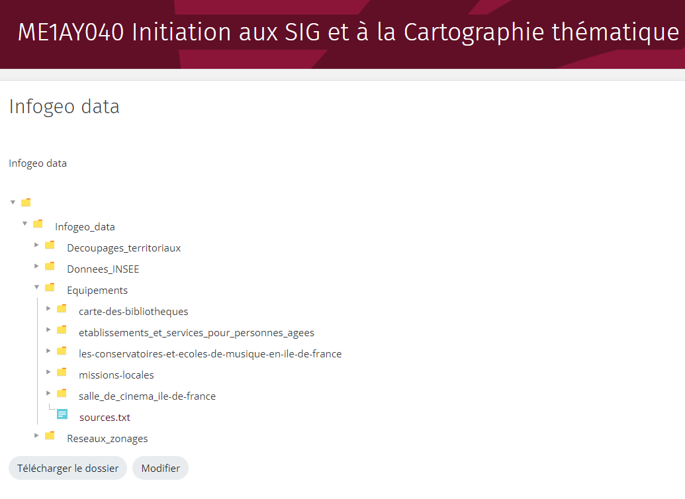
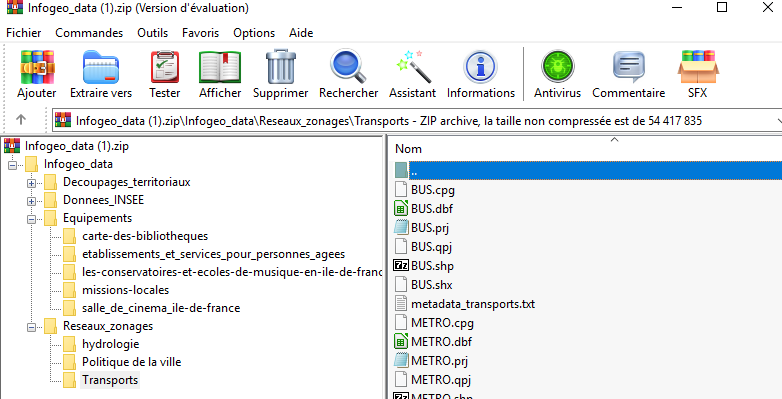
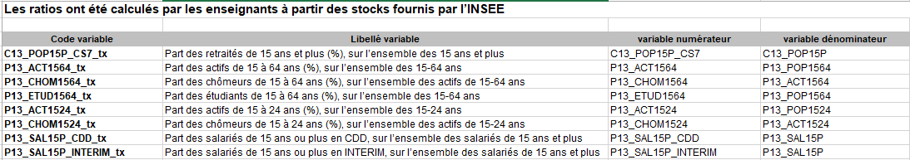
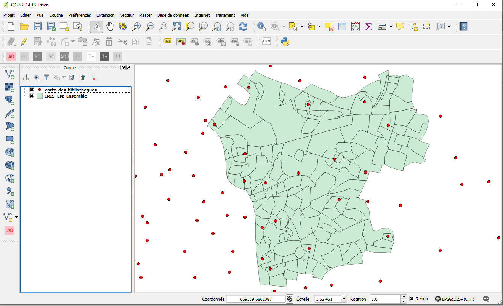

```{r setup, include=FALSE}
options(htmltools.dir.version = FALSE, crayon.enabled = TRUE)
knitr::opts_chunk$set(cache = TRUE,
                      fig.align='center',
                      message = FALSE,
                      warning = TRUE)
# install.packages("devtools")
# devtools::install_github("gadenbuie/countdown")
# devtools::install_github("mitchelloharawild/icons")
library(countdown)
library(icons)
#download_fontawesome()
```


```{r xaringan-themer, include=FALSE, warning=FALSE}
library(xaringanthemer)
style_duo_accent(
  primary_color = "#1d3352",
  secondary_color = "#383838",
  inverse_header_color = "#ffae00"
)
```


<br><br><br><br><br><br><br>
# 1. Un peu d'histoire...

---
## Londres, 1854

.pull-left[
**John Snow** est un médecin britannique. Ses travaux sur la **propagation du choléra** dans le quartier de Soho à Londres en 1854 sont reconnus dans l'histoire de l'**épidémiologie moderne** et de l'**analyse spatiale**.

.left-column[
<br>

]

.right-column[
.medium[
Il va identifier la **cause de l'épidémie** en utilisant un procédé simple, mais innovant, qui repose sur le principes de fonctionnement des SIG : **superposer deux couches géographiques différentes** :

- **Les lieux de résidence des décès liés à l'épidémie**.
- **Les pompes à eau** du quartier.]]  

.medium[
<br><br><br><br><br><br><br><br><br><br><br><br><br>
Il déterminera que la **transmission s'effectue par l'eau** et **identifiera le foyer de contamination** : la pompe de Brewer Street.]
]

.pull-right[

.leg-fig[**Carte de John Snow** avec la localisation des lieux de résidence des personnes décedées du choléra.]
]

---

## Un précurseur...

.pull-left[

.leg-fig[Carte de John Snow revue par Mark Monmonnier, 1996]
]


.pull-right[

]
---

## ...des applications SIG

.center[Si John Snow avait utilisé un système d'information géographique...]

.pull-left[

]

.pull-right[

]

---

<br><br><br><br><br><br><br>
# 2. Systèmes d'Information Géographique ?

---

## Historique

**Le concept de Système d'Information Géographique s'est développé et a évolué avec le développement de l'informatique**. 

- **1950 – 1970** : début de l’informatique, premières cartographies automatiques.

- **1970 - 1980** : diffusion des outils de cartographie automatique/SIG dans les organismes d’État (armée, cadastre, services topographiques…

- **1980 - 1990** : croissance du marché des logiciels SIG, développement des applications SIG.

- **Depuis les années 90 et 2000** : diffusion de SIG plus légers, libres, d'applications web et banalisation de l’usage de l’information géographique (cartographie en ligne, calcul d’itinéraires, utilisation de la géolocalisation, base de données participatives.

.medium[
**Les SIG sont aujourd’hui utilisés dans de nombreux domaines** : 
*Agriculture, aménagement du territoire, architecture, assurances & banque, automobile, BTP, cadastre, découpage électoral, défense, démographie, eau et assainissement, électricité, enseignement, environnement, épidémiologie, équipement, géologie, géomarketing, gestion de flotte, gestion de patrimoine, gestion de réseaux, gestion des sols, Internet, immobilier, implantation de commerces, ingénierie logistique, optimisation de parcours, pétrole et gaz, publicité, recherche, ressources naturelles, santé, services d'urgence, télécommunications, tourisme,...* ]

---

## Définition

**Système informatique de matériels, de logiciels, et de processus conçus pour permettre la collecte, la gestion, la manipulation, l'analyse, la modélisation et l'affichage de données à référence spatiale** afin de résoudre des problèmes complexes d'aménagement et de gestion. (*Comité fédéral de coordination inter-agences pour la cartographie numérique, 1988*)</p> 

.pull-left[
La pratique des logiciels de SIG est un métier : **sigiste**. 

Le SIG est également **l'outil de référence des géomaticiens**. 

La géomatique est une discipline issue de la géographie et des développements de l'informatique (**GEO**graphie + infor**MATIQUE**). 

La géomatique regroupe l'ensemble des outils et méthodes permettant d'acquérir, de représenter, d'analyser et d'intégrer des données géographiques.
]

.pull-right[

]

---

## Principes et fonctionnalités

Les logiciels SIG permettent de **superposer des couches géographiques de différentes natures, dans un même système de projection**. Cela permet de réaliser de puissantes **analyses croisées**.

.pull-left[
<br><br><br>
Ces logiciels permettent d'opérer sur l'intégralité de la chaîne de traitement des données géographiques :

- **Digitalisation** (Saisir et abstraire)  
- **Stockage** et **gestion** (Base de données)    
- **Analyse** (Géotraitements, analyse spatiale)       
- **Représentation** (Cartographie)   
]

.pull-right[

]

---

## Principes et fonctionnalités

.pull-left[
<br><br><br>
Pour **modéliser la réalité**, on superpose plusieurs couches d'information géographique, **vecteur et/ou raster**.

Chaque **couche géographique contient des objets de même type** (adresses, parcelles, routes, bâtiments, cours d'eau, limites administratives...)

**Une couche géographique = un type d'objet géographique** : point, ligne, polygone ou image géoréférencée (raster).
]

.center[
.pull-right[

]]

---

## Principe et fonctionnalités

Un SIG permet de travailler sur les trois composantes de l'information géographique :

.pull-left[
.medium[
### Niveau sémantique
**Les attributs** qui décrivent les objets géographiques (ex : libellé, population, catégorie) **peuvent être modifiés, supprimés, ajoutés et surtout requêtés** : Il est possible de sélectionner des objets géographiques **en fonction de la valeur des attributs**.

### Niveau géométrique
Possibilité de **modifier la localisation** et/ou **la forme** des objets géographiques, de **calculer des surfaces**, **des distances**, ou encore des **zones tampons**, de **convertir des polygones en point**... Les opérations possibles sur la géométrie des objets sont multiples.
]
]

.pull-right[
.medium[
### Niveau topologique
Une fonctionnalité puissante qui consiste à **requêter des objets par localisation**, c'est à dire **en fonction de leur positionnement par rapport à d'autres objets**. Pour cela on peut utiliser une série d'opérateur, exemple : *Contient*, *Croise*, *Intersecte*, *Est à l’intérieur*...]

.center[


.small[
Ex : *Séléction d'objets géographiques ponctuels situés à une certaine distance (euclidienne) d'autres objets géographiques ponctuels*
]]]

---

## Principaux logiciels SIG

.center[

]
---

## Installez QGIS ! 

Pour travailler depuis chez vous, nous vous conseillons d'installer QGIS sur votre ordinateur personnel *(https://www.qgis.org/fr/site/forusers/download.html)*. Choisissez la version long terme (la plus stable). 

.center[

]

---


<br><br><br><br><br><br><br>
# 3. Premiers pas dans un SIG et découverte de QGIS


---

## Présentation des données à disposition

Des jeux de données ont été extraits et préparés pour vous par les enseignants pour réaliser votre étude. Ils sont organisés par dossiers et sont disponibles sur [Moodle](https://moodle.u-paris.fr/course/view.php?id=6316).

.pull-left[
.medium[
**Maillages territoriaux** *(répertoire maillage)* : 
Données issues de l'IGN, contient les géométries des découpages administratifs français pour la métropole du Grand Paris (IRIS, communes, départements).

**Équipements existants** *(répertoire Equipements)* :
Données issues de la plateforme open data de la région Ile-de-France, contient les localisations des équipements cibles pour votre étude 

- Bibliothèques et médiathèques (844 points pour l'Ile-de-France)
- Établissements et services pour les personnes âgées (1774 points)
- Conservatoires et écoles de musique (331 points)
- Missions locales pour l'emploi (172 points) et établissements cinématographiques (312 points)
]
]

.pull-right[
]


---

## Présentation des données à disposition

Des jeux de données ont été extraits et préparés pour vous par les enseignants pour réaliser votre étude. Ils sont organisés par dossiers et sont disponibles sur [Moodle](https://moodle.u-paris.fr/course/view.php?id=6316).

.pull-left[
.medium[**Réseaux et zonages** *(répertoire Reseaux_zonages)* : Données également extraites depuis Open data IDF, contient les géométries des quartiers prioritaires pour la politique de la ville (300 quartiers), la localisation d'arrêts de transport collectif (bus, tram, métro, RER) ainsi que le réseau hydrographique principal de la région.

**Critères socio-économiques** *(répertoire maillage)* : Contient des indicateurs statistiques à l'échelle de l'IRIS issus du recensement principal de l'INSEE (année de référence : 2013). Il s'agit de structures par âge de la population, les catégories sociales en 8 postes, actifs, chômeurs, étudiants, retraités, étudiants, personnes en CDD, interim, ainsi que le revenu médian de la population.
]
]


.pull-right[

]

---

## Ouvrir QGIS

**Lancez l'application QGIS Desktop**, comme vous le feriez avec n'importe quel logiciel :

<br><br>
.center[

]
---

## Organiser son travail

L'utilisation d'un SIG nécessite de la **rigueur méthodologique**, car l'on se retrouve vite submergé de fichiers. Vous devez donc :

- Travailler en **projet**.

- Utiliser des **intitulés de fichiers** intelligibles.

- Ranger vos données en utilisant des **sous-répertoires**.

- Stocker votre projet **sur une clef USB** (et faire une copie). 


Commencez par **créer votre répertoire de travail** (sur une clé USB de préférence). Téléchargez les données du Moodle et décompressez-les dans votre répertoire de travail. **Ouvrez Qgis et créez un nouveau projet**. *(Projet/enregister/)*

---

## Organiser son projet

Dans votre répertoire de travail, créez une architecture de sous-répertoires qui vous paraît cohérente et dans laquelle vous vous y retrouverez facilement. Ne gardez que les fichiers qui vous seront utiles !</p>

.center[

]

---

## Métadonnées

Les métadonnées apportent des éléments essentiels pour comprendre le contenu des ressources à votre disposition, leur origine et d'éventuelles informations sur leur utilisation. Leur consultation attentive est primordiale.




.medium[Avec ces métadonnées, vous êtes en mesure de répondre aux questions suivantes : *Quelle est la signification du code "P13_CHOM1564_tx" ? Quelle est son unité de mesure ? Qui a produit la donnée, quand ? Quelle est l'année de référence de l'indicateur ? Qu'est-ce qu'un IRIS ?*]

---


## L'Interface de QGIS

.left-column[
<br>
.medium[
1.  **Menu principal**
2.  **La barre d’outils** : Raccourci vers les outils les plus récurrents utilisés
3.  **Barre d’outils latérale** : Par défaut, raccourci vers les options d'import de données.
4.  **La barre d’état** : Niveau de zoom, échelle, coordonnées géographiques
5.  **Les panneaux** : Explorateur, listing des couches géographiques chargées...
6.  **Le canevas de carte** : visualisation des couches géographiques.  
]
]

.right-column[

]

---

## Import (vecteur, raster, données tabulaires... )


**Pour importer des données facilement**, utilisez la barre d'outil latérale.

.left-column[
.medium[
<br><br><br><br>
Choisissez l'icône **en fonction du type de données à importer** (Vecteur, raster, csv...).

<br>
**TO DO** : *Importez La couche géographique IRIS de votre espace d'étude, celle de votre équipement et celle des communes de la Métropole du Grand Paris*.
]
]

.right-column[
.center[

]
]

---

## Import (vecteur, raster, données tabulaires... )

**Pour importer des données facilement**, utilisez la barre d'outil latérale.

.left-column[
.medium[
<br><br><br><br>
Import d'un fichier de données (1 et 2), définir les séparateurs de champs (3) et préciser si le fichier contient des géométries ou non (4).

<br>
**TO DO** : *Importez le fichier de données contenant les structures par âge des IRIS (Ratio_DEMO_IRIS_2013.csv).*
]
]

.right-column[
.center[

]
]

---

## Gestion de la projection

**La projection** d'une couche géographique **est indiquée dans ses propriétés générales**.

.left-column[
.medium[
<br><br>
Les couches géographiques s'affichent automatiquement dans le système de projection de la première couche géographique importée.

Pour modifier le système de projection, il suffit d'enregistrer une nouvelle version de la couche géographique concernée dans le système de projection souhaité (clic-droit sur la couche, enregistrez-sous...).

**TO DO** : *Enregistrez la couche géographique des équipements dans la même projection que la couche géographique des IRIS*.]
]

.right-column[
.center[

]
]

---

## Consulter les données attributaires et sélectionner des valeurs

Chaque couche géographique est associée à une **table attributaire**.

.left-column[
<br><br>
.medium[
Pour consulter la table attributaire d'une couche géographique, cliquez droit sur la couche concernée dans le panneau légende, puis cliquez sur **Ouvrir la table d'attributs**.

**TO DO** : *Ouvrez la table attributaire de votre couche d'IRIS, ordonnez la colonne TYP_IRIS (clic sur l'en-tête de colonne) et sélectionnez uniquement les IRIS d'habitation (type = H)*
]]

.right-column[
.center[

]
]

---
## Autres options de sélection

**Pour sélectionner et zoomer**, uilisez les différentes fonctionnalité de la barre d'outils.

.left-column[
.medium[
<br><br><br><br>
Les icônes *loupe* permettent de **zoomer/dézoomer**. Il est également possible d'utiliser la roulette de votre souris. **L'outil de sélection offre plusieurs solutions** : sélection par clic, par polygone, à main levée...

**TO DO** : *Cliquez sur l'outil identifiez les résultats, puis sélectionnez n'importe quel objet. Que constatez vous ?*
]
]

.right-column[
.center[

]
]

---
## Gestion de l'affichage graphique

.left-column[
.medium[
<br><br>
Pour changer l'ordre d'affichage des couches, il suffit de les faire glisser à la position de son choix, comme des onglets dans un navigateur Web.

Pour **visualiser l'ensemble d'une couche géographique**, **cliquez droit sur la couche** concernée dans le panneau légende, puis cliquez sur *Zoomer sur la couche*.

**TO DO** : *Si ce n'est pas déjà fait, placez les couches géographiques dans l'ordre suivant : IRIS, communes, votre équipement.* 
]
]

.right-column[
.center[

]
]


---

## Gestion de l'affichage graphique

Modifier le style graphique (**symbologie**) d'une couche géographique

.left-column[
<br><br><br><br>
.medium[
**Double-cliquez sur la couche géographique concernée**, puis allez dans l'onglet *symbologie*.

**TO DO** : *Jouez sur le style graphique (couleur de fond, bordures) des couches IRIS, communes et équipement.*
]
]

.right-column[
.center[

]
]


---

## Gestion de l'affichage graphique

Vous pouvez aussi rajouter des **labels (étiquettes)** à la couche pour faciliter le repérage.

.left-column[
<br><br><br><br>
.medium[
Clic-droit sur la couche commune, puis propriétés. Cliquez ensuite sur "étiquettes".

**TO DO** : *Faites apparaître sur l'espace d'affichage le nom des communes de votre espace d'étude.*
]
]

.right-column[
.center[

]
]
---

## Gestion de l'affichage graphique

Familiarisez vous avec vos équipements et votre espace d'étude en **superposant intelligemment les couches IRIS, communes, départements** ainsi que celle contenant **votre équipement**. Jouez sur les styles, et améliorez la **lisibilité**</p>

.center[

]


---
## Exportez une image, enregistrez votre projet

.left-column[

]

.right-column[
**Vous pouvez exporter le visuel créé au format .png**. 
Attention néanmoins, il **manque beaucoup d'éléments** (titre, légende, sources...) etc. pour que cette carte soit valable ! Nous verrons cela dans les prochaines séances. Cela peut néanmoins constituer une base de travail et de réflexion. 

**Enregistrez votre projet à la racine de votre dossier de travail**. Les couches que vous avec chargé et leur style associé seront ainsi enregistrées pour la prochaine utilisation 
]

---
## Où en sommes-nous ? 


L'**exploration attentive** des données (et métadonnées) à notre disposition constitue toujours la **phase préalable** à la réalisation d'un projet SIG (hors collecte des données).

Plusieurs éléments fondamentaux pour initier un projet SIG ont aujourd'hui été abordés :

- **Consulter les données** mises à disposition, **organiser son projet SIG** et **enregistrer** sa session de travail.
- Importer **une information géographique**, tout en identifiant sa nature (point, ligne, surface, raster, vecteur ?)
- Jouer avec la **table attributaire**. Observer le nombre d'**objets géographiques** contenus dans chacune des couches ainsi que les données associées aux géométries.
- Identifier la **projection** utilisée pour chacune des couches géographiques. Savoir **transformer la projection** d'une couche pour que l'ensemble des couches disposent du même référentiel géographique.
- Savoir extraire les informations importantes dans les **métadonnées**.
- Gérer l'**ordre d'affichage** des couches géographiques et leur style.