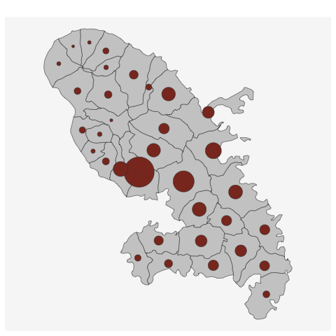

```{r setup, include=FALSE}
options(htmltools.dir.version = FALSE, crayon.enabled = TRUE)
knitr::opts_chunk$set(cache = TRUE,
                      fig.align='center',
                      message = FALSE,
                      warning = TRUE)
# install.packages("devtools")
# devtools::install_github("gadenbuie/countdown")
# devtools::install_github("mitchelloharawild/icons")
library(countdown)
library(icons)
#download_fontawesome()
```


```{r xaringan-themer, include=FALSE, warning=FALSE}
library(xaringanthemer)
style_duo_accent(
  primary_color = "#1d3352",
  secondary_color = "#383838",
  inverse_header_color = "#ffae00"
)
```


<br><br><br><br><br><br><br>
# 1. Un peu d'histoire...

---
## Londres, 1854

.pull-left[
**John Snow** est un médecin britannique. Ses travaux sur la **propagation du choléra** dans le quartier de Soho à Londres en 1854 sont reconnus dans l'histoire de l'**épidémiologie moderne** et de l'**analyse spatiale**.

.left-column[
<br>

]

.right-column[
.medium[
Il va identifier la **cause de l'épidémie** en utilisant un procédé simple, mais innovant, qui repose sur le principes de fonctionnement des SIG : **superposer deux couches géographiques différentes** :

- **Les lieux de résidence des décès liés à l'épidémie**.
- **Les pompes à eau** du quartier.]]  

.medium[
<br><br><br><br><br><br><br><br><br><br><br><br><br>
Il déterminera que la **transmission s'effectue par l'eau** et **identifiera le foyer de contamination** : la pompe de Brewer Street.]
]

.pull-right[

.leg-fig[**Carte de John Snow** avec la localisation des lieux de résidence des personnes décédées du choléra.]
]

---

## Londres, 1854

.pull-left[
**John Snow** est un médecin britannique. Ses travaux sur la **propagation du choléra** dans le quartier de Soho à Londres en 1854 sont reconnus dans l'histoire de l'**épidémiologie moderne** et de l'**analyse spatiale**.

.left-column[
<br>

]

.right-column[
.medium[
Il va identifier la **cause de l'épidémie** en utilisant un procédé simple, mais innovant, qui repose sur le principes de fonctionnement des SIG : **superposer deux couches géographiques différentes** :

- **Les lieux de résidence des décès liés à l'épidémie**.
- **Les pompes à eau** du quartier.]]  

.medium[
<br><br><br><br><br><br><br><br><br><br><br><br><br>
Il déterminera que la **transmission s'effectue par l'eau** et **identifiera le foyer de contamination** : la pompe de Brewer Street.]
]

.pull-right[

.leg-fig[Carte de John Snow revue par Mark Monmonnier, 1996]
]


---

## Un précurseur des applications SIG

.center[Si John Snow avait utilisé un système d'information géographique...]

.pull-left[

]

.pull-right[

]

---

<br><br><br><br><br><br><br>
# 2. Systèmes d'Information Géographique ?

---

## Historique

**Le concept de Système d'Information Géographique s'est développé et a évolué avec le développement de l'informatique**. 

- **1950 – 1970** : début de l’informatique, premières cartographies automatiques.

- **1970 - 1980** : diffusion des outils de cartographie automatique/SIG dans les organismes d’État (armée, cadastre, services topographiques…

- **1980 - 1990** : croissance du marché des logiciels SIG, développement des applications SIG.

- **Depuis les années 90 et 2000** : diffusion de SIG plus légers, libres, d'applications web et banalisation de l’usage de l’information géographique (cartographie en ligne, calcul d’itinéraires, utilisation de la géolocalisation, base de données participatives.

---

## Définition

**Système informatique de matériels, de logiciels, et de processus conçus pour permettre la collecte, la gestion, la manipulation, l'analyse, la modélisation et l'affichage de données à référence spatiale** afin de résoudre des problèmes complexes d'aménagement et de gestion. (*Comité fédéral de coordination inter-agences pour la cartographie numérique, 1988*)</p> 

.pull-left[
La pratique des logiciels de SIG est un métier : **sigiste**. 

Le SIG est également **l'outil de référence des géomaticiens**. 

La géomatique est une discipline issue de la géographie et des développements de l'informatique (**GEO**graphie + infor**MATIQUE**). 

La géomatique regroupe l'ensemble des outils et méthodes permettant d'acquérir, de représenter, d'analyser et d'intégrer des données géographiques.
]

.pull-right[

]

---

## Principes et fonctionnalités

Les logiciels SIG permettent de **superposer des couches géographiques de différentes natures, dans un même système de projection**. Cela permet de réaliser de puissantes **analyses croisées**.

.pull-left[
<br><br><br>
Ces logiciels permettent d'opérer sur l'intégralité de la chaîne de traitement des données géographiques :

- **Digitalisation** (Saisir et abstraire)  
- **Stockage** et **gestion** (Base de données)    
- **Analyse** (Géotraitements, analyse spatiale)       
- **Représentation** (Cartographie)   
]

.pull-right[

]

---

## Principes et fonctionnalités

.pull-left[
<br><br><br>
Pour **modéliser la réalité**, on superpose plusieurs couches d'information géographique, **vecteur et/ou raster**.

Chaque **couche géographique contient des objets de même type** (adresses, parcelles, routes, bâtiments, cours d'eau, limites administratives...)

**Une couche géographique = un type d'objet géographique** : point, ligne, polygone ou image géoréférencée (raster).
]

.center[
.pull-right[

]]

---

## Principes et fonctionnalités

.pull-left[
<br><br><br>
Pour **modéliser la réalité**, on superpose plusieurs couches d'information géographique, **vecteur et/ou raster**.

Chaque **couche géographique contient des objets de même type** (adresses, parcelles, routes, bâtiments, cours d'eau, limites administratives...)

**Une couche géographique = un type d'objet géographique** : point, ligne, polygone ou image géoréférencée (raster).
]

.center[
.pull-right[

]]

---

## Principes et fonctionnalités

.pull-left[
<br><br><br>
Pour **modéliser la réalité**, on superpose plusieurs couches d'information géographique, **vecteur et/ou raster**.

Chaque **couche géographique contient des objets de même type** (adresses, parcelles, routes, bâtiments, cours d'eau, limites administratives...)

**Une couche géographique = un type d'objet géographique** : point, ligne, polygone ou image géoréférencée (raster).
]

.center[
.pull-right[

]]

---

## Principes et fonctionnalités

.pull-left[
<br><br><br>
Pour **modéliser la réalité**, on superpose plusieurs couches d'information géographique, **vecteur et/ou raster**.

Chaque **couche géographique contient des objets de même type** (adresses, parcelles, routes, bâtiments, cours d'eau, limites administratives...)

**Une couche géographique = un type d'objet géographique** : point, ligne, polygone ou image géoréférencée (raster).
]

.center[
.pull-right[

]]

---
## Principes et fonctionnalités

Un SIG permet de travailler sur les trois composantes de l'information géographique :

.pull-left[
.medium[
### Niveau sémantique
**Les attributs** qui décrivent les objets géographiques (ex : libellé, population, catégorie) **peuvent être modifiés, supprimés, ajoutés et surtout requêtés** : Il est possible de sélectionner des objets géographiques **en fonction de la valeur des attributs**.

### Niveau géométrique
Possibilité de **modifier la localisation** et/ou **la forme** des objets géographiques, de **calculer des surfaces**, **des distances**, ou encore des **zones tampons**, de **convertir des polygones en point**... Les opérations possibles sur la géométrie des objets sont multiples.
]
]

.pull-right[
.medium[
### Niveau topologique
Une fonctionnalité puissante qui consiste à **requêter des objets par localisation**, c'est à dire **en fonction de leur positionnement par rapport à d'autres objets**. Pour cela on peut utiliser une série d'opérateur, exemple : *Contient*, *Croise*, *Intersecte*, *Est à l’intérieur*...]

.center[


.small[
Ex : *Sélection d'objets géographiques ponctuels situés à une certaine distance (euclidienne) d'autres objets géographiques ponctuels*
]]]

---

## Principaux logiciels SIG

.center[

]
---

## Installez QGIS ! 

Pour travailler depuis chez vous, nous vous conseillons d'installer QGIS sur votre ordinateur personnel *(https://www.qgis.org/fr/site/forusers/download.html)*. Choisissez la version long terme (la plus stable). 

.center[

]

---


<br><br><br><br><br><br><br>
# 3. Premiers pas dans un SIG et découverte de QGIS

Téléchargez les données sur [Moodle](https://moodle.u-paris.fr/course/view.php?id=6316)
---

## Présentation des données à disposition - Couches géographiques

Les couches géographiques vectorielles (points, lignes, surfaces) au format shapefile (. shp), auxquelles sont souvent associées des attributs (ex : capacité des salles de cinéma).

.pull-left[
.medium[

**00_Équipements existants** 

- Bibliothèques et médiathèques, conservatoires de musique, missions locales pour l'emploi, salles de cinéma, équipements sportifs, issues de la plateforme open data de la région Ile-de-France, contient les localisations des équipements cibles pour votre étude 

- Hôtels à insecte, ruches, lieux d'écoute à oiseaux, issus de la plateforme collaborative OpenStreetMap. **Attention à la complétude des données** !

**01_Maillages territoriaux** :  IRIS, communes, EPCI et départements de la Métropole du Grand
Paris L’IRIS correspond au découpage territorial le plus fin en France. Ce sera aussi la brique
territoriale que vous utiliserez pour définir le lieu d’implantation (favorisez l’implantation de
l’équipement dans tel et tel IRIS…) IRIS…). Source : IGN en géographie du 1er janvier 2022).

]
]

.pull-right[
]


---

## Présentation des données à disposition - Couches géographiques

D’autres couches géographiques sont disponibles. Elles serviront à définir des critères d’implantation pour optimiser l’implantation de l’équipement que vous aurez choisi..

.medium[
.pull-left[


**BPE** : une sélection pour l’Ile de France de 44 équipements géolocalisés que nous avons jugé
adapté au regard des équipements à implanter. Source INEE, Base Permanente des
Équipements 2021

**Grille 200 m** : Des données socio économiques dans des carreaux réguliers de 200 mètres de
côté (le plus fin existant en France).

**Couverture du sol** : les parcs et jardins, les zones majoritairement dédiées aux fleurs, les
forêts et vergers de la Métropole du Grand Paris. Source : OpenStreetMap.

**Hydrologie** : Le réseau hydrologique principal d’Ile de France (Seine, Marne). Source
Plateforme Open Data de la Région Ile de France.

]

.pull-right[
**Transports** : Le réseau routier principal et le réseau ferré en Ile de Franc e (source :
OpenStreetMap ), ainsi que la localisation des arrêts de bus, de train, de tram et de métro
(source : Plateforme Open Data de la Région Ile de France.

]
]


---

## Présentation des données à disposition - Données statistiques

Fichiers au format Excel qui correspondent à des extraits pour la Métropole du Grand Paris des données officielles de
l’INSEE à l’échelle des IRIS et à la commune. 

.medium[
.pull-left[
**BPE** : Les mêmes équipements que ceux disponibles dans le dossier des couches
géographiques, mais agrégés à l’échelle des IRIS et des communes (e.g. nombre de médecins
généralistes par IRIS ou par commune). Source : INSEE, Base Permanente des équipements en
2021.

**Démo** : Population totale et structure par âge de la population. Source : INSEE.

**Socio-éco** : Structure de l’emploi (chômage, type de salariat, catégories socioprofessionnelles)
de la population de plus de 15 ans selon la situation d’activité  et niveaux de vie des ménages (pauvreté, revenus). Source : INSEE.

A partir de ces données, vous pourrez être en mesure de calculer des ratios d'intérêt : taux de chômage, part de la population jeune / âgée...
]

.pull-right[
]
]

---


## Présentation des données à disposition - Métadonnées

Les métadonnées apportent des éléments essentiels pour comprendre le contenu des ressources à votre disposition, leur origine et d'éventuelles informations sur leur utilisation. Leur consultation attentive est primordiale.

.medium[
Avec ces métadonnées, vous êtes en mesure de répondre aux questions suivantes : *Quelle est la signification du code "P18_POP0002" ? Quelle est son unité de mesure ? Qui a produit la donnée, quand ? Quelle est l'année de référence de l'indicateur ??*
]


---

## Ouvrir QGIS

**Lancez l'application QGIS Desktop**, comme vous le feriez avec n'importe quel logiciel :

<br><br>
.center[

]
---

## Organiser son travail

L'utilisation d'un SIG nécessite de la **rigueur méthodologique**, car l'on se retrouve vite submergé de fichiers. Vous devez donc :

- Travailler en **projet**.

- Utiliser des **intitulés de fichiers** intelligibles.

- Ranger vos données en utilisant des **sous-répertoires**.

- Stocker votre projet **sur une clef USB** (et faire une copie). 


Commencez par **créer votre répertoire de travail** (sur une clé USB de préférence). Téléchargez les données du Moodle et décompressez-les dans votre répertoire de travail. **Ouvrez Qgis et créez un nouveau projet**. *(Projet/enregister/)*

---

## Organiser son projet

Dans votre répertoire de travail, créez une architecture de sous-répertoires qui vous paraît cohérente et dans laquelle vous vous y retrouverez facilement. Ne gardez que les fichiers qui vous seront utiles !</p>

.center[

]

---
.left-column[
## L'Interface de QGIS

.medium[
1.  **Menu principal**

2.  **La barre d’outils** : Raccourci vers les outils les plus récurrents utilisés

3.  **Barre d’outils latérale** : Par défaut, raccourci vers les options d'import de données.

4.  **La barre d’état** : Niveau de zoom, échelle, coordonnées géographiques

5.  **Les panneaux** : Explorateur, listing des couches géographiques chargées...

6.  **Le canevas de carte** : visualisation des couches géographiques.  
]
]

.right-column[


]

---

.left-column[
## Importer une couche vectorielle

**Pour importer des données facilement**, utilisez la barre d'outil latérale.

Choisissez l'icône **en fonction du type de données à importer** (Vecteur, raster, csv...).

Choisissez la couche *IRIS* (Couches Géo > 01_Découpages_territoriaux)
]

.right-column[


.center[
Importez la couche **IRIS** dans QGIS
]
]

---

.left-column[
## Sélection par attributs

Il est possible de sélectionner les objets géographiques à partir de leur **table attributaire**

1. Clic droit sur la couche IRIS
2. Ouvrir la table d'attribut
3. Sélectionner les entités en utilisant une expression 
]


.right-column[

.center[
Sélectionnez uniquement les IRIS de **votre espace d'étude**
]
]

---

.left-column[
## Sélection par attributs

Il est possible de sélectionner les objets géographiques à partir de leur **table attributaire**


1. Clic droit sur la couche IRIS
2. Ouvrir la table d'attribut
3. Sélectionner les entités en utilisant une expression 
4. Choisir son espace d'étude (champ LIB_EPCI)
]

.right-column[


.center[
Sélectionnez uniquement les IRIS de **votre espace d'étude**
]
]


---
.left-column[
## Export d'une sélection


1. Suite à la précédente sélection, clic droit sur la couche IRIS
2. Sélectionner "Exporter, sauvegarder les entités sous...
3. Sélectionner **l'emplacement de votre dossier de travail** et **nommer** la couche. Choisissez un format shapefile ou GEOJSON. 
4. Sélectionner l'option **N'enregistrer que les entités sélectionnées**

]

.right-column[

.center[
**Exportez les IRIS** qui composent votre espace d'étude
]
]

---
.left-column[
## Gestion de la projection

**La projection** d'une couche géographique **est indiquée dans ses propriétés générales**.

.medium[
Les couches géographiques s'affichent automatiquement dans le système de projection de la première couche géographique importée.

Pour modifier le système de projection, il suffit d'enregistrer une nouvelle version de la couche géographique concernée dans le système de projection souhaité (clic-droit sur la couche, enregistrez-sous...).
]
]

.right-column[


Importez la couche géographique contenant vos **équipements d'intérêt**, observez sa **projection** et enregistrez la dans la même projection que celle de vos **IRIS**.

]

---

.left-column[

## Quelques options utiles

**Pour sélectionner et zoomer**, utilisez les différentes fonctionnalité de la barre d'outils.

.medium[
Les icônes *loupe* permettent de **zoomer/dé-zoomer**. Il est également possible d'utiliser la roulette de votre souris. **L'outil de sélection offre plusieurs solutions** : sélection par clic, par polygone, à main levée...

]
]

.right-column[
.center[

]
]

---
.left-column[
## Gestion de l'affichage graphique

Pour changer l'ordre d'affichage des couches, il suffit de les faire glisser à la position de son choix, comme des onglets dans un navigateur Web.

Pour **visualiser l'ensemble d'une couche géographique**, **cliquez droit sur la couche** concernée dans le panneau légende, puis cliquez sur *Zoomer sur la couche*.

]

.right-column[


.center[
Importez la couche géographique des **communes**, placer les couches géographiques dans l'ordre suivant : **IRIS, communes, votre équipement** 
]
]

---
.left-column[
## Gestion de l'affichage graphique

Modifier le style graphique (**symbologie**) d'une couche géographique

**Double-clic sur la couche géographique concernée**, puis onglet*symbologie*.


]

.right-column[


.center[
Jouer sur le **style graphique** (couleur de fond, bordures) des couches IRIS, communes et équipement.
]
]


---
.left-column[
## Gestion de l'affichage graphique

Rajouter des **labels (étiquettes)** à la couche peut faciliter le repérage / la lecture de la carte.


Clic-droit sur la couche commune, puis propriétés. Cliquez ensuite sur "étiquettes".

]

.right-column[
.center[


Faites apparaître sur l'espace d'affichage **le nom des communes** de votre espace d'étude.
]
]
---

## Gestion de l'affichage graphique

.center[


Familiarisez vous avec vos équipements et votre espace d'étude en **superposant intelligemment les couches IRIS, communes, départements** ainsi que celle contenant **votre équipement**. 

Jouez sur les styles, et améliorez la **lisibilité**
]


---
## Exportez une image, enregistrez votre projet

.left-column[

]

.right-column[
**Vous pouvez exporter le visuel créé au format .png**. 
Attention néanmoins, il **manque beaucoup d'éléments** (titre, légende, sources...) etc. pour que cette carte soit valable ! Nous verrons cela dans les prochaines séances. Cela peut néanmoins constituer une base de travail et de réflexion. 

**Enregistrez votre projet à la racine de votre dossier de travail**. Les couches que vous avec chargé et leur style associé seront ainsi enregistrées pour la prochaine utilisation 
]

---
## Où en sommes-nous ? 


L'**exploration attentive** des données (et métadonnées) à notre disposition constitue toujours la **phase préalable** à la réalisation d'un projet SIG (hors collecte des données).

Plusieurs éléments fondamentaux pour initier un projet SIG ont aujourd'hui été abordés :

- **Consulter les données** mises à disposition, **organiser son projet SIG** et **enregistrer** sa session de travail.
- Importer **une information géographique**, tout en identifiant sa nature (point, ligne, surface, raster, vecteur ?)
- Jouer avec la **table attributaire**. Observer le nombre d'**objets géographiques** contenus dans chacune des couches ainsi que les données associées aux géométries.
- Identifier la **projection** utilisée pour chacune des couches géographiques. Savoir **transformer la projection** d'une couche pour que l'ensemble des couches disposent du même référentiel géographique.
- Savoir extraire les informations importantes dans les **métadonnées**.
- Gérer l'**ordre d'affichage** des couches géographiques et leur style.