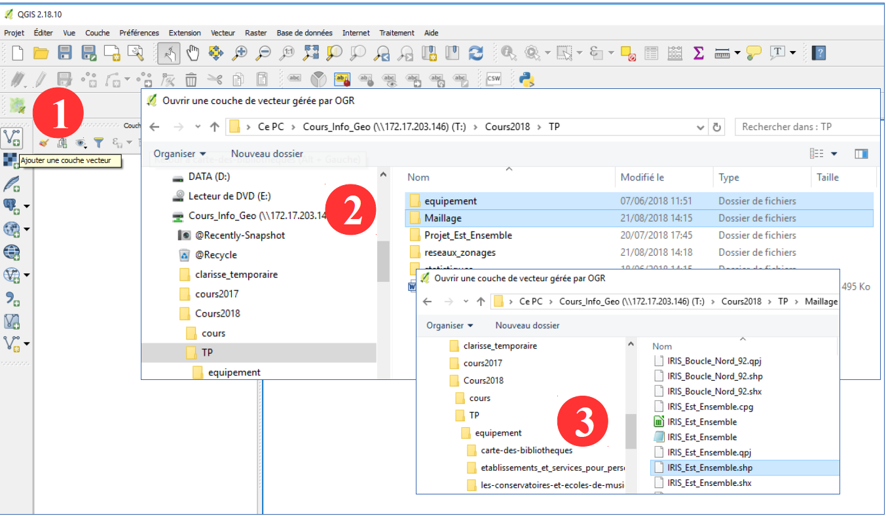
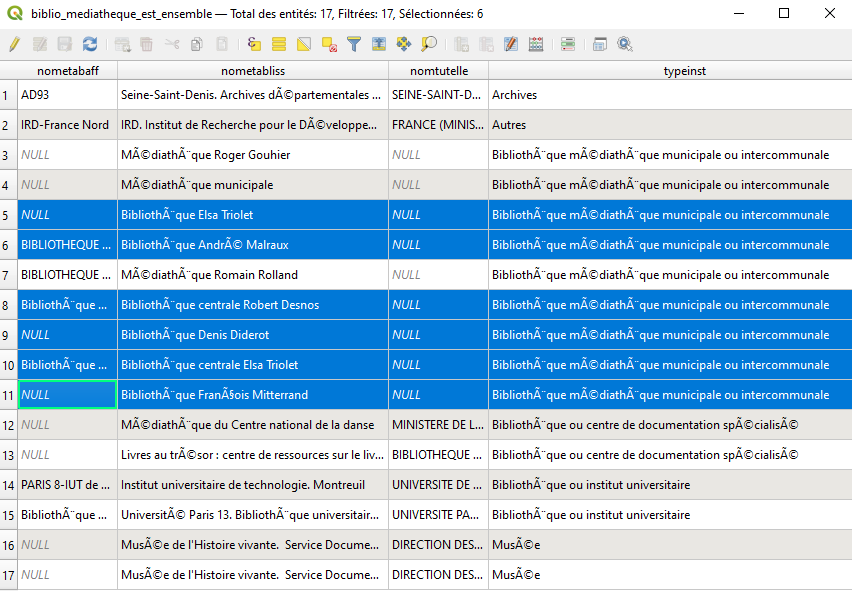
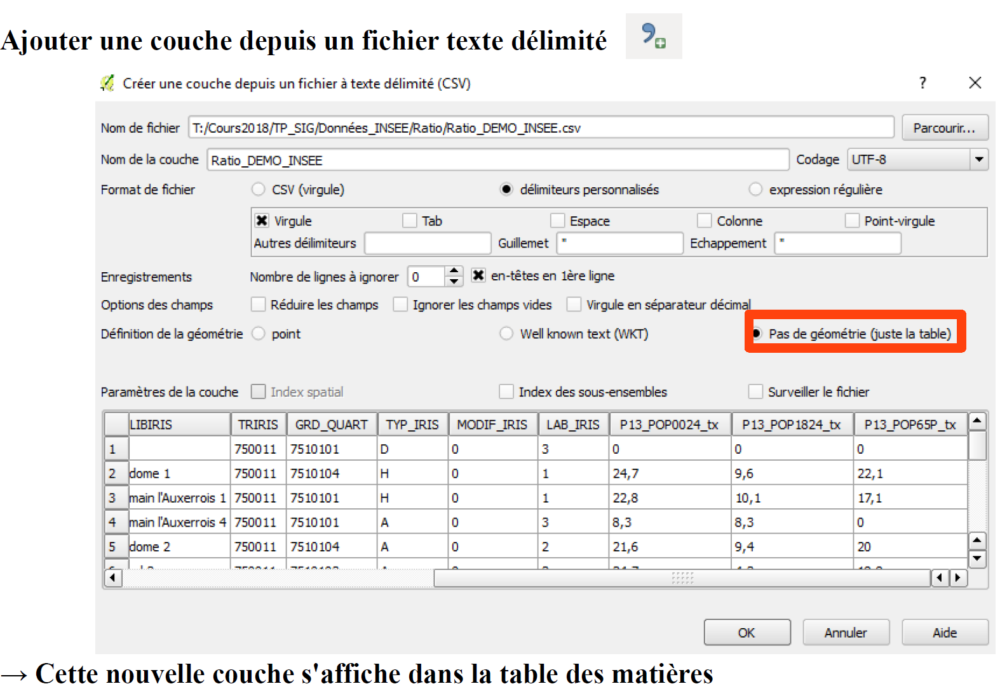
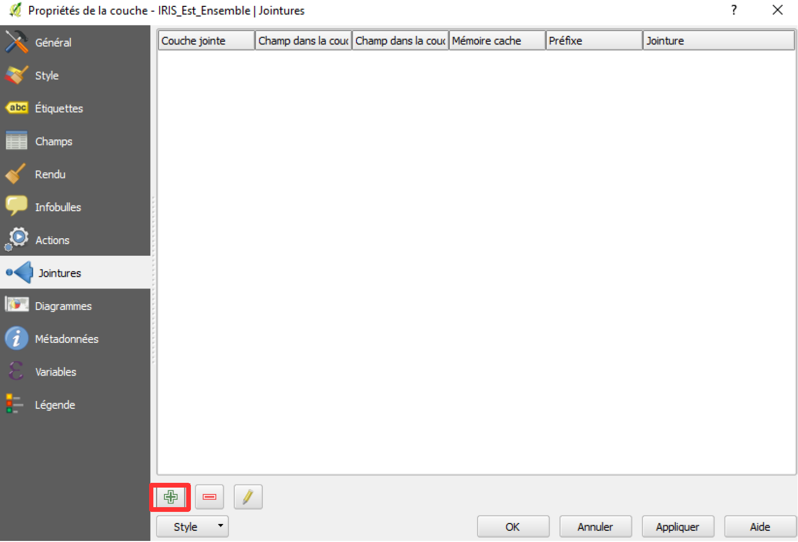
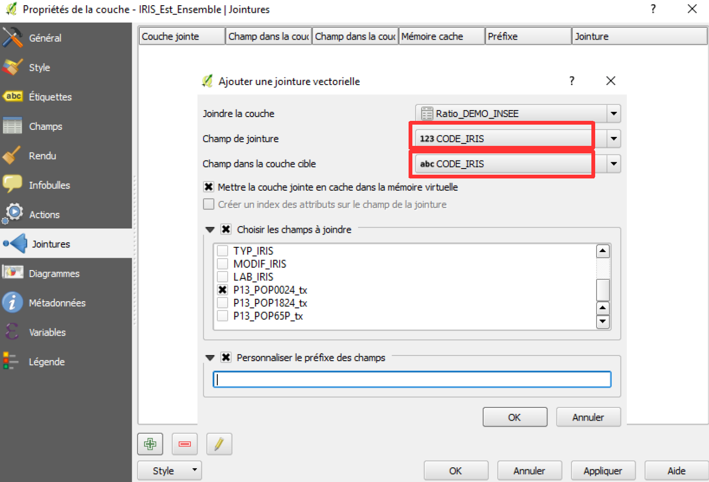

```{r setup, include=FALSE}
options(htmltools.dir.version = FALSE, crayon.enabled = TRUE)
knitr::opts_chunk$set(cache = TRUE,
                      fig.align='center',
                      message = FALSE,
                      warning = TRUE)
# install.packages("devtools")
# devtools::install_github("gadenbuie/countdown")
# devtools::install_github("mitchelloharawild/icons")
library(countdown)
library(icons)
#download_fontawesome()
```


```{r xaringan-themer, include=FALSE, warning=FALSE}
library(xaringanthemer)
style_duo_accent(
  primary_color = "#1d3352",
  secondary_color = "#383838",
  inverse_header_color = "#ffae00"
)
```


<br><br><br><br><br><br><br>
# 1. Éléments de vocabulaire...

---
## Jointure attributaire

.pull-left[
Une **jointure attributaire** permet de joindre **deux tables attributaires décrivant des entités communes et partageant un champ commun**. L'opération produit **une seule table** juxtaposant les champs de la table à joindre à ceux de la table d'origine.

Dans un SIG la table d'origine est souvent celle associée aux entités localisées d'**une couche géographique**, ce qui permet par exemple de cartographier les **données d'un tableau statistique sans dimension spatiale**. 

Les jointures attributaires sont utilisées lorsque l'on souhaite introduire des informations nouvelles dans une couche géographique, par exemple des données décrivant le nombre de commerces que l'on souhaite joindre à une couche de communes.
]

.pull-right[
<br><br><br>


.leg-fig[Source : Université Virtuelle Environnement et Développement durable, glossaire des SIG.
]
]
---
## Jointure spatiale

.pull-left[
<br><br>
Une **jointure spatiale** permet de caractérister le **positionnement relatif d'entités issues de deux couches géographiques différentes**.

Par exemple, une table des écoles pourra être jointe à une table des communes en fonction d'une **relation spatiale de type inclusion géométrique**. 

Si le point de l'école se trouve dans le polygone correspondant à la commune, les attributs de la table commune deviendront des attributs de la table école. Par définition, une jointure ne peut donc être effectuée qu'entre des données géographiques et non des tables attributaires.
]

.pull-right[


.leg-fig[
Source : Université Virtuelle Environnement et Développement durable, glossaire des SIG.
]
]

---

## Sélection par attributs

.pull-left[
Il s'agit d'une sélection portant sur les **caractéristiques non spatiales des entités**. Dans un SIG, elles sont prises en charge dans la table attributaire des couches géographiques.

On peut effectuer une sélection par expression sur des **variables catégorielles/qualitatives** *(ex : IRIS de de la commune "Bagnolet")* ou sur des **variables quantitatives** *(ex: IRIS dont le nombre de foyers fiscaux est supérieur à "10000")*

Le SIG renverra alors une sélection des entités dont les valeurs répondent à la requête
]

.pull-right[

]

---
## Sélection par localisation

.pull-left[
<br><br><br><br>
La sélection par localisation permet de sélectionner certaines entités d'une couche au regard de leur positionnement géographique vis-à-vis d'une autre couche géographique.

Le choix du **prédicat géométrique est important** (intersecte, contient, est disjoint, égal, touche, chevauche, à l'intérieur, croise, etc.) 
]

.pull-right[

.leg-fig[Source : École nationale des techniciens de l'équipement. Établissement d'Aix-en-Provence
]
]

---
<br><br><br><br><br><br><br>
# 2. Exercice pratique (1)

## Extraire les biblioothèques inclues dans le territoire d'Est-Ensemble
### Changer la projection, sélectionner par localisation et sélectionner par expression. 

---

## Sélection des bibliothèques d'Est Ensemble

### **Étape 1** - Importer des couches vecteur

.medium[
*Importez les couches bibliothèque et IRIS Est Ensemble. (ajouter une couche vecteur)*
]
.center[

]
---

## Sélection des bibliothèques d'Est Ensemble

### **Étape 2** - Harmoniser les projections

.medium[
*Enregistrez la couche d'équipement dans la même projection que la couche IRIS. (clic droit sur la couche bibliothèque > enregistrez sous > choisir le même SCR que la couche IRIS)*
]
.center[

]

---

## Sélection des bibliothèques d'Est Ensemble

### **Étape 3** - Sélection par localisation

.medium[Ne sélectionnez que les bibliothèques contenues dans le territoire d'Est Ensemble *(vecteur > outil de recherche > sélection par localisation)*.]

.center[

]

---

## Sélection des bibliothèques d'Est Ensemble

### **Étape 3** - Sélection par localisation

.medium[
Observer le résultat de la sélection et l'enregistrer. *(clic droit sur la couche bibliothèques > n'enregistrer que les entités sélectionnées)*.
**NB**: pour connaître les bibliothèques qui ne sont pas comprises dans cet espace, on peut inverser la sélection.
]

.center[

 ]

---

## Sélection des bibliothèques d'Est Ensemble

### **Étape 4** - Filtrer les résultats 

.left-column[
.medium[
*Pour notre projet, nous décidons de moderniser une bibliothèque existante. Nous souhaitons donc retirer toutes les médiathèques déjà existantes de cette sélection.*

*Ouvrez la table attributaire, triez les résultats, et ne sélectionnez que les bibliothèques. Enregistrez la sélection sous le nom "bibli_est_ensemble"*.

*On note ainsi que 16 bibliothèques et sont incluses dans le territoire d'Est Ensemble. Ce territoire compte aussi déjà 2 médiathèques, situées dans les communes de Bagnolet et Noisy-le-Sec.*
]]

.right-column[
.center[

]]

---

## Sélection des bibliothèques d'Est Ensemble

### **Étape 5** - Enregistrer le résultat

.left-column[
.medium[
 <br><br><br>
 S'il s'agissait de votre projet, nous vous conseillerions d'améliorer le style de cette couche importante, de lui trouver un nom clair du type *critere1_bibli_est_ensemble.shp* et de l'enregistrer dans un dossier que vous maîtrisez.

Ne jamais oublier d'enregistrer votre projet à la fin de votre travail pour conserver l'ordre des couches et le style que vous leur avez affecté.
]
]

.right-column[
.center[

]]

---

<br><br><br><br><br><br><br>
# 3. Exercice pratique (2)
## Sélectionner les IRIS caractérisés par une population jeune
### Import de données attributaires, jointures attributaires, statistiques basiques, sélections par expression. 


---

## Sélection des IRIS caractérisés par une population jeune

### **Étape 1** - Importer un fichier tabulaire

.medium[
*Importez le fichier contenant les structures par âge des IRIS d'Ile-de-France.*
]
.center[

]

---

## Sélection des IRIS caractérisés par une population jeune

### **Étape 2** - Jointure attributaire

.left-column[

.medium[
<br><br><br>
Jointure de ce fichier de données non spatiales à la couche géographique des IRIS.

Au préalable, il faut s'assurer de la concordance des données statistiques avec les géométries et identifier le nom de la colonne (identifiant unique) sur laquelle portera la jointure.

*Clic droit sur la couche IRIS, propriétés, jointure, cliquer sur "+"*
]
]

.right-column[
.center[

]]

---

## Sélection des IRIS caractérisés par une population jeune

### **Étape 2** - Jointure attributaire

.left-column[
.medium[
<br><br><br>
Jointure de ce fichier de données non spatiales à la couche géographique des IRIS.

Au préalable, il faut s'assurer de la concordance des données statistiques avec les géométries et identifier le nom de la colonne (identifiant unique) sur laquelle portera la jointure.

*Choisir les deux champs à mettre en lien N'hésitez pas à jeter un oeil aux tables attributaires et aux métadonnées pour vous aider à cibler les bons identifiants.*
]
]

.right-column[
.center[

]]

---

## Sélection des IRIS caractérisés par une population jeune

### **Étape 2** - Jointure attributaire

**BRAVO !!! Vous venez de joindre les données démographiques de l'INSEE dans la table attributaire de la couche IGN IRIS !** 

.center[

]

---

## Sélection des IRIS caractérisés par une population jeune

### **Étape 3** - Sélection par expression

.left-column[
.medium[
<br><br><br>
Sélectionnez les IRIS caractérisés par une part de la population supérieure à 33 %.
*Clic droit sur la couche IRIS > ouvrir la table d'attributs > sélectionner des entités en utilisant une expression.*

NB : On pourrait aussi envisager la sélection autrement: 25 % des IRIS les plus jeunes, créer des indices de vieillissement, prendre des classes d'âge plus fines. Il vous faudra justifier vos choix. 
]
]

.right-column[
.center[

]]

---

## Sélection des IRIS caractérisés par une population jeune

### **Étape 4** - Enregistrer les résultats 

.left-column[
<br><br><br>
.medium[
85 IRIS à Est-Ensemble sont caractérisés par une part de la population âgée de 0 à 24 ans supérieure à un tiers de la population totale !

*Clic droit sur la couche IRIS > enregistrer la couche vectorielle sous...> n'enregistrer que les entités sélectionnés*

Toujours choisir un nom de fichier qui vous parle (et assez court). Ex : "CRITERE_POP024.shp"<
]
]

.right-column[

]


---

## Où en sommes nous ? 
.center[


.small[
Extrait du chemin décisionnel conduisant à l'implantation d'une médiathèque sur Est-Ensemble. La procédure technique serait la même pour le critère de revenu. Il faut juste veiller à choisir et justifier l'utilisation des **bons indicateurs** et des **bons seuils** statistiques pour la sélection.]]

---

# A vous de jouer !

- **Adaptez ces méthodes** aux critères que vous avez identifié.  

- Pensez à **justifier vos choix** ! N'hésitez pas à recourir à de la bibliographie (enquêtes de fréquentation, publics cibles identifiés par les structures, etc.)

- L'exercice est pensé pour que vous n'ayez pas à collecter de données. Dans la réalité il faudrait au préalable effectuer une **veille** sur les ressources disponibles (cf cours 1), télécharger les données et les mettre en forme.

- Vous avez la possibilité d'aller chercher d'**autres ressources** (données statistiques ou couches d'information géographique) qui pourraient vous permettre d'affiner vos critères de sélection ! > si pb nous sommes là pour vous aider...

---

## Pour aller plus loin...

.pull-left[
L'INSEE fournit d'autres données à l'échelle de l'IRIS, comme la Base Permanente des Équipements [**BPE**.](https://www.insee.fr/fr/statistiques/3568629?sommaire=3568656#consulter)

Par exemple, on ne pourrait sélectionner que les IRIS qui sont caractérisés par la présence au moins d’une classe pré-élémentaire en école élémentaire (fichier enseignement).
]

.pull-right[

]
</div>

---

## Pour aller plus loin...

[**Open Data Ile-de-France**](https://data.iledefrance.fr) fournit d'autres couches géographiques que celles extraites qui peuvent être utiles pour penser de nouveaux critères.

Par exemple, on ne pourrait sélectionner que les bibliothèques qui sont incluses dans un carré de grille dont le cumul des nuisances environnementales n'excède pas un seuil donné.

.center[

]