```{r setup, include=FALSE}
options(htmltools.dir.version = FALSE, crayon.enabled = TRUE)
knitr::opts_chunk$set(cache = FALSE,
                      fig.align='center',
                      message = FALSE,
                      warning = TRUE)
# install.packages("devtools")
# devtools::install_github("gadenbuie/countdown")
# devtools::install_github("mitchelloharawild/icons")
library(countdown)
library(icons)
#download_fontawesome()
```


```{r xaringan-themer, include=FALSE, warning=FALSE}
library(xaringanthemer)
style_duo_accent(
  primary_color = "#1d3352",
  secondary_color = "#383838",
  inverse_header_color = "#ffae00"
)
```


<br><br><br><br><br><br><br>
# 1.Rappels... 

---

## Jointures, sélections par expression...

**Objectif** : Réaliser une sélection sur un second critère statistique : Faible revenu dans les IRIS d'Est Ensemble.

**Proposition d'un 3e critère** : Sélectionner les 50% d'IRIS les plus pauvres d'Est ensemble.

→ Comment procéder ?

--

1. Importer le fichier `socio_eco.xlsx` après avoir repéré le champ pertinent (`DEC_MED19`)
2. Faire la **jointure attributaire** avec la couche IRIS
3. Repérer le niveau de revenu des 50% des IRIS les plus pauvres, c'est-à-dire sous la *médiane* des valeurs d'Est Ensemble
4. Sélectionner (**sélection par attribut**) les IRIS qui correspondent à cette tranche de revenu médian
5. Enregistrer le résultat (3e critère)

---

.left-column[
## 50 % des IRIS à plus faible revenu
Consulter le fichier `socio_eco.xlsx`. Après avoir repéré le champ pertinent (`DEC_MED19`) et exporté le fichier Excel au format .csv, importer cette couche de texte délimité dans QGIS.
]

.right-column[
.center[
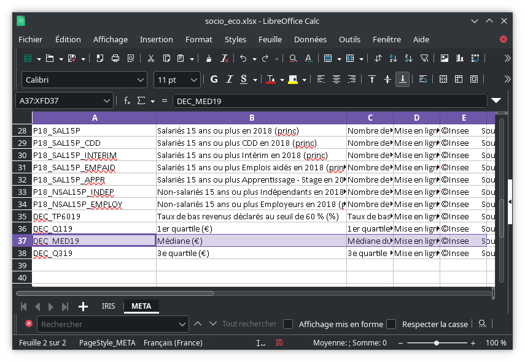
]
]

---

.left-column[
## 50 % des IRIS à plus faible revenu
Faire la **jointure attributaire** avec la couche IRIS
]

.right-column[
.center[

]
]

---

.left-column[
## 50 % des IRIS à plus faible revenu
Repérer le niveau de revenu des 50% des IRIS les plus pauvres, c'est-à-dire la *médiane*
]

.right-column[
.center[
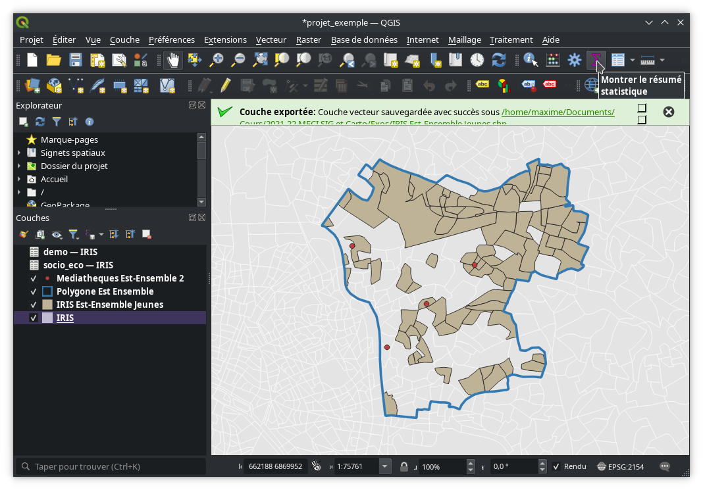

]
]

---

.left-column[
## 50 % des IRIS à plus faible revenu
Repérer le niveau de revenu des 50% des IRIS les plus pauvres, c'est-à-dire la *médiane*
]

.right-column[
.center[

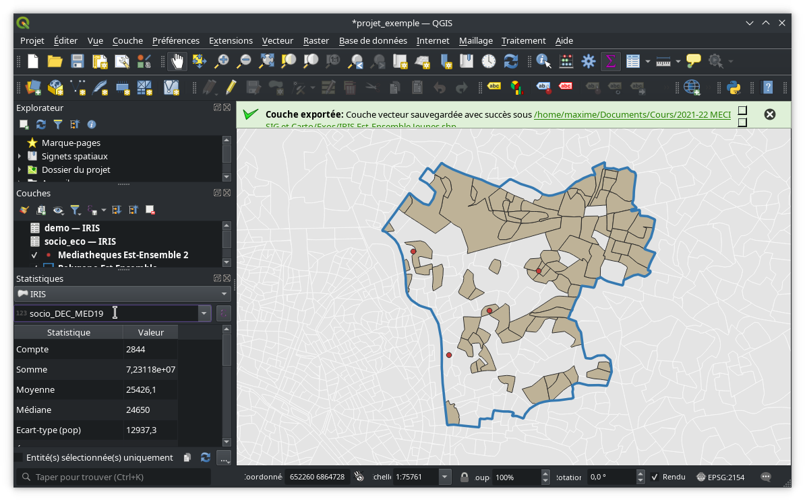
]
]

---

.left-column[
## 50 % des IRIS à plus faible revenu
Repérer le niveau de revenu des 50% des IRIS les plus pauvres, c'est-à-dire la *médiane*
]

.right-column[
.center[

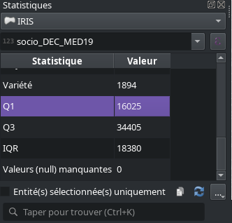
]
]

---
.left-column[
## 50 % des IRIS à plus faible revenu
Sélectionner (**sélection par attribut**) les IRIS qui correspondent à cette tranche de revenu médian
]

.right-column[
.center[
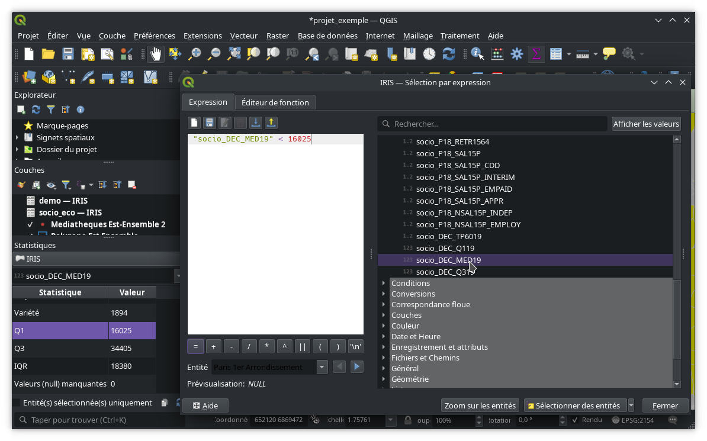
]
]

---

.left-column[
## 50 % des IRIS à plus faible revenu
Enregistrer le résultat (3e critère)
]

.right-column[
.center[
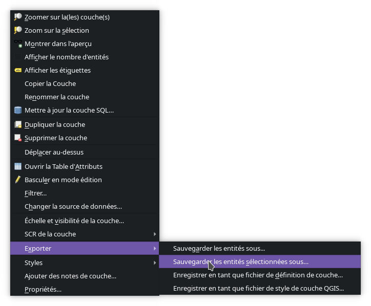
]]


---

<br><br><br><br><br><br><br>
# 2. Éléments de vocabulaire et de méthode...


---

## Raster

.pull-left[
Le mode **raster**  représente l'espace selon un maillage régulier appliqué sur la surface terrestre. Ce maillage se fait sous forme d'une grille formée de cellules de taille prédéterminée auxquelles sont attribuées des valeurs spécifiques. La taille de la cellule / du pixel s'appelle la résolution spatiale.

Leur analyse et leur traitement relève d'un domaine spécifique : **la télédétection**. ]

.pull-right[


.leg-fig[Source : Université Virtuelle Environnement et Développement durable, glossaire des SIG.]
]


---

## Digitalisation

.pull-left[
La digitalisation consiste à **numériser des points à partir d'un support visuel**, en attribuant à chaque point des coordonnées X et Y dans un système de projection quelconque.

Elle peut être réalisée avec deux méthodes : la digitalisation sur table à digitaliser ou directement sur un écran à partir d'une source numérisée. 

L'une des bases de départ des SIG est le plan cadastre digitalisé.

La digitalisation nécessite beaucoup de méthode, de pratique et de précaution (éviter les erreurs topologiques, chevauchement des polygones, etc.). Sa pratique ne sera pas abordée dans ce cours.]

.pull-right[


.leg-fig[
Pour en savoir plus, se reporter à [ce document](https://hal.inrae.fr/hal-02791101/document) sur la digitalisation et le géoréférencement de cartes d'État Major ou à [celui-ci]((https://oatao.univ-toulouse.fr/16382/1/Grel_16382.pdf)) pour une application à l'analyse du couvert forestier (source : INRA).
]
]

---

## Digitalisation

.center[

]

---

## Digitalisation

.center[
<iframe width="840" height="472.5" src="https://www.youtube.com/embed/uFaN-uDv90s" title="YouTube video player" frameborder="0" allow="accelerometer; autoplay; clipboard-write; encrypted-media; gyroscope; picture-in-picture" allowfullscreen></iframe>

.leg-fig[Une vidéo (source : CADGIS network) qui explique comment digitaliser une image géoréfrencée avec QGIS)]
]

---

## Géotraitement

.pull-left[

Les SIG proposent plusieurs outils de **géotraitement**. Ils permettent d'opérer sur la **géométrie et/ou la topologie** des objets géographiques. La dimension attributaire est parfois également prise en compte. Ces traitements peuvent s'effectuer en mode **vecteur** et/ou en mode **raster**.

Le résultat d'un géotraitement est la **création d'une nouvelle couche géographique**.


.leg-fig[
Extrusion des contours des côtes bretonnes par une série de géotraitements (Source : [Atol Open Blog](https://blog.atolcd.com/mise-a-jour-en-vue-pour-lextension-gis-de-pentaho-data-integration/))
]

]

.pull-right[


.leg-fig[
Tampons variables autour des rivières (Source : [Documentation QGIS](https://docs.qgis.org/2.8/fr/docs/gentle_gis_introduction/vector_spatial_analysis_buffers.html))]
]

---

## Zone tampon (buffer, distances tampon)

.center[

]

---

## Intersection

.center[

]

---

## Différenciation symétrique (ou différence)

.center[

]

---

## Union

.center[

]

---

## Regroupement (merge, dissolve)

.center[

]

---

<br><br><br><br><br><br><br>
# Exercice pratique avec les données d'Est Ensemble...

- Agréger les IRIS d'Est-Ensemble en communes à partir de la valeur d'un champ (leur EPT d'appartenance) : **géotraitement *"regroupement"* **. 

- **Diversifier l'offre géographique** : Extraire l'espace situé à plus de 1500m d'une médiathèque sur le territoire d'Est Ensemble : **géotraitements *espace tampon* et *différence* **.  

- **Une médiathèque accessible** : Extraire l'espace situé à moins de 1000m d'une station de RER : **géotraitements *union*, *espace tampon* et *intersection* **.  

---

## Agréger les IRIS en communauté d'agglomération


.left-column[
.medium[
Objectif : Créer une couche présentant l'**emprise spatiale de la communauté d'agglomération Est Ensemble** à partir du fichier des communes.

Une méthode possible : **agrégation sur les valeurs d'un champ (ou dissolve).**

Afficher la couche IRIS de votre espace d'étude, ouvrez la table attributaire et trouver le nom du champ correspondant au nom (ou au code de la communauté d'agglomération d'appartenance des IRIS.

Vecteur > outils de géotraitement > Regrouper.]]

.right-column[

.center[
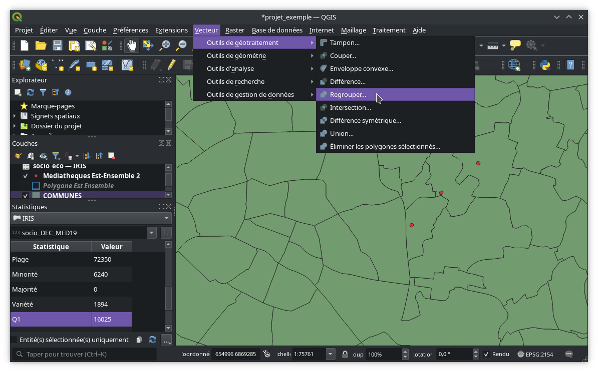

]]

---

## Agréger les IRIS en communauté d'agglomération

.pull-left[
Champ de regroupement : Sélectionner la colonne qui spécifie l'appartenance aux EPCI des communes (EPT_LIBEPT par exemple).

Nommer le fichier de sortie **EPT_Est_Ensemble.shp**.]


.pull-right[
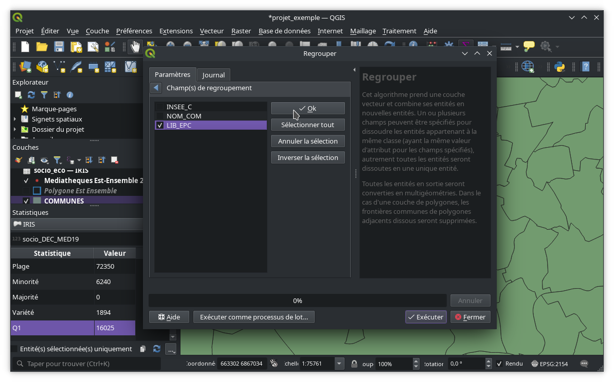
]

---

## Agréger les IRIS en communauté d'agglomération

Résultat pour Est-Ensemble et les EPCI avoisinants

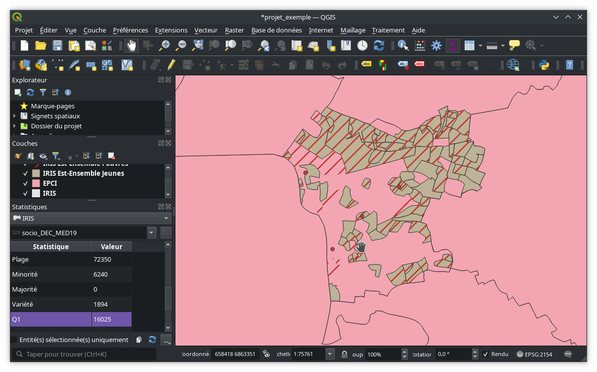


---

## Diversifier l'offre géographique

.left-column[
.medium[
Objectif : Extraire l'**espace situé à plus de 1500m d'une médiathèque** sur le territoire d'Est Ensemble.

### **Étape 1** 
Ouvrir la couche *bibliotheque_Est_Ensemble.shp* (correctement projetée), extraire uniquement les médiathèques (depuis la table attributaire ou par une sélection par expression). 

### **Étape 2** 
Réaliser un **espace tampon** de 1500 mètres autour de celles-ci et nommer cette couche *mediatheques_1500m*.]]

.right-column[
.center[


.leg-fig[Création d'un **espace tampon de 1500m autour des médiathèques**]]]


---

## Diversifier l'offre géographique

.left-column[
.medium[
Objectif : Extraire l'**espace situé à plus de 1500m d'une médiathèque** sur le territoire d'Est Ensemble.

### **Étape 1** 
Ouvrir la couche *bibliotheque_Est_Ensemble.shp* (correctement projetée), extraire uniquement les médiathèques (depuis la table attributaire ou par une sélection par expression). 

### **Étape 2** 
Réaliser un **espace tampon** de 1500 mètres autour de celles-ci et nommer cette couche *mediatheques_1500m*.]]

.right-column[
.center[
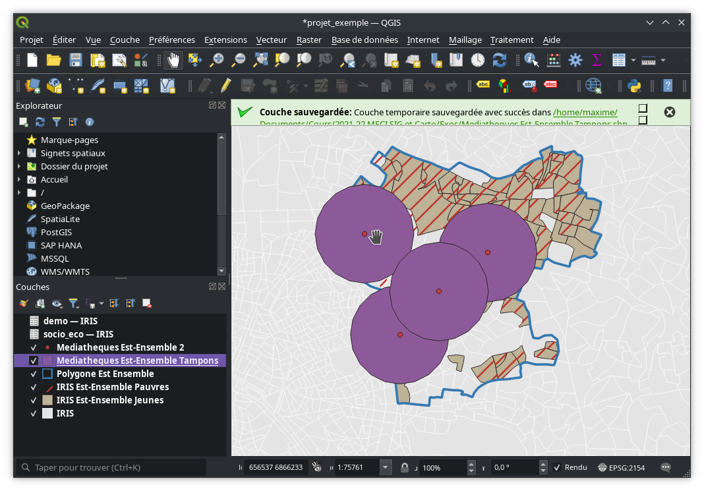
.leg-fig[Création d'un **espace tampon de 1500m autour des médiathèques**]]]

---

## Diversifier l'offre géographique

.left-column[
.medium[
Objectif : Extraire l'**espace situé à plus de 1500m d'une médiathèque** sur le territoire d'Est Ensemble.

### **Étape 3** 
Réaliser la **différence** entre la couche *mediatheques_1500m* et la couche *EPT_Est_Ensemble*, la nommer *mediatheques_1500diff*.
]]

.right-column[
.center[
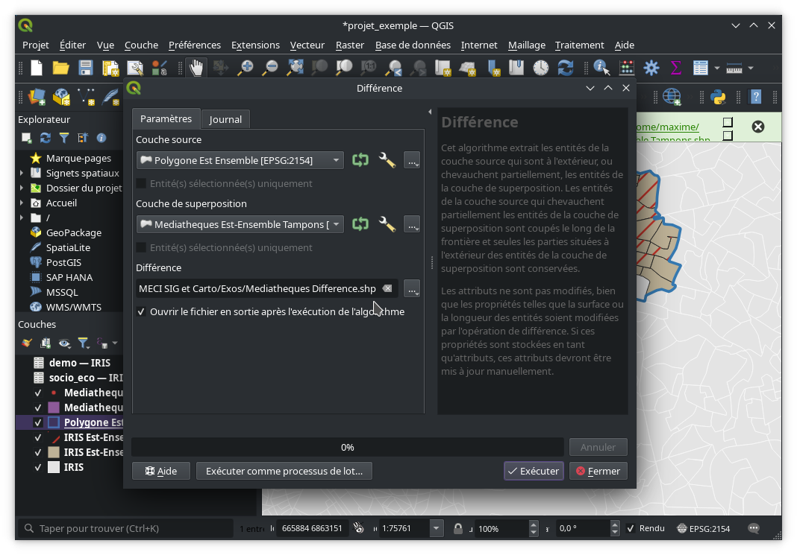
]]

---

## Diversifier l'offre géographique

.left-column[

.medium[

Objectif : Extraire l'**espace situé à plus de 1500m d'une médiathèque** sur le territoire d'Est Ensemble.

### **Étape 4** 
Supprimer les couches intermédiaires affichées dans le SIG, enregistrer la couche finale dans le répertoire adéquat et jouer sur le style de cette couche finale qui nous intéresse directement pour notre projet.]]

.right-column[
.center[
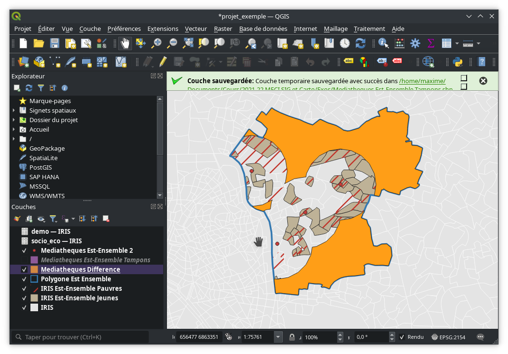
.leg-fig[L'espace à plus de 1500 mètres d'une médiathèque est dorénavant sélectionné !]]]

---

## Une médiathèque accessible

.left-column[
.medium[

Objectif : Extraire l'**espace qui se situe à moins de 1000m d'une station de tramway ou de métro**.

### **Étape 1**
Ouvrir les couches *arrets_metro* et *arrets_tram*, les enregistrer dans la projection du projet (EPSG:2154).

### **Étape 2**
Créer **l'union** de ces deux couches. Nommer le résultat *Metro_Tram*
]]

.right-column[
.center[
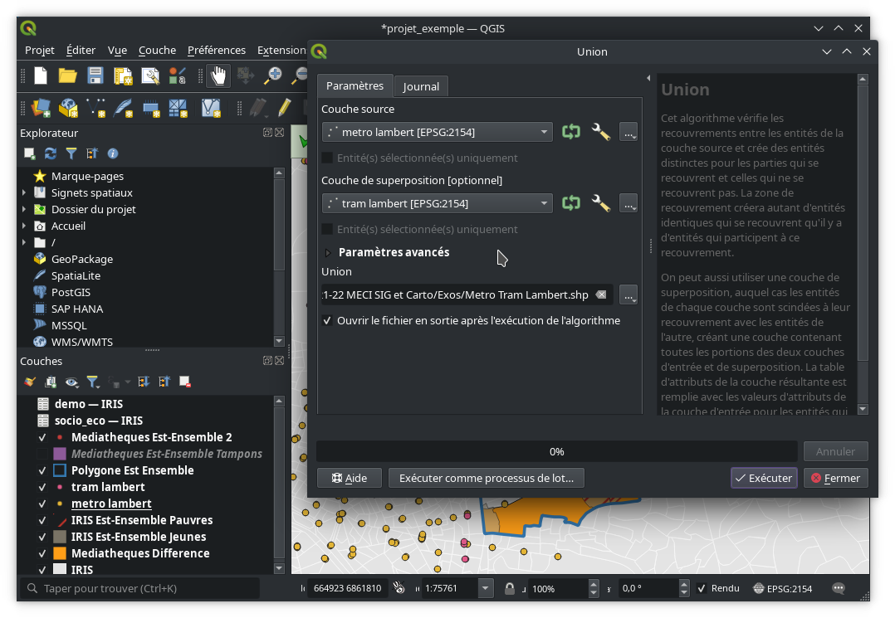
]]

---

## Une médiathèque accessible

.left-column[
.medium[

Objectif : Extraire l'**espace qui se situe à moins de 1000m d'une station de tramway ou de métro**.

### **Étape 1**
Ouvrir les couches *arrets_metro* et *arrets_tram*, les enregistrer dans la projection du projet (EPSG:2154).

### **Étape 2**
Créer **l'union** de ces deux couches. Nommer le résultat *Metro_Tram*
]]

.right-column[
.center[
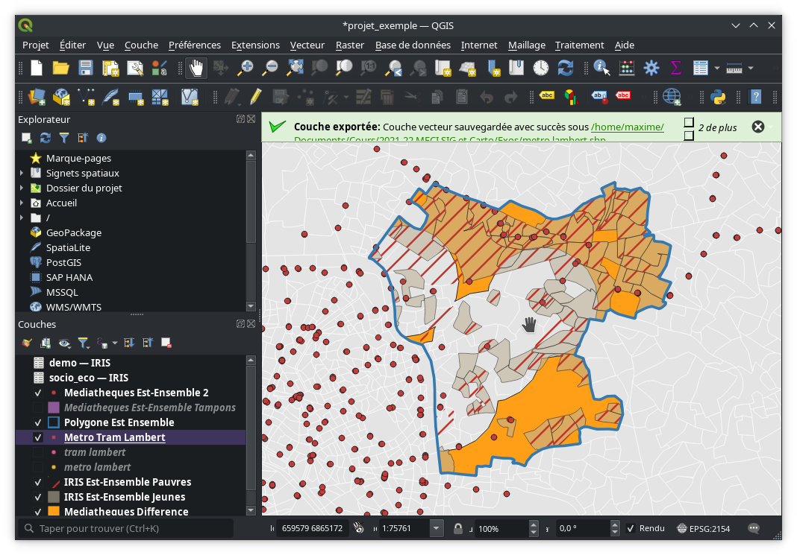
.leg-fig[Les deux couches géographiques de transport sont désormais réunies en une seule !]
]]


---

## Une médiathèque accessible

.left-column[
.medium[

Objectif : Extraire l'**espace qui se situe à moins de 1000m d'une station de RER ou de métro**.

### **Étape 3**
Réaliser un **espace tampon** de 1000 mètres autour de celle-ci et nommer cette couche *Metro Tram 1000m*.]]  

.right-column[
.center[
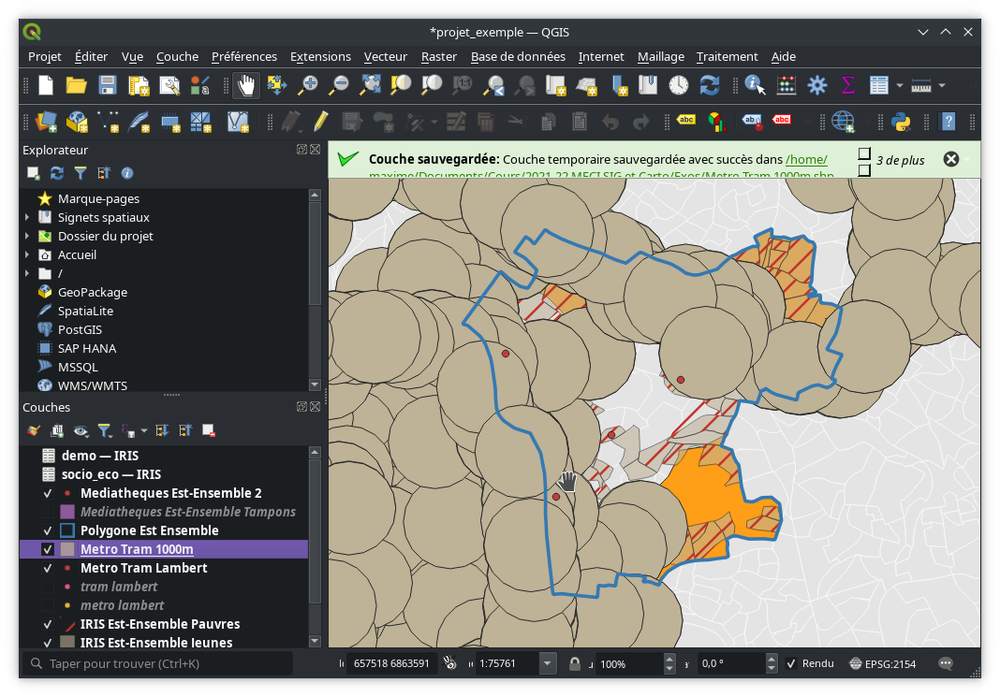
]]

---

## Une médiathèque accessible

.left-column[
.medium[
### **Étape 4**
Réaliser l'**intersection** entre la couche `Metro Tram 1000M` et la couche **EPT_Est_Ensemble**, la nommer *Accessibilite*.

### **Étape 5**
Supprimer les couches intermédiaires affichées dans le SIG, enregistrer la couche finale dans le répertoire adéquat et jouer sur le style de cette couche finale qui nous intéresse directement pour notre projet.]]

.right-column[
.center[
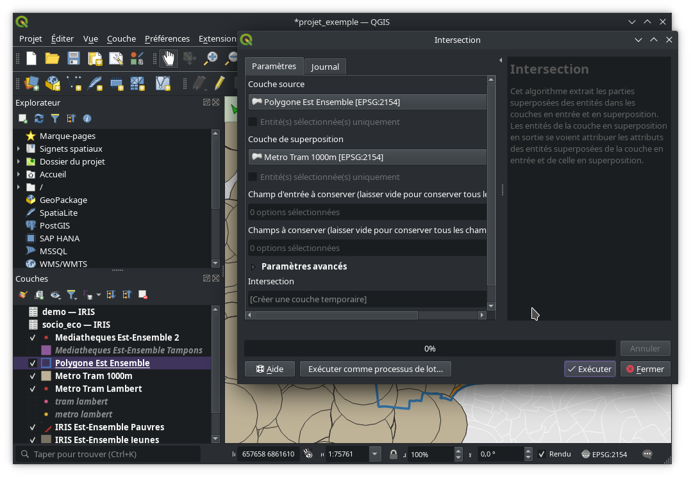
]]

---

.center[
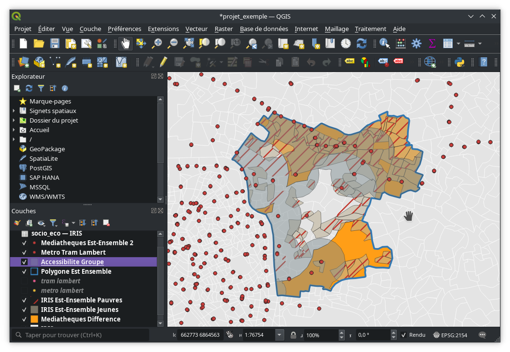
]


---
<br><br><br><br><br><br><br>
# 3. Modéliser sa chaine de traitement

---
## Modéliser sa chaine de traitement

La modélisation graphique de la chaîne de traitement, aussi appelée *cheminement décisionnel* est particulièrement utile pour :

- Expliquer **les étapes de la réalisation** à d’autres personnes (reproductibilité des résultats, transposition à d'autres espaces d'études ou objets géographiques).

- Apporter de la **rigueur méthodologique** à ses travaux (transparence de la procédure). 

- Se rappeler comment sont **nommées et organisés les fichiers** (particulièrement utile d’une séance à l’autre).  

Nous vous conseillons de réaliser ce schéma au fur et à mesure de l’avancement de vos traitements ! 

---

## Modéliser sa chaine de traitement

.center[
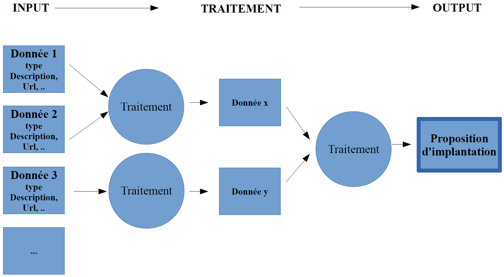
]

---

## Modéliser sa chaine de traitement

.center[
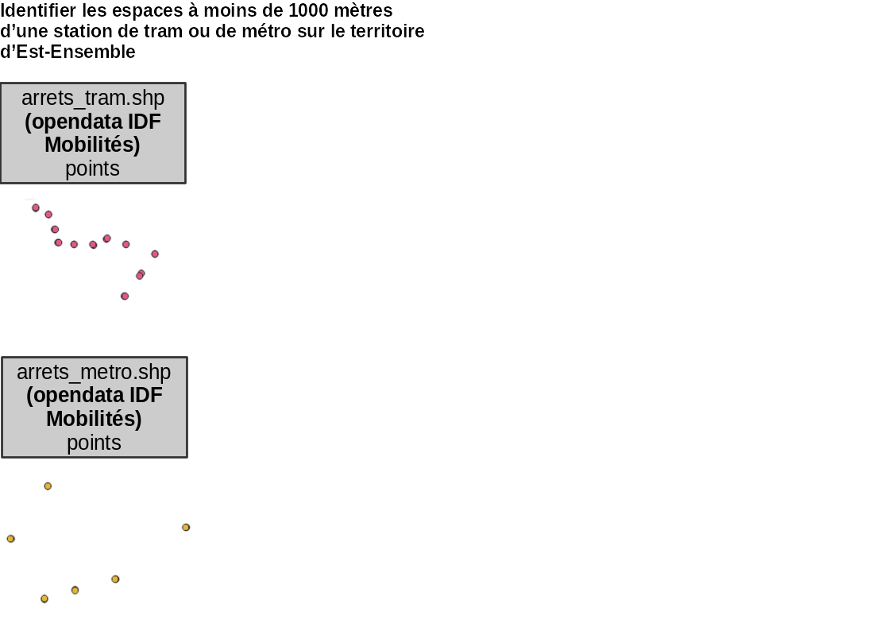
]

---

## Modéliser sa chaine de traitement

.center[
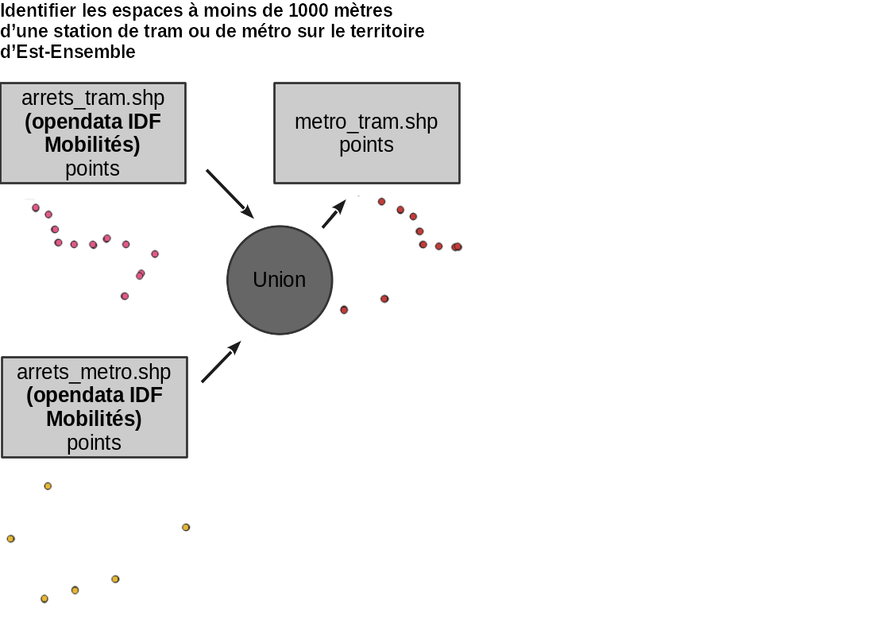
]

---

## Modéliser sa chaine de traitement

.center[
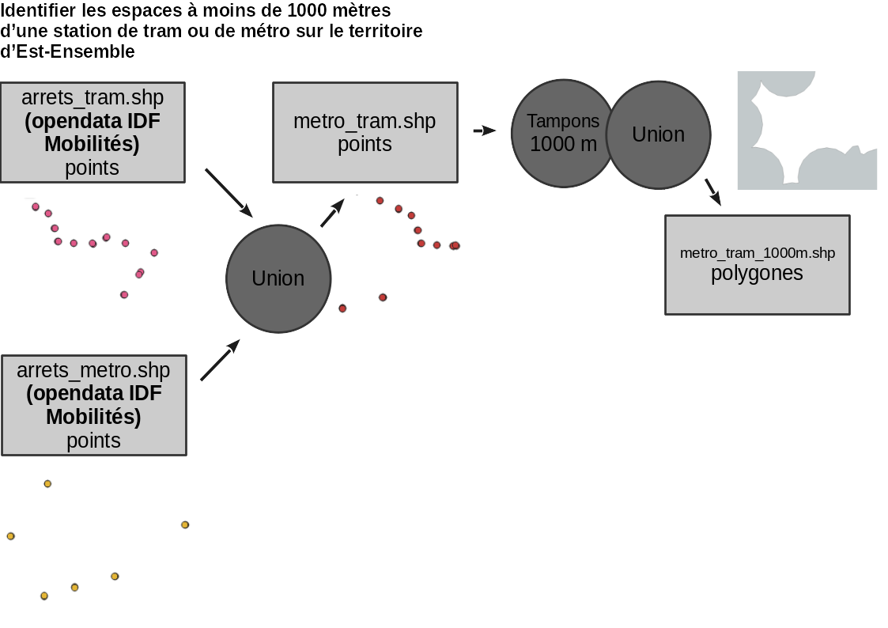
]

---

## Modéliser sa chaine de traitement

.center[
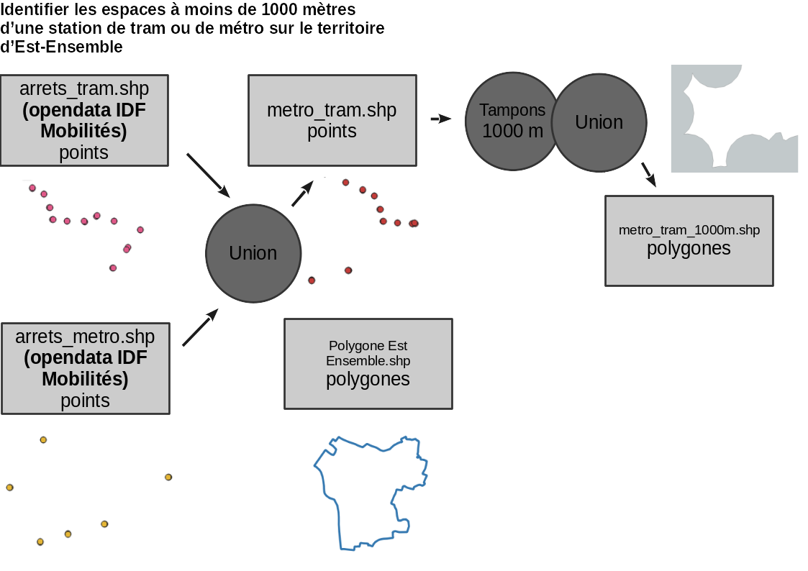
]

---

## Modéliser sa chaine de traitement

.center[
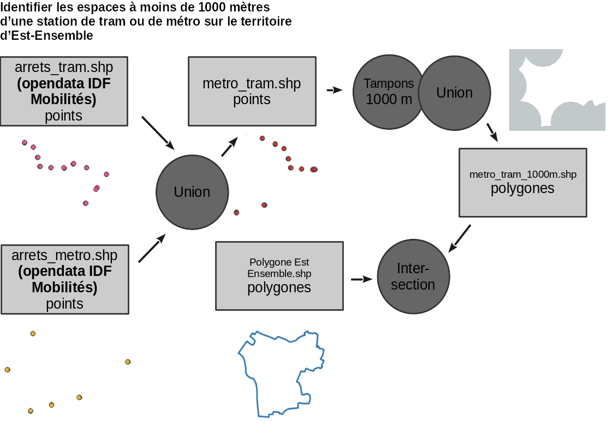
]

---

## Modéliser sa chaine de traitement

.center[
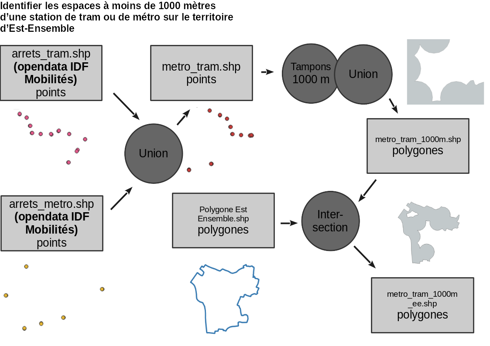
]

---

.left-column[
## Où en sommes-nous ? 

Nous avons créé ensemble toutes les couches (critère 1, 2, 3, 4 et 5) nécessaires à la définition de l'implantation finale !
]

.right-column[
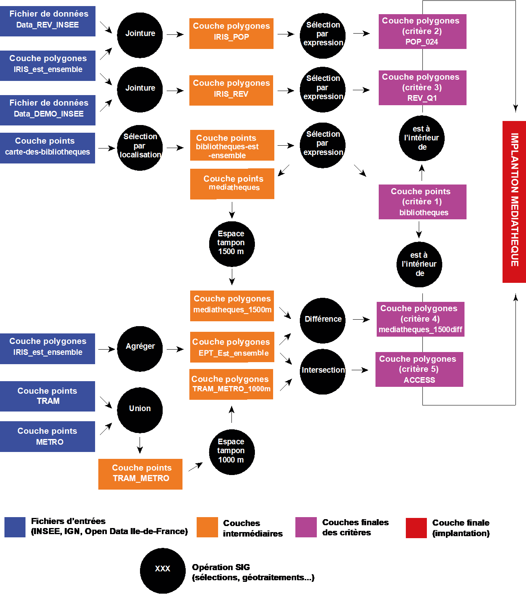
]


---
<br><br><br><br><br><br><br>
# 4. A vous de jouer !

- **Adaptez ces méthodes** aux critères que vous avez identifié. 

- Pensez à **justifier vos choix** ! Pourquoi telle distance (tampon ?), pourquoi tels points pour les stations de transport ? etc.

- Une bonne manière de procéder consiste à imaginer d'abord ce que vous souhaitez réaliser avec les couches dont vous disposez, et ensuite de modéliser sur papier la façon dont vous pensez procéder (sélections, géotraitements). Cela permettra de vous avancer sur la modélisation du chemin décisionnel.

- Vous avez la possibilité d'aller chercher d'**autres ressources couches d'information géographique** qui pourraient vous permettre d'affiner vos critères de sélection ! > si pb nous sommes là pour vous aider...

---

## Pour aller plus loin...

[**Open Data Ile-de-France**](https://data.iledefrance.fr) fournit d'autres couches géographiques que celles extraites qui peuvent être utiles pour penser de nouveaux critères.

.center[

]

Par exemple, on pourrait décider de privilégier l'implantation de cette médiathèque non loin d'une école ou d'un collège ou un lycée...


---

## Pour aller plus loin...

.left-column[
Renseignez-vous sur les géotraitements et statistiques spatiales disponibles dans QGIS. Un très bon manuel existe avec des exemples [**documentés**](https://docs.qgis.org/3.16/en/docs/training_manual/index.html).

Par exemple, la constitution d'une matrice de distance entre les bibliothèques d'Est Ensemble (outils d'analyse) permet d'identifier que la bibliothèque *Romain Roland à Romainville* est celle qui dispose de la distance moyenne aux autres bibliothèques la plus faible : 2647m.
]

.right-column[
.center[

]]