```{r setup, include=FALSE}
options(htmltools.dir.version = FALSE, crayon.enabled = TRUE)
knitr::opts_chunk$set(cache = FALSE,
                      fig.align='center',
                      message = FALSE,
                      warning = TRUE)
# install.packages("devtools")
# devtools::install_github("gadenbuie/countdown")
# devtools::install_github("mitchelloharawild/icons")
library(countdown)
library(icons)
#download_fontawesome()
```


```{r xaringan-themer, include=FALSE, warning=FALSE}
library(xaringanthemer)
style_duo_accent(
  primary_color = "#1d3352",
  secondary_color = "#383838",
  inverse_header_color = "#ffae00"
)
```


<br><br><br><br><br><br><br>
# Quelle implantation ?

---

## Une possible procédure... 

Nous avons créé 4 couches géographiques qui constituent nos critères pour l'implantation d'une nouvelle médiathèque :

- **POP024** : IRIS dont la part de la population de 0 à 24 ans est supérieure à 33 %. 
- **REV_Q1** : les 25 % plus pauvres IRIS sur le territoire d'Est Ensemble.
- **ACCESS** : l'espace situé à moins de 1000 m d'une station de métro ou de RER sur le territoire d'Est Ensemble.  
- **1500DIFF** : l'espace situé à plus de 1500 m d'une médiathèque existante.

<br>

Dans notre cas, nous allons explorer **deux situations** :

- **Nouvelle implantation** : Définir les IRIS qui présentent des caractéristiques favorables à l'implantation d'un nouvel équipement.
- **Modernisation d'une bibliothèque** : Identifier les bibliothèques dans ces secteurs favorables. 

---
## Une possible procédure... 

On peut procéder de bien des manières dans QGIS pour aboutir au résultat escompté, en voici par exemple une : 

1. Afficher les couches **IRIS**, **POP024** et **REV_Q1**.  
2. Par une **sélection par localisation**, sélectionner les IRIS de POP024 qui sont **égaux** à REV_Q1. Enregistrer la sélection sous le nom **IRIS_POP_REV**.
3. Sélectionner les IRIS de la couche **IRIS_POP_REV** qui sont à l'intérieur de **1500_DIFF**. Enregistrer la sélection sous le nom **IRIS_POP_REV_DISTMED**.
4. Sélectionner les IRIS de la couche **IRIS_POP_REV_MED** qui sont à l'intérieur de **ACCESS**. On enregistre la sélection sous le nom **IMPLANTATION_IRIS**.   

Pour maîtriser votre traitement, travaillez avec soin et méthode :
- N'affichez que les couches sur lesquelles vous effectuez vos sélections. Observez si les résultats sont conformes à votre intention avant de les enregistrer. 
- Maîtrisez l'endroit où vous enregistrez ces différents traitements intermédiaires, et nommez clairement les couches géographiques issues de ces sélections. 

---

## IRIS jeunes et à faible revenu... 

.center[
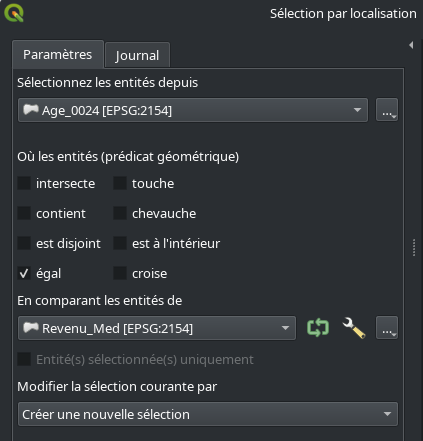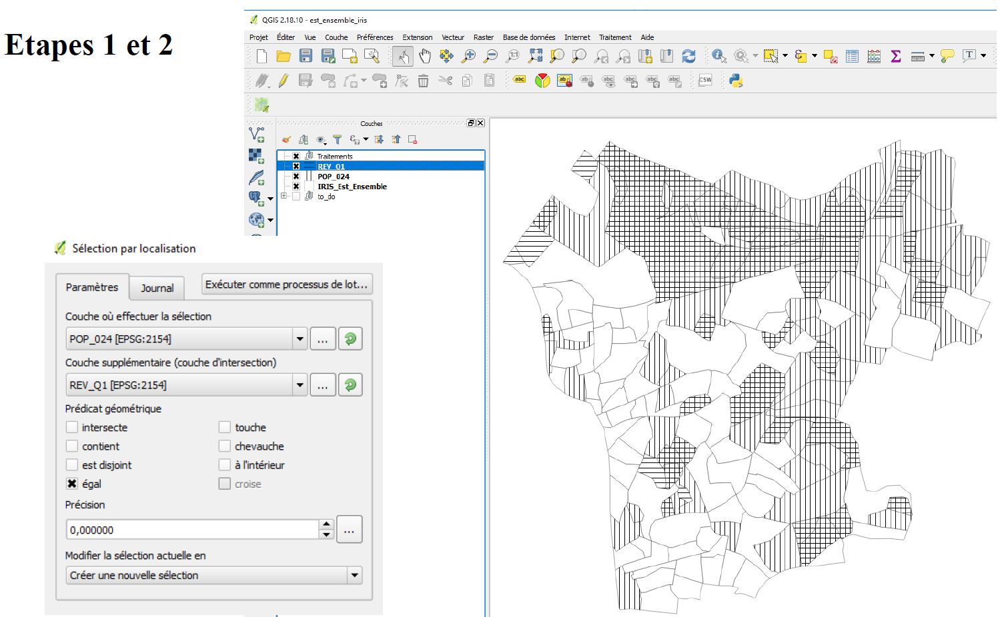
]


---

## IRIS jeunes et à faible revenu...  

.center[
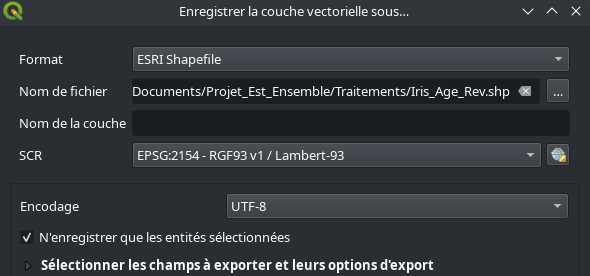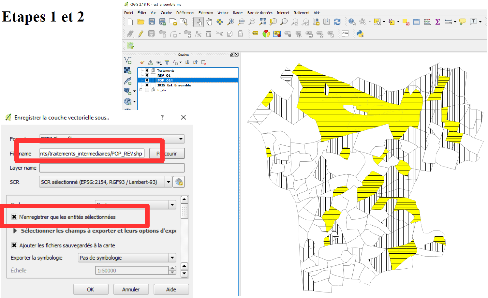
]


---

## ... A plus de 1500 m à vol d'oiseau d'une médiathèque existante...

.center[
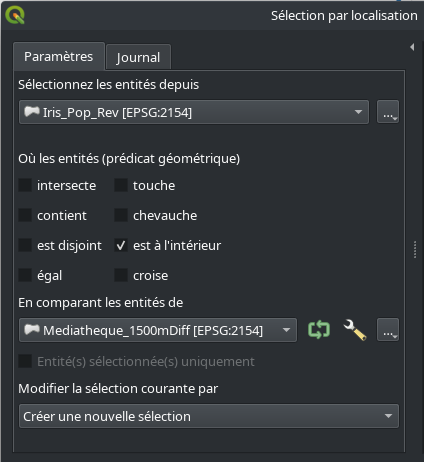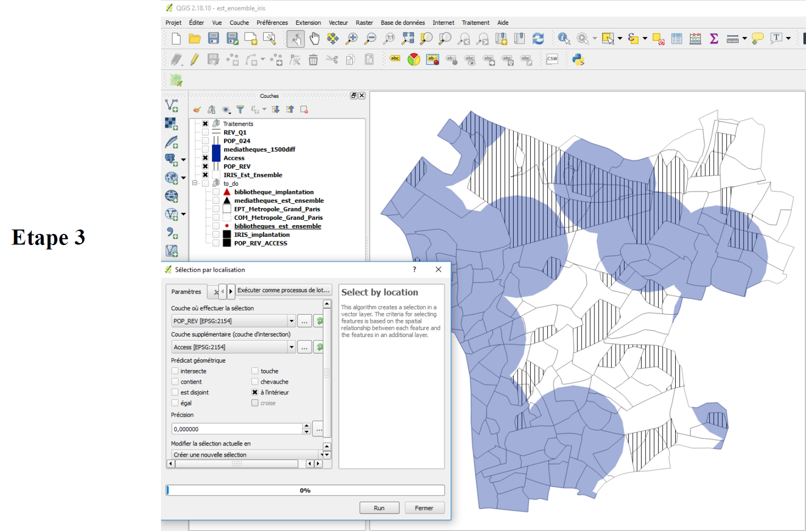
]

---

## ... A plus de 1500 m à vol d'oiseau d'une médiathèque existante...

.center[
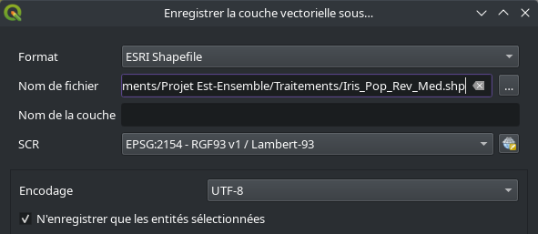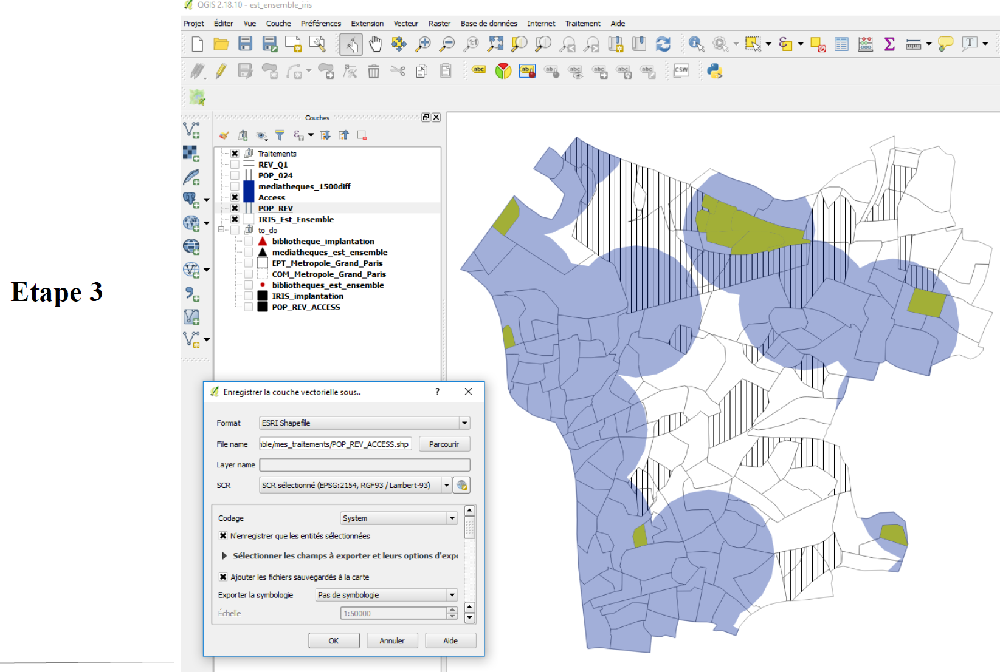
]

---

## ... Et à moins de 1000 m d'une station de métro ou de RER ! 

.center[
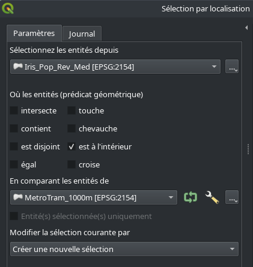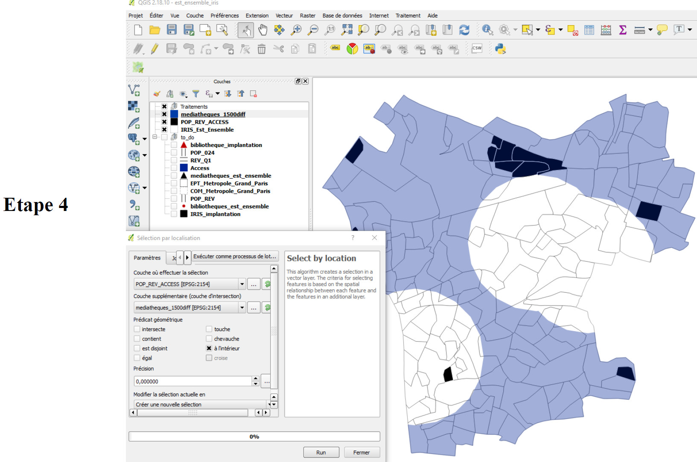
]

---

## ... Et à moins de 1000 m d'une station de métro ou de RER ! 

.center[
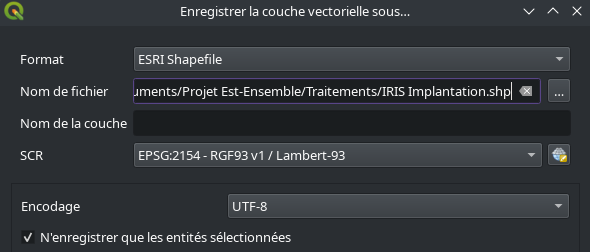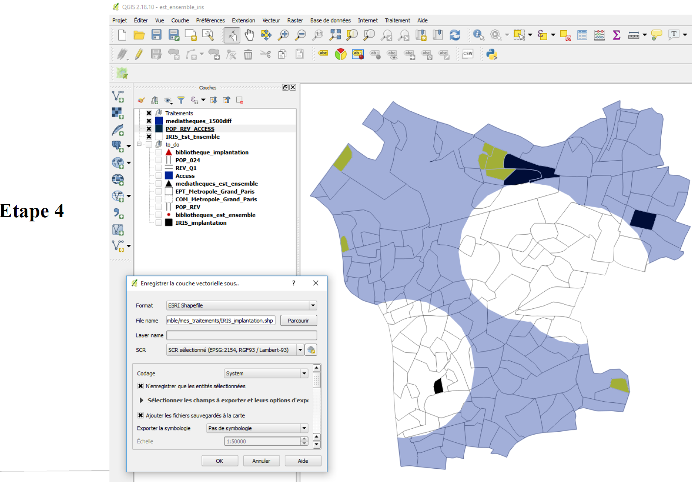
]

---
class:center

##         Eureka ! Vous avez trouvé !!        

.center[
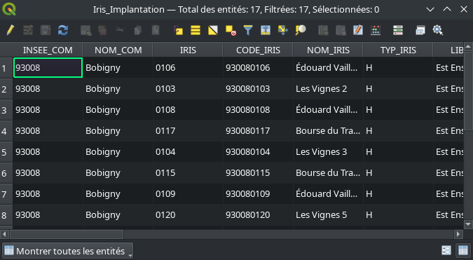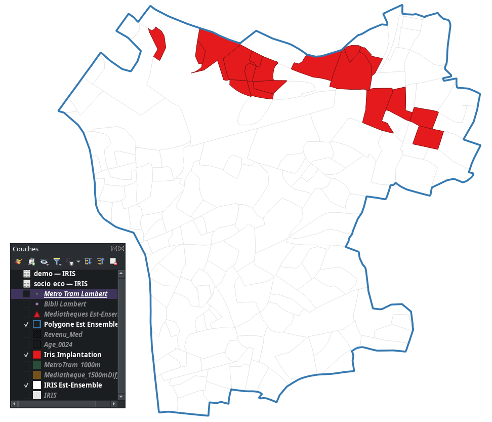
]

##


---

## Et si l'objectif était de moderniser une bibliothèque ?

.center[
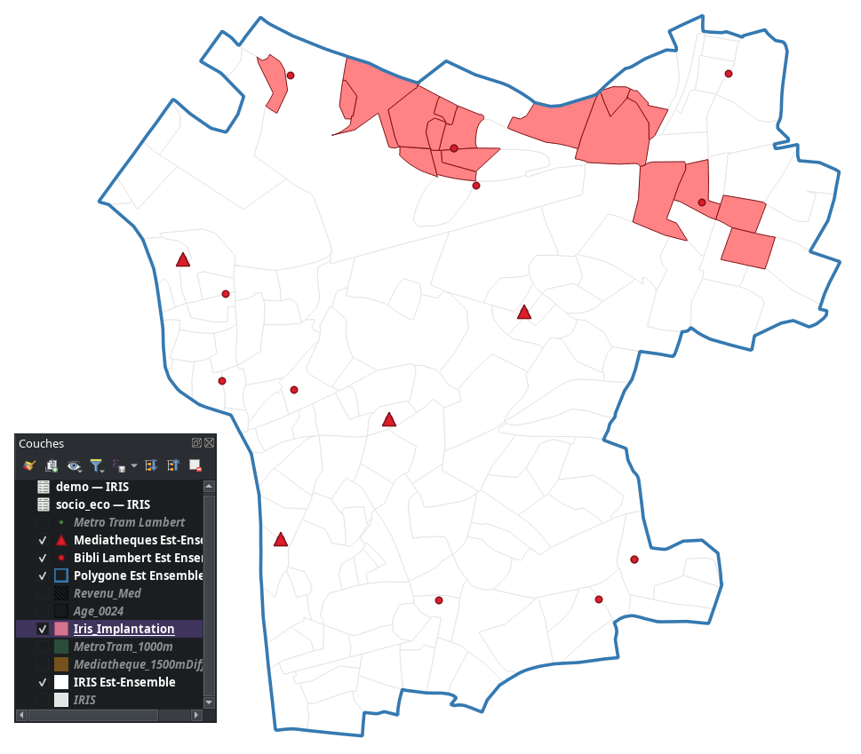
]

---


## Et si l'objectif était de moderniser une bibliothèque ?

.center[
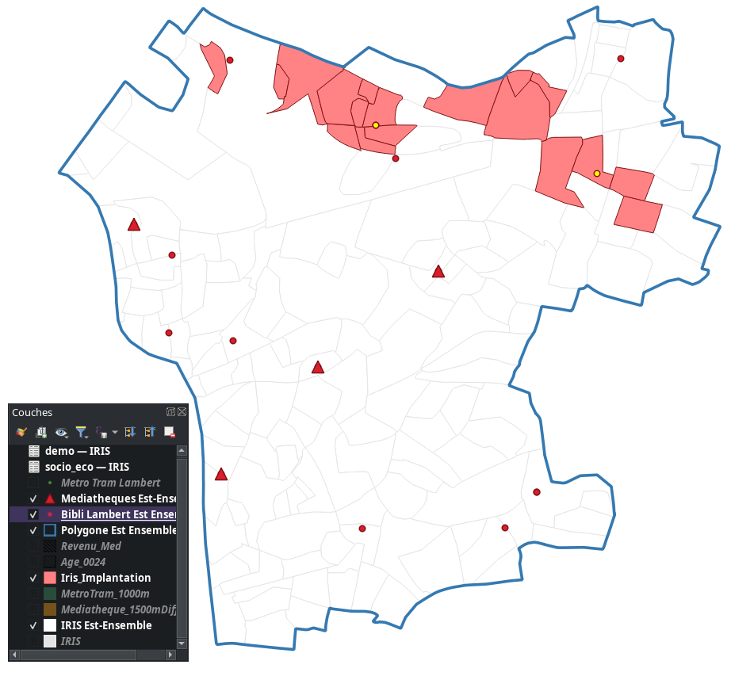
]

---

<br><br><br><br><br><br><br>
# Mettre en page sa carte avec QGIS

---
## Comment arriver à cette carte de synthèse ?

.center[

]

---

## Des éléments incontournables de mise en page

- La carte doit disposer obligatoirement d'un **titre** , d'une **échelle**,  de la mention des **sources mobilisées (nom, date de téléchargement)** et la **date de référence des données**.

- Les éléments graphiques doivent être **hiérarchisés**.

- Pour la représentation des données, respecter les règles de sémiologie graphique (séances suivantes).

- La **légende** résume les éléments présentés sur la carte. Celle-ci peut être organisée par sous-titres de légende pour mieux contextualiser l'information que vous présentez (*par ex : équipements existants, caractéristiques socio-économiques, distances aux équipements*).

- Ne pas trop surcharger la carte : ne pas hésiter à produire des cartes plutôt qu'une. 

- N'hésitez pas à jouer sur la transparence, les hachures, ajouter des labels, des encadrés etc. pour améliorer la lisibilité de votre carte !

---

## Mise en page dans QGIS

.center[

]

---

## Mise en page dans QGIS

.center[
<iframe width="840" height="472.5" src="https://www.youtube.com/embed/zuYOBoMVfrI" title="YouTube video player" frameborder="0" allow="accelerometer; autoplay; clipboard-write; encrypted-media; gyroscope; picture-in-picture" allowfullscreen></iframe>

.leg-fig[Une vidéo (source : La Minute QGIS) qui explique les fondements de la mise en page avec QGIS]
]

---
class: center middle
background-image: url("figures/ouinideyou.PNG")
background-size: contain