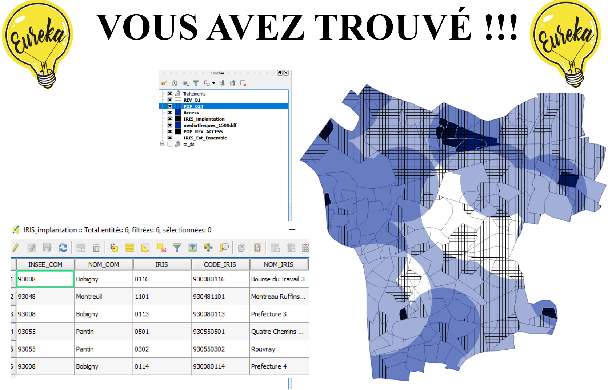
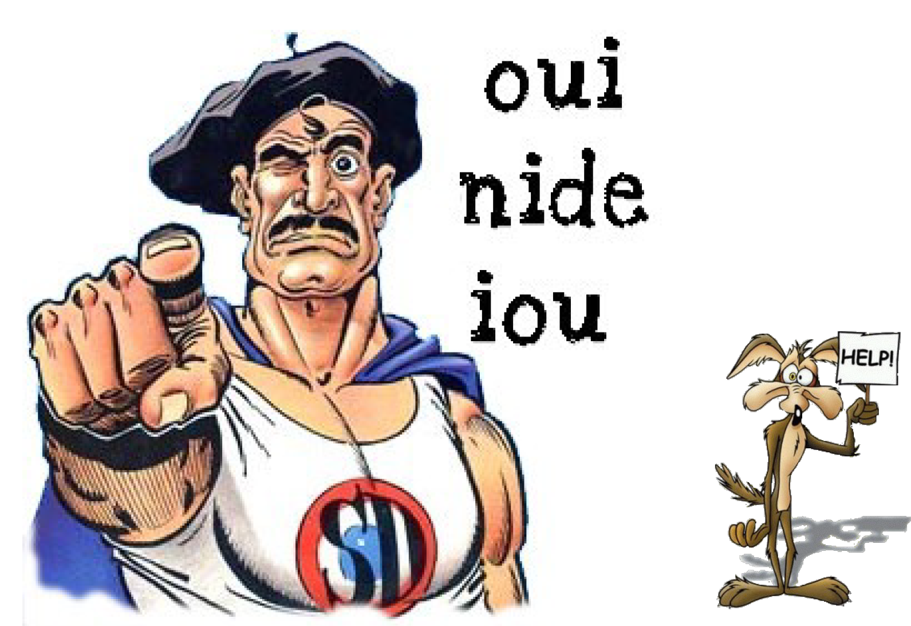

```{r setup, include=FALSE}
knitr::opts_chunk$set(echo = FALSE)
```

<script src="https://ajax.googleapis.com/ajax/libs/jquery/1.12.2/jquery.min.js"></script>

<script>
    $(document).ready(function() {
      $('slide:not(.title-slide, .backdrop, .segue)').append('<footer label=\""Initiation à la digitalisation et aux géotraitements\"></footer>');    
    })
</script>


# Quelle implantation ?

## Une possible procédure... 

<p style="font-size:15pt;line-height:1.3"> Nous avons créé 4 couches géographiques qui constituent nos critères pour l'implantation d'une nouvelle médiathèque : </p>

> -	<span style="font-size:15pt">**POP024.shp** : IRIS dont la part de la population de 0 à 24 ans est supérieure à 33 %.</span>  
> -	<span style="font-size:15pt">**REV_Q1.shp** : les 25 % plus pauvres IRIS sur le territoire d'Est Ensemble.</span> 
> -	<span style="font-size:15pt">**ACCESS.shp** : l'espace situé à moins de 1000 m d'une station de métro ou de RER sur le territoire d'Est Ensemble.</span>  
> -	<span style="font-size:15pt">**1500DIFF.shp** : l'espace situé à plus de 1500 m d'une médiathèque existante.</span>   


## Une possible procédure... 

<p style="font-size:15pt;line-height:1.3"> On peut procéder de bien des manières dans QGIS pour aboutir au résultat escompté, en voici par exemple une : </p>

> -	<span style="font-size:15pt">1. On affiche les couches **IRIS**, **POP024** et **REV_Q1**</span>  
> -	<span style="font-size:15pt">2. Par une **sélection par localisation**, on regarde les IRIS de POP024 qui sont **égaux** à REV_Q1. On enregistre la sélection sous le nom **IRIS_POP_REV**.</span> 
> -	<span style="font-size:15pt">3. On regarde les IRIS de la couche **IRIS_POP_REV** qui sont à l'intérieur de **1500_DIFF**. On enregistre la sélection sous le nom **IRIS_POP_REV_MED**.</span>  
> -	<span style="font-size:15pt">4. On regarde les IRIS de la couche **IRIS_POP_REV_MED** qui sont à l'intérieur de **ACCESS**. On enregistre la sélection sous le nom **IMPLANTATION**.</span>   

<p style="font-size:15pt;line-height:1.3"> On montre ici la possibilité 2 : quel IRIS pour une nouvelle médiathèque ? Si l'objectif aurait été de moderniser une bibliothèque nous serions partis des bibliothèques existantes et non des IRIS.</p>


## Une possible procédure... 

<div  class="centered">

</div>


## Une possible procédure... 

<div  class="centered">

</div>


## Une possible procédure... 

<div  class="centered">

</div>


## Une possible procédure... 

<div  class="centered">

</div>


## Une possible procédure... 

<div  class="centered">

</div>


## Une possible procédure... 

<div  class="centered">

</div>


## Une possible procédure... 

<div  class="centered">

</div>


# Mettre en page sa carte avec QGIS

## Comment arriver à cette carte de synthèse ?

<div  class="centered">

</div>


## Des éléments incontournables

<p style="font-size:18pt;line-height:1.3"> La carte doit disposer obligatoirement d'un **titre**, une **échelle**, la mention des **sources utilisées**, la **date des données**. </p>

<p style="font-size:18pt;line-height:1.3"> Les éléments graphiques doivent être **hiérarchisés**. </p>

<p style="font-size:18pt;line-height:1.3">On doit pouvoir distinguer les différentes informations représentées sur la carte (information qualitative).</p>

<p style="font-size:18pt;line-height:1.3">N'hésitez pas à jouer sur la transparence, les hachures, ajouter des labels, des encadrés etc. pour améliorer la lisibilité de votre carte !</p>


## Dans QGIS : projet > mise en page 

<div  class="centered">

</div>


# A vous de jouer !

<div  class="centered">

</div>
