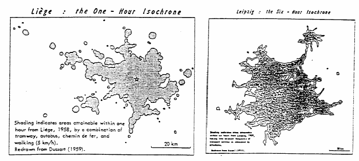
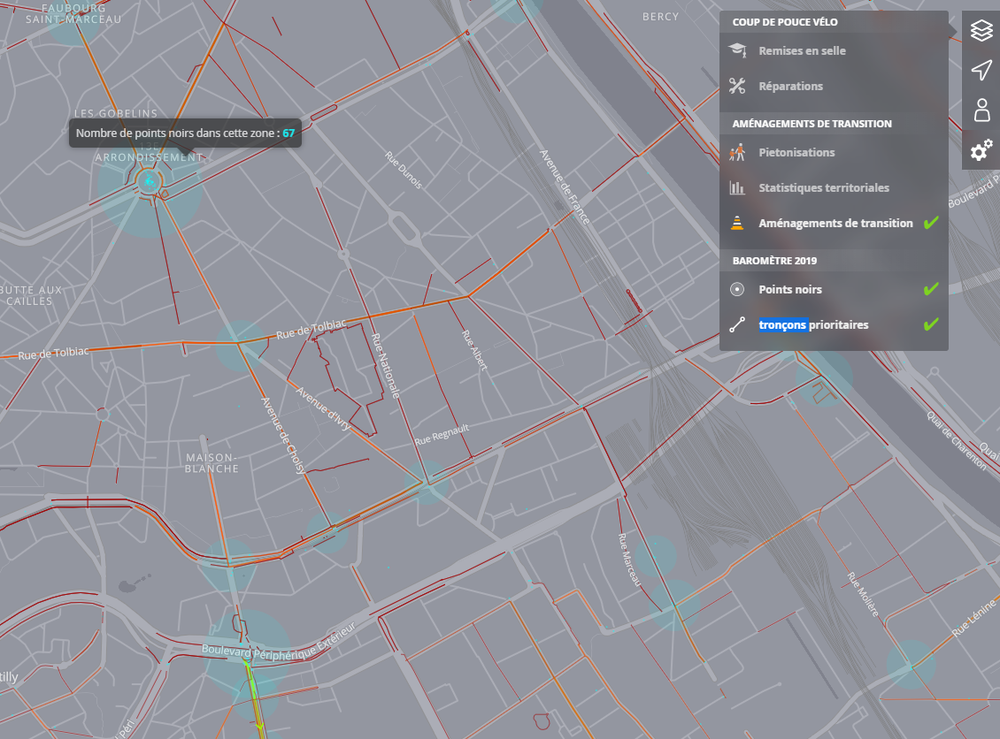
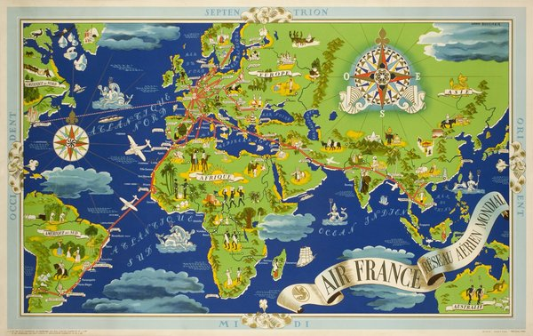
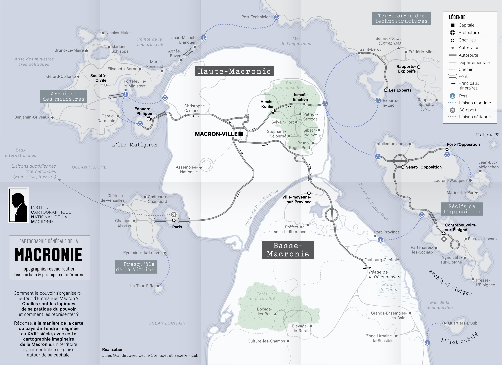
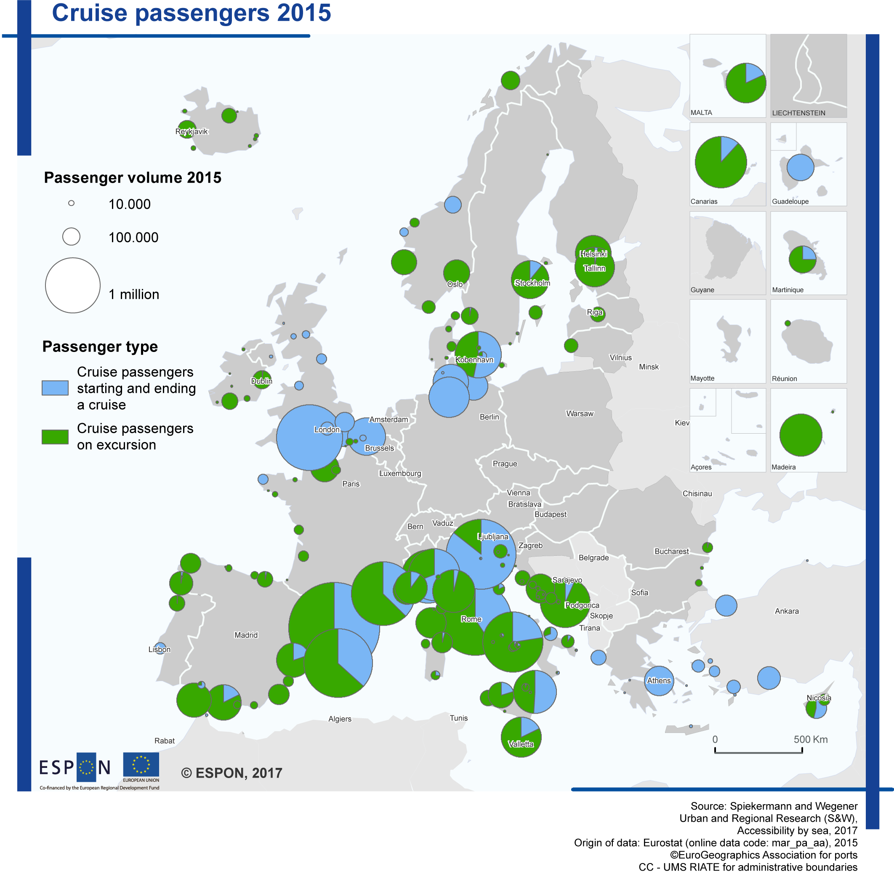
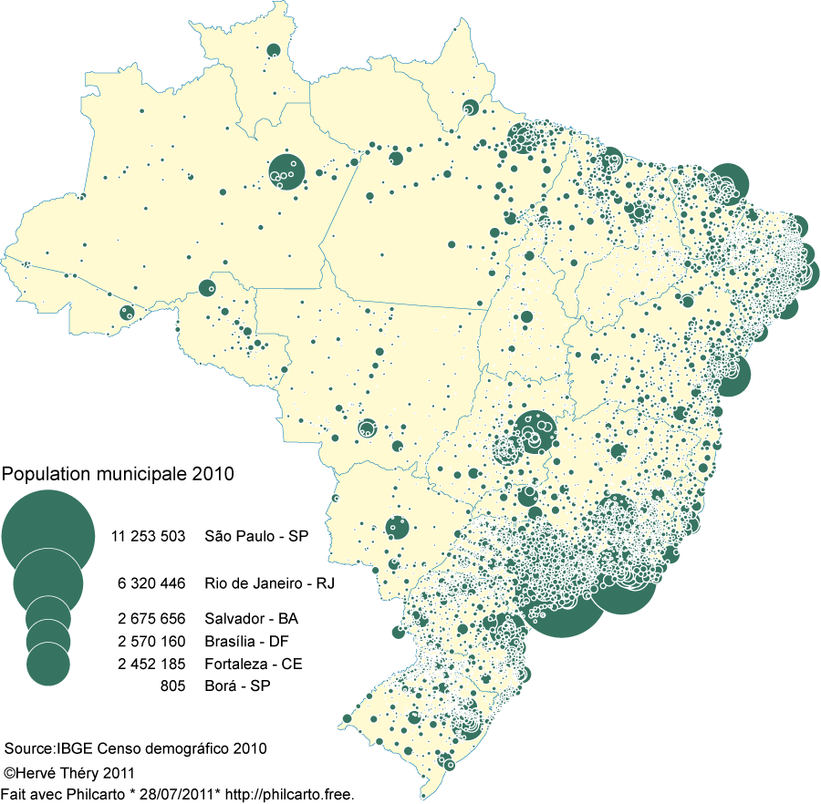

```{r setup, include=FALSE}
options(htmltools.dir.version = FALSE, crayon.enabled = TRUE)
knitr::opts_chunk$set(cache = FALSE,
                      fig.align='center',
                      message = FALSE,
                      warning = TRUE)
# install.packages("devtools")
# devtools::install_github("gadenbuie/countdown")
# devtools::install_github("mitchelloharawild/icons")
library(countdown)
library(icons)
#download_fontawesome()
```


```{r xaringan-themer, include=FALSE, warning=FALSE}
library(xaringanthemer)
style_duo_accent(
  primary_color = "#1d3352",
  secondary_color = "#383838",
  inverse_header_color = "#ffae00"
)
```
<br><br><br><br><br><br><br>
# Cartographie ? 

---
## Deux grandes catégories de cartes

Il existe une **multitude de réalisations cartographiques** : *carte météo, géologique, de végétation, climatique, touristique, d'inventaire, routière, animée, interactive*.... **Deux grandes catégories se dégagent** :

.pull-left[
### Cartes topographiques

]

.pull-right[
### Cartes thématiques

]

---
## La cartographie

**La cartographie est une discipline** (composante de la géomatique) qui a pour objectif la construction de cartes. c'est à la fois une discipline  **scientifique**, **technique** et **artistique**.

.pull-left[
### Une science 
Les **bases sont mathématiques** (Système de référence et projection). L’enjeu est la **précision et la fiabilité**.    

La représentation cartographique est régie par des **règles de sémiologie graphique** et un **socle méthodologique fort**. 

Des recherches sont effectuées en cartographie (efficacité communicationnelle, cartographie animée, optimisation de la représentation des flux).

]

.pull-right[

]

---

## La cartographie

**La cartographie est une discipline** (composante de la géomatique) qui a pour objectif la construction de cartes. c'est à la fois une discipline  **scientifique**, **technique** et **artistique**.

.pull-left[
### Une technique
Sa maitrise repose sur l'acquisition de données, la préparation et le traitement de données, **et la maîtrise de logiciels**
spécialisés... 
]

.pull-right[

]


---

## La cartographie

**La cartographie est une discipline** (composante de la géomatique) qui a pour objectif la construction de cartes. c'est à la fois une discipline  **scientifique**, **technique** et **artistique**.

.pull-left[
### Un art  

Recherche d'**esthétisme**, d'une **"touche graphique"**.

Comme pour tout objet de communication, le graphisme d'une carte à un impact sur la transmission du message.

<br><br><br>
.leg-fig[
Frontière États-Unis / Mexique : une fracture humaine et économique ([Rekacewicz, 2009](https://www.monde-diplomatique.fr/cartes/maquiladoras)) >>

]
]

.pull-right[

]
---

## La cartographie

**La cartographie est une discipline** (composante de la géomatique) qui a pour objectif la construction de cartes. c'est à la fois une discipline  **scientifique**, **technique** et **artistique**.

.pull-left[
### Un art  

Recherche d'**esthétisme**, d'une **"touche graphique"**.

Comme pour tout objet de communication, le graphisme d'une carte à un impact sur la transmission du message.

<br><br><br>
.leg-fig[
War Business ([Lambert, Zainin, Mad Maps, 2019](http://www.cartolycee.net/spip.php?article152)) >>

]
]

.pull-right[

]
---

.pull-left[
## Un public, un objectif et un message

On distingue souvent ([Jégou, 2021](https://rawcdn.githack.com/transcarto/presentation_images/20d4feabc6bf2c18278efa0457b302e2e7b39419/Pr%C3%A9sentation_LJegou.html#1)) :

- La carte **performative**, qui vise à faire réagir, de propagande, rhétorique (vision *post-moderniste*, B. Harley). 

.leg-fig[
Bunge W., Bordessa R., 1975, Region of Rat-Bitten Babies, the Canadian Alternative
]
]

.pull-right[


.leg-fig[
<p>Bunge W., 1971, Geography of Revolution</p>
Pour en savoir plus, allez [ici](https://jacket2.org/commentary/william-bunge-dgei-radical-cartography) 
]
]

---

.pull-left[
## Un public, un objectif et un message

On distingue souvent ([Jégou, 2021](https://rawcdn.githack.com/transcarto/presentation_images/20d4feabc6bf2c18278efa0457b302e2e7b39419/Pr%C3%A9sentation_LJegou.html#1)) :

- La carte **performative**, qui vise à faire réagir, de propagande, rhétorique (vision *post-moderniste*, B. Harley). 

- La carte comme **outil d'analyse**, moyen de faire découvrir des phénomènes et des relations, dans un processus d'exploration et de transformation (paradigme *analytique*, W. Tobler et K. Clarke)


]

.pull-right[
.center[

 .leg-fig[Gilbert W, 1958, Adaptation de la carte de John Snow sur l'épidémie de choléra à Londres en 1854
]]
.medium[
<br><br><br>
<< Tobler 1993, [Three presentations of geographical analysis and modeling, Technical Report](http://www.lukatela.com/hrvoje/papers/tobler93.html)
]]

---

.pull-left[
## Un public, un objectif et un message

On distingue souvent ([Jégou, 2021](https://rawcdn.githack.com/transcarto/presentation_images/20d4feabc6bf2c18278efa0457b302e2e7b39419/Pr%C3%A9sentation_LJegou.html#1)) :

- La carte **performative**, qui vise à faire réagir, de propagande, rhétorique (vision *post-moderniste*, B. Harley). 

- La carte comme **outil d'analyse**, moyen de faire découvrir des phénomènes et des relations, dans un processus d'exploration et de transformation (paradigme *analytique*, W. Tobler et K. Clarke)

- La carte comme **outil d'organisation** d'une communauté sur son territoire (paradigme *participatif*, M. Noucher, T. Jolliveau).

]

.pull-right[
.center[
<br><br><br><br><br>

.medium[
Cartographie des points noirs et des tronçons à aménager de façon prioritaire

([Fédération des Usagers de la Bicyclette, 2019, 18 3000 contributions](https://carto.parlons-velo.fr/))
]
]
]

---

.pull-left[
## Un public, un objectif et un message

On distingue souvent ([Jégou, 2021](https://rawcdn.githack.com/transcarto/presentation_images/20d4feabc6bf2c18278efa0457b302e2e7b39419/Pr%C3%A9sentation_LJegou.html#1)) :

- La carte comme **outil de visualisation de son propre territoire et de navigation**, adaptée et centrée sur sa position actuelle (paradigme de l'*égo-cartographie*) 

]

.pull-right[
<br><br><br><br><br>

.center[

]
]

---
 
.pull-left[
## Un public, un objectif et un message

On distingue souvent ([Jégou, 2021](https://rawcdn.githack.com/transcarto/presentation_images/20d4feabc6bf2c18278efa0457b302e2e7b39419/Pr%C3%A9sentation_LJegou.html#1)) :

- La carte comme **outil de visualisation de son propre territoire et de navigation**, adaptée et centrée sur sa position actuelle (paradigme de l'*égo-cartographie*) 

- La carte **décorative**, à valeur esthétique, historique, émotive.
]

.pull-right[
.center[
<br><br><br><br><br>

.leg-fig[
Boucher, L., 1937, affiche publicitaire Air France
]]]

---

 
.pull-left[
## Un public, un objectif et un message

On distingue souvent ([Jégou, 2021](https://rawcdn.githack.com/transcarto/presentation_images/20d4feabc6bf2c18278efa0457b302e2e7b39419/Pr%C3%A9sentation_LJegou.html#1)) :

- La carte comme **outil de visualisation de son propre territoire et de navigation**, adaptée et centrée sur sa position actuelle (paradigme de l'*égo-cartographie*) 

- La carte **décorative**, à valeur esthétique, historique, émotive.

- La carte **imaginaire ou poétique**, qui vise à faire réfléchir.
]

.pull-right[
.center[
<br><br><br><br><br>

.leg-fig[
Grandin J., 2018
]]]


---

## Prendre du recul

Le contexte de production compte, pour mieux appréhender les questions de lisibilité et de transmission du message cartographique (Jégou, 2021) :

- Quel ***rôle*** j'endosse quand je produis une carte ?

- À quoi doit ***servir*** ma carte, comment doit-on y réagir ? 

- À quel ***public*** est-elle destinée ? Que doit-il savoir pour la comprendre ?

- Au final, comment ***fonctionne*** ma carte ? 

<br>

Efficacité et lisibilité de la carte (communication) + design (message véhiculé par la carte)

Cela influence directement l'**emprise géographique** et la **projection utilisée**, la **généralisation du fond de carte**, les choix graphiques (fontes, couleurs, format de diffusion), le vocabulaire utilisé. 

---

## Prendre du recul

.center[
<iframe width="840" height="472.5" src="https://www.youtube.com/embed/RDwn5Qzq6Fc" title="YouTube video player" frameborder="0" allow="accelerometer; autoplay; clipboard-write; encrypted-media; gyroscope; picture-in-picture" allowfullscreen></iframe>

.leg-fig[Méfiez-vous des cartes, pas des migrants (Lambert, Bahoken, 2018)]
]

---

.left-column[
## La carte thématique / statistique


.medium[
Un outil d’**analyse**, d’**aide à la décision** et de **communication** largement apprécié et utilisé.

Un document graphique basé sur la **communication par les signes**. Elle relève du **langage visuel** et nécessite d'être appréhendée comme tel.
]
]

.right-column[

.leg-fig[
[Lambert N., 2021](https://neocarto.hypotheses.org/3239)]

Nécessité d'**identifier les moyens graphiques** qui permettent de passer d'une **information statistique spatialisée** à une **représentation graphique efficace**
]

---

<br><br><br><br><br><br><br>
# Les fondamentaux

---

## Les fondamentaux

L’efficacité d'une carte thématique réside dans le **temps nécessaire** pour mémoriser correctement l’information qui veut être transmise. Pour cela, il ne faut jamais oublier : 
  
1- L’**objectif** de la carte et le **public visé**

2- Les **codes** et **conventions** de la cartographie

3- Les règles de la **sémiologie graphique**.


---
.pull-left[

## Codes et conventions cartographiques : Aider à la mise en contexte
### Des éléments obligatoires

.medium[
- Un **titre** 
- Une **date**
- Une **légende**  
- Une **source** (un **auteur**)
- Une **échelle** 
- Une **orientation** (optionnel).  
 ]

### Couleurs et projections

.medium[
Le choix des couleurs n'est pas anodin (considérations thématiques, statistiques, culturelles, etc.)

L'usage de la projection doit être maîtrisé. Il est parfois soumise à des normes, comme vu lors des précédentes séances.
]
]
 
.pull-right[

 .leg-fig[
 [Lambert, N, Des morts par milliers aux portes de l'Europe, 2015](https://neocarto.hypotheses.org/1370)
 ]
 ]

---

## Les Règles de la sémiologie graphique

.center[
Le **langage cartographique** a été théorisé par **Jacques Bertin** (1967).

.pull-left[

]

.pull-right[

]

« ***La graphique*** *utilise les propriétés de l'image visuelle pour faire apparaître les* ***relations*** *de* ***différence***, ***d'ordre*** et de ***proportionnalité*** entre les données ».
]
---

## Sémiologie graphique : implantation et variable visuelle

.pull-left[
**L'implantation** est la transcription graphique - par des points, des lignes ou des polygones - d'un objet géographique.

Trois types d'implantation existent : **ponctuel**, **linéaire** et **zonale** (surfacique).

<br>

**Les variables visuelles** (ou rétiniennes) sont les **moyens graphiques pour retranscrire visuellement une information**.

Elles possèdent des propriétés différentes qui permettent de **différencier**, **ordonner** et **mesurer les données**.
]

.pull-right[
.center[

<br><br><br><br>


.leg-fig[Source : Manuel de cartographie : principes, méthodes, applications (Lambert, Zanin, 2016)]
]
]
---

## Les variables visuelles (6 + 1)

.pull-left[


]

.pull-right[


.leg-fig[Source : Manuel de cartographie : principes, méthodes, applications (Lambert, Zanin, 2016)]
]


---

## Les 3 propriétes des variables visuelles

.center[


.leg-fig[Source : Manuel de cartographie : principes, méthodes, applications (Lambert, Zanin, 2016)]
]
---

## Des relations différentes selon le type de données

.center[


.leg-fig[Source : Manuel de cartographie : principes, méthodes, applications (Lambert, Zanin, 2016)
]
]


---

## Données quantitatives et qualitatives

.pull-left[
Une variable est **quantitative** lorsque **ses valeurs sont des nombres** qui peuvent être **ordonnés** et dont la **moyenne a un sens**.

.medium[
Elle est **quantitative absolue** lorsqu'il s'agit d'une **variable de stock** qui exprime des quantités concrètes : la **somme a un sens**.
> Une surface, une population, une richesse

Elle est **quantitative relative** lorsqu'il s'agit d'une **variable de taux** qui exprime un  rapport entre deux quantités ou un indice : **la somme n'a aucune signification**.
> Densité de population, un indice de développement humain...  

]
]

.pull-right[
Une variable est dite **qualitative** lorsque **ses valeurs sont définies par des modalités** (catégories, niveaux) et la **moyenne n'a aucune signification**.

.medium[
Elle est **qualitative ordinale** lorsque ses modalités peuvent être **hiérarchisées**, suivant un ordre logique : 
> [*zonage communale en aires urbaines de 2010*](https://www.insee.fr/fr/statistiques/1281191)

Il s'agit d'une variable **qualitative nominale**.
> Langue officielle des pays du monde, zones climatiques... 

]
]

---

## Comment caractériser ses données ?

.center[

.leg-fig[Source : Manuel de cartographie : principes, méthodes, applications (Lambert, Zanin, 2016)]
]

---

## Comment caractériser ses données ?

.center[

]

---

## Une erreur à éviter absolument ! 

.center[


.leg-fig[Source : Manuel de cartographie : principes, méthodes, applications (Lambert, Zanin, 2016)]
]

---

## Choisir la bonne variable visuelle

.center[
Le choix des représentations cartographiques se fait en fonction de la **nature de la donnée** à représenter et le **type d'implantation** de **l'objet géographique** concerné par la représentation. 


.leg-fig[Source : Manuel de cartographie : principes, méthodes, applications (Lambert, Zanin, 2016)]
]


---

<br><br><br><br><br><br><br>
# Représenter des données quantitatives absolues

---

## Représenter des données quantitatives absolues

**UNE SEULE variable visuelle** peut être utilisée pour représenter des données **quantitatives absolues** : la variable visuelle **TAILLE**.

.center[


.leg-fig[Source : Manuel de cartographie : principes, méthodes, applications (Lambert, Zanin, 2016)]

C'est la seule variable visuelle qui permet de retranscrire correctement ***des différences***, ***une hiérarchie*** et surtout ***la proportionnalité***.
]

---

## Données quantitatives absolues - *implantation ponctuelle*

.center[



.leg-fig[
Source : [ESPON, 2017](https://www.espon.eu/topics-policy/publications/maps-month/shaping-new-policies-specific-types-territories-europe-islands#prettyPhoto)]
]
]

---

## Données quantitatives absolues - *implantation linéaire*

.center[


.leg-fig[Les émigrants du Globe (Minard, 1858)]
]

---

## Données quantitatives absolues - *implantation linéaire*

.center[
.pull-left[

]

.pull-right[

]
]
---

## Données quantitatives absolues - *implantation surfacique*

.left-column[
Pas de solution graphique simple pour utiliser la variable visuelle taille sur une surface. Il est généralement nécessaire d'extraire un figuré ponctuel de l'implantation surfacique

Les logiciels de cartographie placent généralement le figuré ponctuel sur le barycentre des polygones (centroide).
]

.right-column[

.center[


.leg-fig[La population brésilienne par municipio en 2010 ([Théry, 2011](https://braises.hypotheses.org/76))]
]
]

---

## Données quantitatives absolues - *implantation surfacique*

.center[

]

---

## Données quantitatives absolues - *variante : carte en proportion*

.center[ 

]

---

## Données quantitatives absolues - *variante : diagramme et camembert*

.pull-left[

]

.pull-right[

]   

---

## Données quantitatives absolues - *variante : cartogramme / anamorphose*

.pull-left[


]

.pull-right[

]


---

## Données quantitatives absolues - *variante : carte en point*

.pull-left[

]

.pull-right[

]


---
<br><br><br><br><br><br><br>
# Représenter des données quantitatives relatives

---

## Représenter des données quantitatives relatives

Les variables visuelles adaptées à la représentation de données quantitatives relatives sont la **VALEUR**, la **COULEUR** (intensité/dégradé), le **GRAIN** ou la **TEXTURE-STRUCTURE**
Elles permettent de retranscrire visuellement des **différences** et une **hiérarchie**.

.pull-left[


]

.pull-right[


**--> N'utilisez jamais la TAILLE**
]

---

## Discrétiser des données quantitatives relatives

.pull-left[

Un préalable à la représentation des données quantitatives relatives consiste à **discrétiser la série statistique en plusieurs classes**.

Il existe plusieurs **méthodes de discrétisation**. Leur choix dépend :

- de la **forme de la distribution statistique**
- des **valeurs centrales** (moyenne, médiane) 
- des **paramètres de dispersion statistique** (écart-type)         

Ce choix à un **impact important** sur l'information représentée...

<br><br><br>
.leg-fig[Source : Manuel de cartographie : principes, méthodes, applications (Lambert, Zanin, 2016)] >>
]

.pull-right[
.center[

]
]

---

## Données quantitatives relatives - *implantation surfacique*

.center[


.leg-fig[
Potentiel d'incendie ([USGS, 2013](https://www.usgs.gov/ecosystems/lcsp/fire-danger-forecast/legacy-fire-danger-forecast-products))
]
]


---

## Données quantitatives relatives - *implantation surfacique*

.center[

]

---

## Données quantitatives relatives - *implantation surfacique*

.pull-left[

]

.pull-right[

]

---

## Données quantitatives relatives - *implantation ponctuelle*

.center[

]

---

## Données quantitatives relatives - *implantation linéaire*

.center[

]


---

<br><br><br><br><br><br><br>
# Représenter des données qualitatives

---

## Représenter des données qualitatives

.pull-left[

.center[
**Qualitative NOMINALE**


Exprime la **différence** entre les modalités
]
]

.pull-right[
.center[
**Qualitative ORDINALE**

   
    
   
   

Exprime l'**ordre** et la **hiérarchie** entre les modalités.
]
]

---

## Donnée qualitative nominale - *implantation ponctuelle*

.center[


]

---
## Donnée qualitative nominale - *implantation ponctuelle*

.center[

]

---

## Donnée qualitative nominale - *implantation ponctuelle*

.center[

]

---
## Donnée qualitative nominale - *implantation linéaire*

.center[

]

---

## Donnée qualitative nominale - *implantation surfacique*

.center[

]

---

## Donnée qualitative nominale - *implantation surfacique*

.center[

]


---

## Donnée qualitative ordinale - *implantation ponctuelle*

.center[

]

---

## Donnée qualitative ordinale - *implantation linéaire*

.center[

]

---

## Donnée qualitative ordinale - *implantation linéaire*
.center[

]

---

## Donnée qualitative ordinale - *implantation surfacique*

.center[

]

---
## Donnée qualitative ordinale - *implantation surfacique*

.center[

]

---

## Composition de données qualitatives en cartographie d'édition
 
.center[

]

---

<br><br><br><br><br><br><br>
# [#Map failed](https://twitter.com/i/events/1100700507620950017?lang=en)

---

## Cherchez l'erreur...

.center[

]

---

## Cherchez l'erreur...

.pull-left[

]

.pull-right[

]

---

## Cherchez l'erreur...

.center[

]

---

## Cherchez l'erreur...

.center[

]

---

## Cherchez l'erreur...

.center[

]

---

## Cherchez l'erreur...

.center[

]

---

## Cherchez l'erreur...

.center[
>
]

---
.pull-left[

]

--
.pull-right[

]

---
## Références


