```{r setup, include=FALSE}
options(htmltools.dir.version = FALSE, crayon.enabled = TRUE)
knitr::opts_chunk$set(cache = FALSE,
                      fig.align='center',
                      message = FALSE,
                      warning = TRUE)
# install.packages("devtools")
# devtools::install_github("gadenbuie/countdown")
# devtools::install_github("mitchelloharawild/icons")
library(countdown)
library(icons)
#download_fontawesome()
```


```{r xaringan-themer, include=FALSE, warning=FALSE}
library(xaringanthemer)
style_duo_accent(
  primary_color = "#1d3352",
  secondary_color = "#383838",
  inverse_header_color = "#ffae00"
)
```


<br><br><br><br><br><br><br>
# Définitions

---

## La cartographie

**La cartographie est une discipline** (composante de la géomatique) qui a pour objectif la construction de cartes. c'est à la fois une discipline  **scientifique**, **technique** et **artistique**.

.pull-left[

### Une science 
Les **bases sont mathématiques** (Système de référence et projection). L’enjeu est la **précision et la fiabilité**.    
La représentation cartographique est régie par des **règles de sémiologie graphique**. 

]

.pull-left[

]

### Une technique
Acquisition de données, préparation et traitement de données, **maîtrise de logiciels**
spécialisés... 


---

## La cartographie

**La cartographie est une discipline** (composante de la géomatique) qui a pour objectif la construction de cartes. c'est à la fois une discipline  **scientifique**, **technique** et **artistique**.

### Un art  
Recherche d'**esthétisme**. Comme pour tout objet de communication, le graphisme d'une carte à un impact sur la transmission du message.


---

## La carte géographique

**Une carte est une représentation géométrique plane, simplifiée et conventionnelle de tout ou partie de la surface terrestre**, et cela dans un rapport de similitude convenable qu'on appelle échelle. (*F. Joly, 1976*).

**Une carte géographique est une représentation d'un espace géographique**. Elle met en valeur l'étendue de cet espace, sa localisation relative par rapport aux espaces voisins, ainsi que la localisation des éléments qu'il contient. **Les cartes servent également à représenter des phénomènes géographiques dont la configuration spatiale produit du sens.**

<br>
La carte est un outil précisément défini.Sa réalisation est sujette à des **conventions**.

---

## Deux grandes catégories de cartes

Il existe une **multitude de cartes géographiques** : carte météo, géologique, de végétation, climatique, touristique, d'inventaire, routière, animée, interactive, spatiocarte.... **Mais deux grandes catégories se dégagent** :</p>

.pull-left[
### Cartes topographiques

]

.pull-right[
### Cartes thématiques
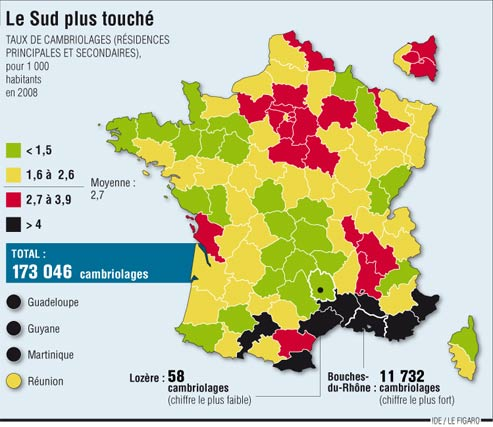
]

---

## La carte thématique

**Carte représentant sur un fond repère** topographique, hydrographique, chorographique ou géographique, **des phénomènes localisables de toute nature, qualitatifs ou quantitatifs**.


.left-column[
**La cartographie thématique est un outil d’analyse, d’aide à la décision et de communication** largement utilisé pour représenter une ou plusieurs variables.

C'est un **moyen très efficace d’exprimer des idées et de repérer des phénomènes** qui ne le seraient pas (ou plus difficilement) par d’autres moyens.

Cest un **document graphique basé sur la communication par les signes. Elle relève du langage visuel**, sa construction doit suivre **les règles de la sémiologie graphique**.
]

.right-column[

]

---

<br><br><br><br><br><br><br>
# Quelques exemples

---

## Carte choroplèthe - *variable quantitative relative*

.pull-left[

]

.pull-right[
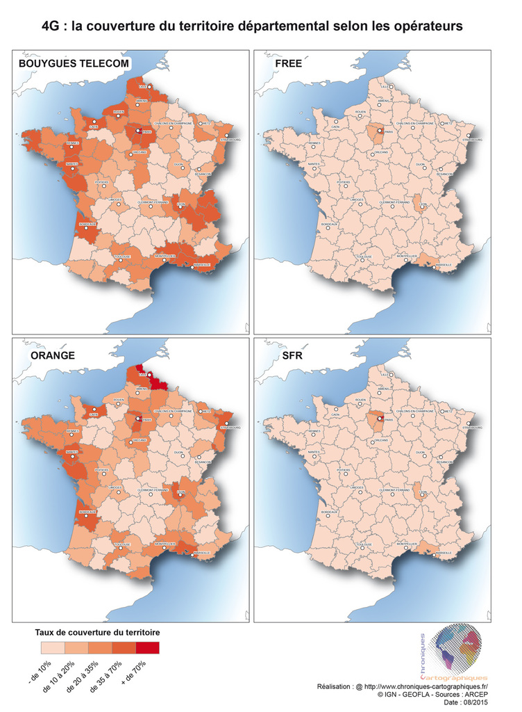
]

---

## Carte choroplèthe - *variable qualitative*

.pull-left[

]

.pull-right[

]

---

## Carte en proportion - *variable quantitative absolue*

.pull-left[
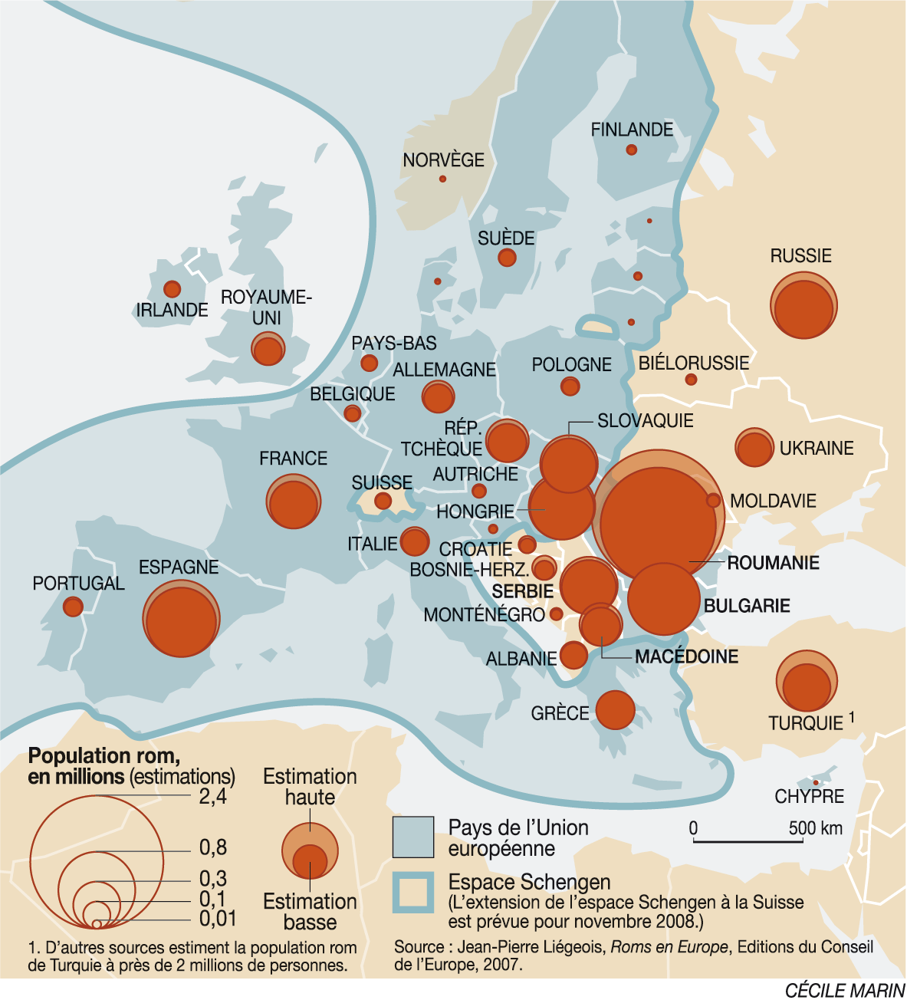
]

.pull-right[
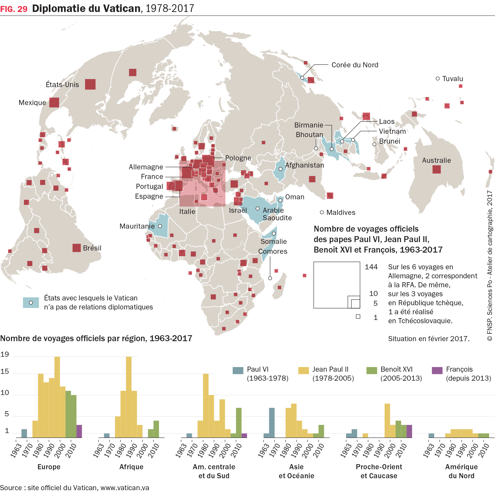
]

---

## Carte en proportion - *variable quantitative absolue*

.center[ 
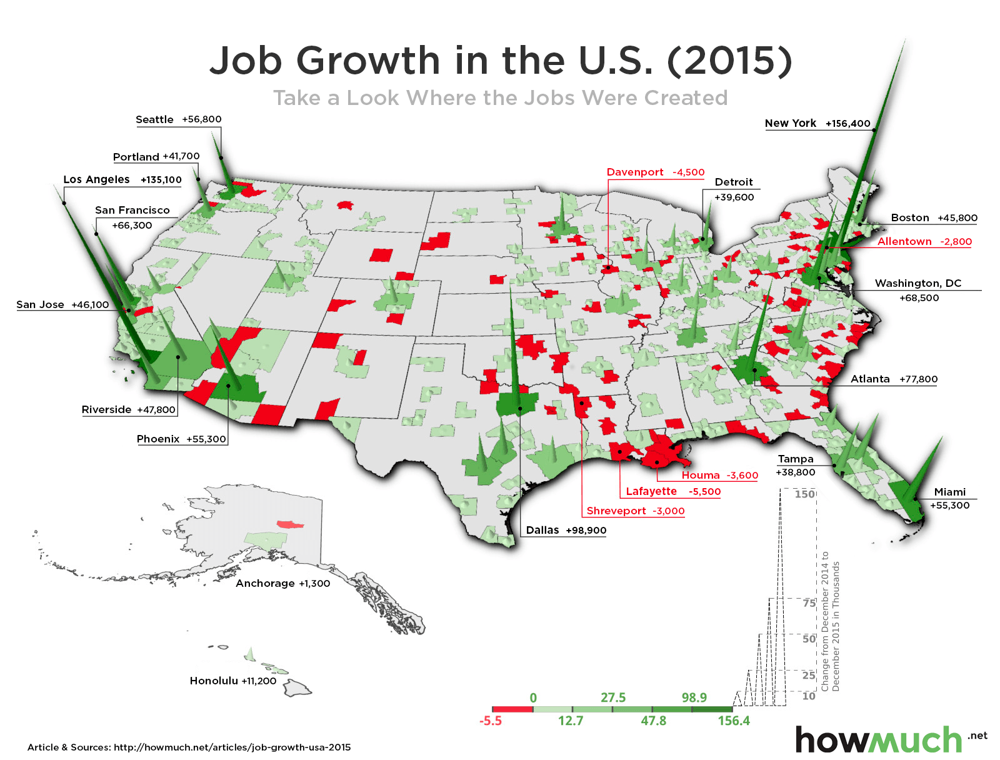
]

---

## Carte en proportion - *diagramme & camenbert*

.pull-left[

]

.pull-right[

]   

---

## Anamorphose / Cartogramme - *Quantitative absolue*

.pull-left[

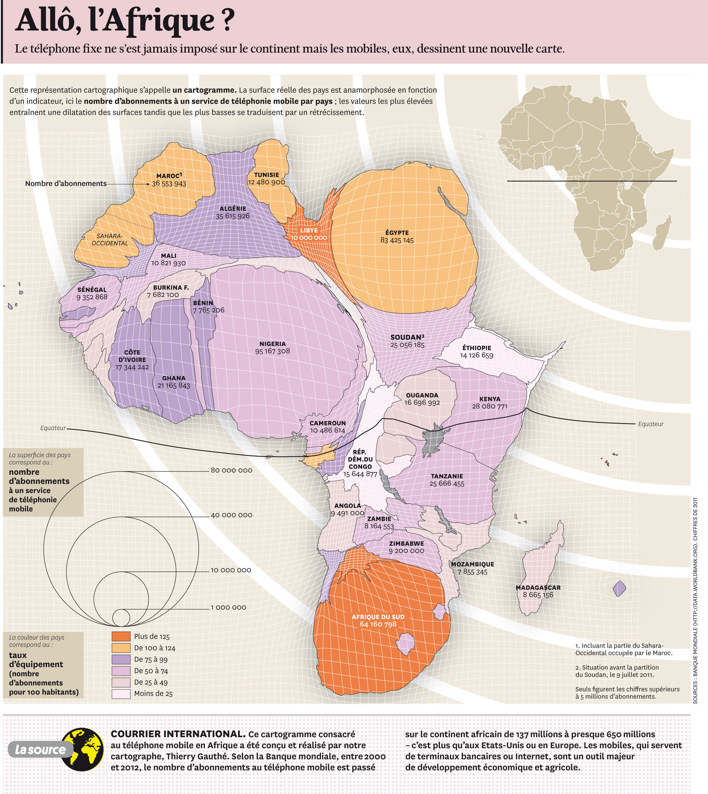
]

.pull-right[
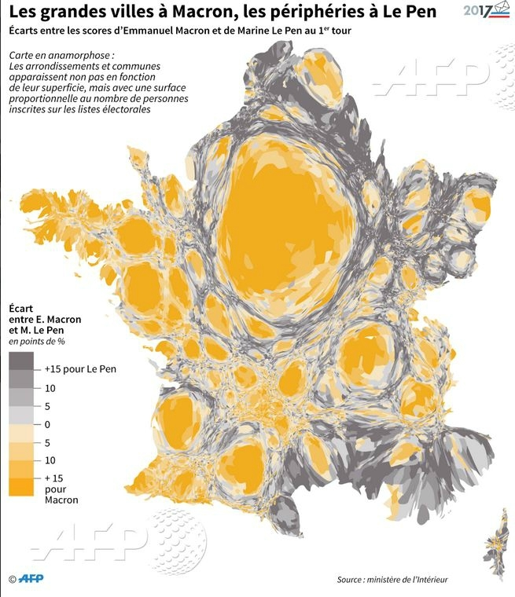
]

---

## Les variantes

.pull-left[
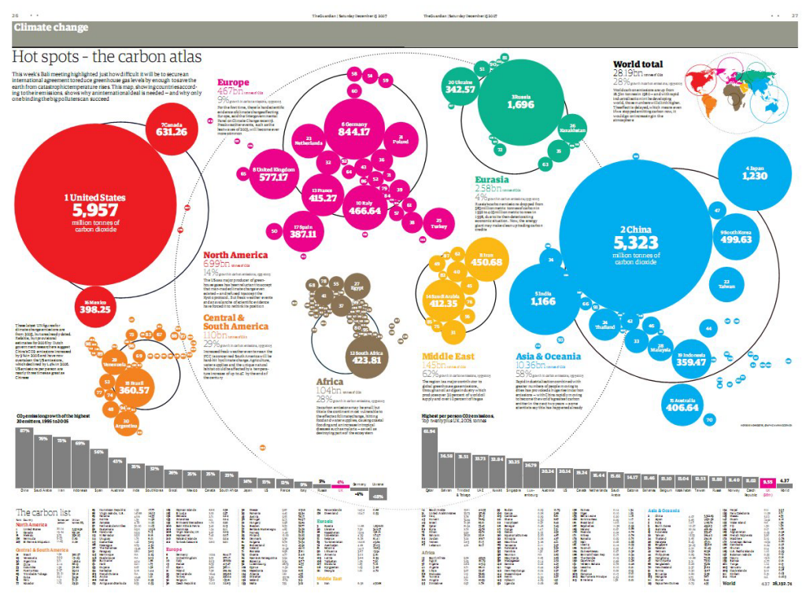
]

.pull-right[
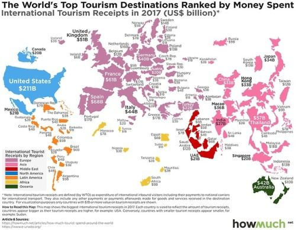
  
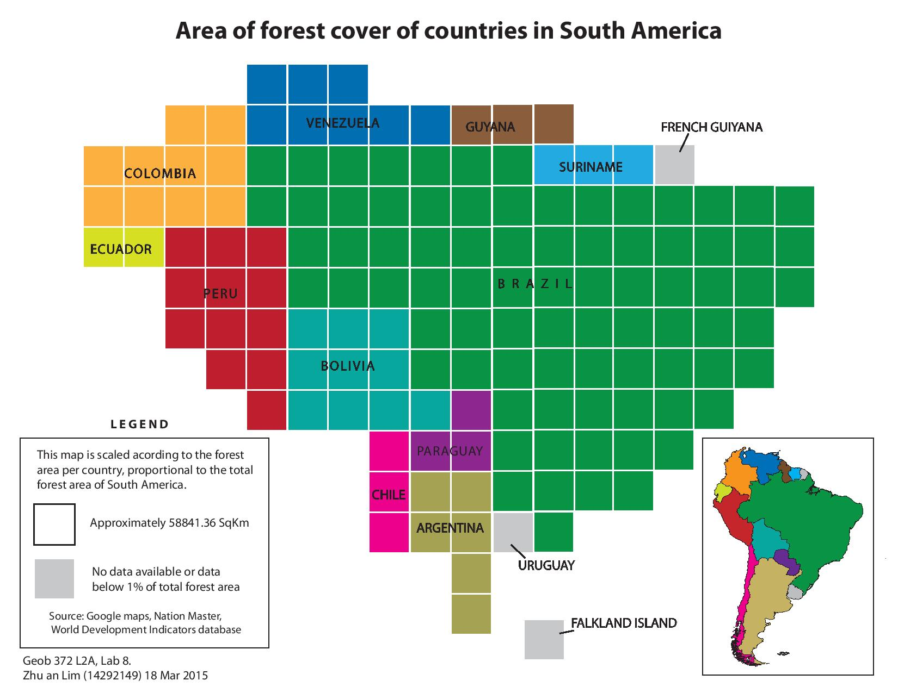

]

---

## Carte en point - *Quantitative absolue*

.pull-left[

]

.pull-right[
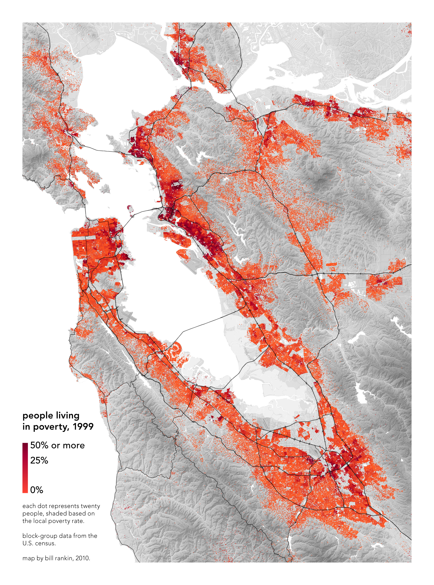
]

---

## Carte en symbole - *Qualitative*

.center[

]

---

## Carte en symbol - *Qualitative*

.center[

]

---

## Carte de réseau/flux - *Qualitative*

.center[
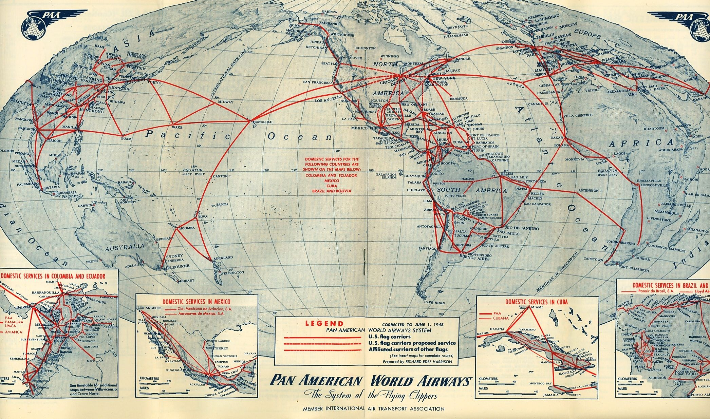
]

---

## Carte de réseau/flux - *Quantitative absolue*

.pull-left[

]

.pull-right[
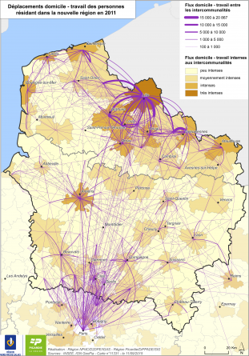
]

---

## Carte isoplèthe

.pull-left[

### Carte isobare

]

.pull-right[
### Carte isochrone
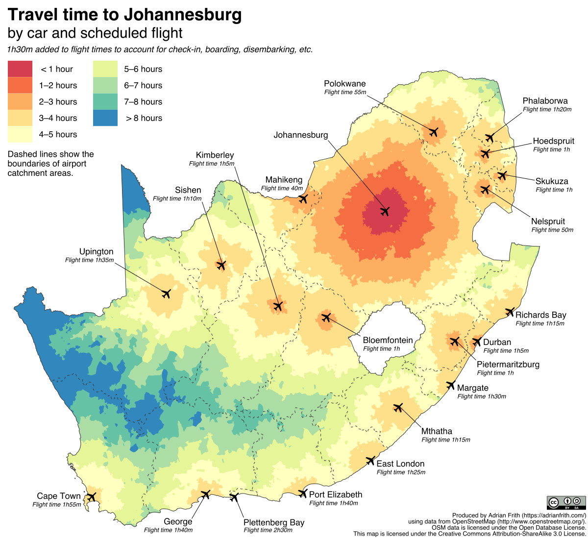
]

---

## Carte isoplèthe

.pull-left[
### Carte lissée
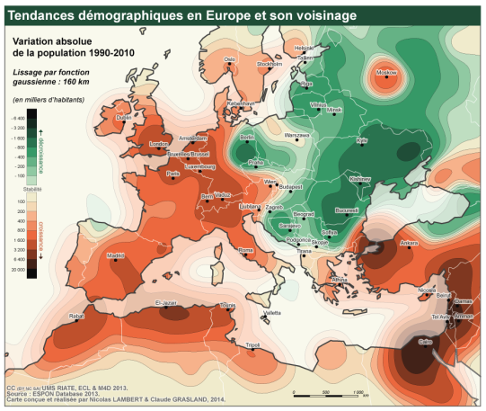
]

.pull-right[
### Carte de potentiel

]

---

<br><br><br><br><br><br><br>
# Les fondamentaux

---

## Les fondamentaux

**L’efficacité d'une carte thématique réside dans le temps nécessaire pour mémoriser correctement l’information qui veut être transmise**. Pour cela, il ne faut jamais oublier : 
  
1- L’**objectif** de la carte et le **public visé**

2- Les **codes** et **conventions** de la cartographie

3- Les règles de la **sémiologie graphique**.

---

## Un public, un objectif et un message

On distingue souvent ([Jégou, 2021](https://rawcdn.githack.com/transcarto/presentation_images/20d4feabc6bf2c18278efa0457b302e2e7b39419/Pr%C3%A9sentation_LJegou.html#1)) :

- La carte **performative**, qui vise à faire réagir, de propagande, rhétorique (vision *post-moderniste*, B. Harley). 

- La carte comme **outil d'analyse**, moyen de faire découvrir des phénomènes et des relations, dans un processus d'exploration et de transformation (paradigme *analytique*, W. Tobler et K. Clarke)
 
- La carte comme **outil d'organisation** d'une communauté sur son territoire (paradigme *participatif*, M. Noucher, T. Jolliveau).

- La carte comme **outil de visualisation de son propre territoire et de navigation**, adaptée et centrée sur sa position actuelle (paradigme de l'*égo-cartographie*) 
 
 - La carte **décorative**, à valeur esthétique, historique, émotive.
 
 ---
 
<div class="columns-2">
<div>
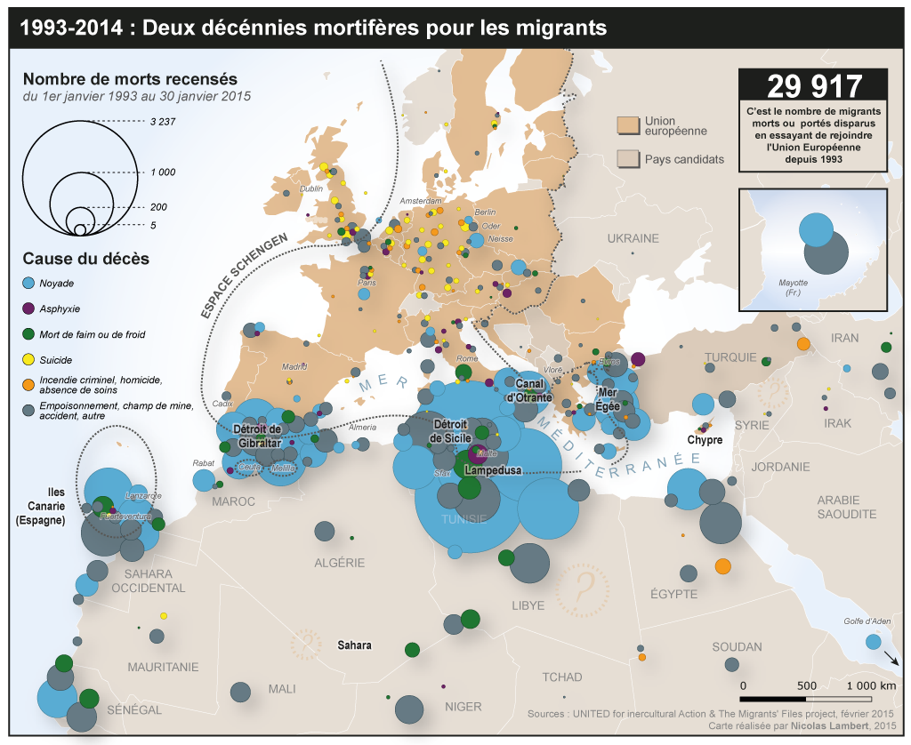
</div>
<div>
<div class="col_3_bis">
<span style="color:#484848;">On ne réalise pas la même carte en fonction du **public ciblé**, de l’**objectif** (opérationnel, décisionnel, communication) et du **message** que le cartographe souhaite transmettre.</span>
<br>    
<span style="color:#9c2005;">Cela influence directement :</span>   

<span style="color:#9c2005;">- **L'emprise** et **la projection** utilisées</span>  
<span style="color:#9c2005;">- La **généralisation du fond de carte**</span>    
<span style="color:#9c2005;">- Les **choix graphiques**</span>   
<span style="color:#9c2005;">- Le **vocabulaire** utilisé</span>   


Cliquez [ici](https://www.youtube.com/watch?v=RDwn5Qzq6Fc&feature=youtu.be) si vous en doutez !

</div>
</div>

## Code et convention cartographique

<div class="columns-2">
<div>

</div>

<div>
<div class="col_3_ter">
<span style="font-size:15pt;">**Les éléments obligatoires d'une carte** :</span>     
    
<span style="color:#9c2005;">- Un **titre**</span>  
<span style="color:#9c2005;">- Une **date**</span>    
<span style="color:#9c2005;">- Une **légende**</span>   
<span style="color:#9c2005;">- Une **source** (un **auteur**)</span>  
<span style="color:#9c2005;">- Une **échelle**</span>   
<span style="color:#9c2005;">- Une **orientation** (optionnel*)</span>   
 
<span style="color:#9c2005;font-size:12pt;">*Par défaut, le Nord géographique vers le haut*</span>  
<br>  
<span style="font-size:15pt;">**Spécificités selon les pays/cultures**, ex :</span>

<span style="font-size:11pt;">*- Utilisation de couleurs froides vers couleurs chaudes ou d’intensité croissante pour signifier l’intensité ou l’abondance*.</span>
 
<span style="font-size:11pt;">*- Le choix de la projection est parfois soumise à des normes. Ex : Depuis  2000 en France métropolitaine → Lambert93 (système géodésique RGF93)*.</span>

</div>
</div>
</div>


## Les Règles de la sémiologie graphique


<div class="column">

</div>

<div class="column">
<br>
<br>
<br>
<div style="font-size:17pt;text-align:center;">Le **langage cartographique**<br>a été théorisé par<br>**Jacques Bertin** (1967)</div> 
</div> 

<div class="column">

</div>

<br>
<br>
<br>

<p style="font-size:19pt;font-style:italic;text-align:center;line-height:140%;">
<span style="color:#9c2005;">« **La graphique**</span> utilise les propriétés de l'image visuelle pour faire apparaître<br>les **relations** de **différence**, **d'ordre** et de **proportionnalité** entre les données »
</p>


## Un peu de vocabulaire...

<div class="columns-2">
<div>
<p style="font-size:15pt;"> <span style="color:#9c2005;"> **L'implantaton** </span> est la transcription graphique - par des points, des lgnes ou des polygones - d'un objet géographique.<br><br>**Trois types d'implantation** sont possibles : **ponctuel**, **linéaire** et **zonale** (surfacique).</p>
</div>

<div class="centered">
<p style="font-size:15pt;">**3 types d'implantation** :</p>

</div>

</div>

<br>

<div class="columns-2">
<div>
<p style="font-size:16pt;"><span style="color:#9c2005;">**Les variables visuelles**</span> (ou variables rétiniennes) sont les **moyens graphiques pour retranscrire visuellement une information**.</p>
<br>
<p style="font-size:17pt;"><span style="color:#9c2005;">Elles possèdent des propriètés différentes qui **permettent de différencier**, **ordonner** et **mesurer  les données**.</span></p>
</div>

<div class="centered">
<p style="font-size:18pt;"><span style="color:#9c2005;">**7 Variables visuelles** :</span></p>

</div>

</div>

## Les variables visuelles (6 + 1)

<div class="columns-2">
<div>


</div>
<div class="centered">


<br>
<br>
<br>
<br>

</div>
</div>


## Les 3 propriétes des variables visuelles

<div class="centered">

</div>

## Des relations différentes selon le type de données

<div class="centered">

</div>

## Données Quantitatives et Qualitatives

<div class="columns-2">
<div>
<p style="font-size:17pt;">Une variable est dite <span style="color:#9c2005;">**quantitative**</span> lorsque **ses valeurs sont des** <span style="color:#9c2005;">**nombres**</span> qui peuvent être **ordonnés** et **additionnés**.</p>

<p style="font-size:15pt;">Elle est dite **quantitative** <span style="color:#9c2005;font-size:16pt;">**absolue**</span> lorsqu'il s'agit d'une **variable de stock** qui expriment des **quantités concrètes** (la somme a un sens). Ex :</p>
>- <p style="font-size:15pt;">*Population totale*</p>

<p style="font-size:15pt;">Elle est dite **quantitative** <span style="color:#9c2005;font-size:16pt;">**relative**</span> lorsqu'il s'agit d'une **variable de taux** qui expriment un **rapport entre deux quantités** (la somme n'a aucune signification). Ex :</p>
>- <p style="font-size:15pt;">*Densité de population*</p>  
</div>


<div>
<p style="font-size:17pt;">Une variable est dite <span style="color:#9c2005;">**qualitative**</span> lorsque **ses valeurs sont des qualités appelées** <span style="color:#9c2005;">**modalités**</span> (catégories, niveaux).</p>

<p style="font-size:15pt;">Elle est dite **qualitative** <span style="color:#9c2005;font-size:16pt;">**ordinale**</span> lorsque ses modalités peuvent être **classées dans une ordre logique**. Ex :</p>
>- <p style="font-size:15pt;">[*zonage communale en aires urbaines de 2010*](https://www.insee.fr/fr/statistiques/1281191){target="_blank"}</p> 

<p style="font-size:15pt;">Le cas échéant, il s'agit d'une variable **qualitative** <span style="color:#9c2005;font-size:16pt;">**nominale**</span>. Ex :</p>
>- <p style="font-size:15pt;">*Langue officielle des pays*</p>

 
</div>
</div>

## Comment caractèriser ses données ?

<div class="centered">

</div>

## Comment caractèriser ses données ?

<div class="centered">

</div>

## Exemple

<div class="centered">

</div>


## Choisir la bonne variable visuelle

<div class="columnbis">
<p style="font-size:16pt;text-align:left;">Le choix des représentations cartographiques se fait en fonction de :</p>

<br>

<p style="font-size:16pt;text-align:left;">1- La <span style="color:#9c2005;">**nature**</span> **de la donnée** à représenter</p>

<br>

<p style="font-size:16pt;text-align:left;">2- Le <span style="color:#9c2005;">**type d'implentation**</span> de **l'objet géographique** concerné</p>

</div>

<div class="centered">

</div>
</div>


## Choisir la bonne variable visuelle

<div class="centered">

</div>


# Représenter des données quantitatives absolues

## Représenter des données quantitatives absolues


<p style="font-size:17pt;text-align:left;">**UNE SEULE variable visuelle** peut être utilisée pour représenter des données <span style="color:#9c2005;">**quantitatives absolues**</span> : la variable visuelle <span style="color:#9c2005;">**TAILLE**</span></p>
<br>

<div class="centered">

</div>
<br>
<p style="font-size:17pt;text-align:left;">**C'est la seule variable visuelle** qui permet de retranscrire correctement **des différences**, **une hiérarchie** et surtout de  <span style="color:#9c2005;">**la proportionalité**</span></p>

## Données quantitatives absolues - *implantation ponctuelle*

<div class="columns-2">
<div class="centered">
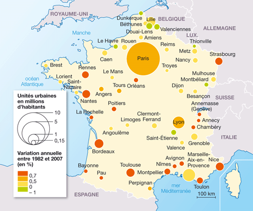
</div>
<div class="centered">
<br>
<br>
<br>
<br>
<br>
<p style="font-size:18pt;">Vous **devez utiliser**<br>la **variable visuelle** <span style="color:#9c2005;">**TAILLE**</span><br>en <span style="color:#9c2005;">**implantation ponctuelle**</span></p>
</div>
</div>

## Données quantitatives absolues - *implantation linéaire*

<div class="columns-2">
<div class="centered">
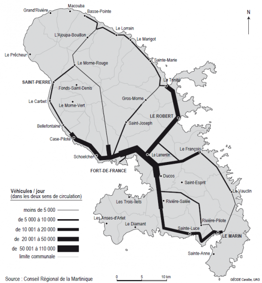
</div>
<div class="centered">
<br>
<br>
<br>
<br>
<br>
<p style="font-size:18pt;">Vous **devez utiliser**<br>la **variable visuelle** <span style="color:#9c2005;">**TAILLE**</span><br>en <span style="color:#9c2005;">**implantation linéaire**</span></p>
</div>
</div>

## Données quantitatives absolues - *implantation surfacique*
<div class="columns-2">
<div class="centered">

</div>

<div class="centered">
<br>
<br>
<br>
<p style="font-size:18pt;">Vous **devez utiliser**<br>la **variable visuelle** <span style="color:#9c2005;">**TAILLE**</span><br>sur un <span style="color:#9c2005;">**figuré graphique ponctuel**</span></p>
<br>
<br>
<p style="font-size:14pt;">Les différents logiciels centrent généralement le figuré ponctuel sur le centroïde des surfaces</p>
</div>
</div>

## Données quantitatives absolues - *implantation surfacique*


<div class="columns-2">
<div>
<p style="font-size:18pt;">**D'autres types de représentations** sont aujourd'hui possibles **pour représenter des données quantitatives absolues** :<br><br><br><br><span style="color:#9c2005;font-size:21pt;text-align:center;">**> les cartogrammes**</span></p>
<br>

<p style="font-size:16pt;"><span style="color:#9c2005;">**La géométrie de l'espace de la carte et la surface des territoires sont déformés**</span> afin de se conformer **aux informations relatives à la variable représentée**.</span></p>
</div>
<div class="centered">
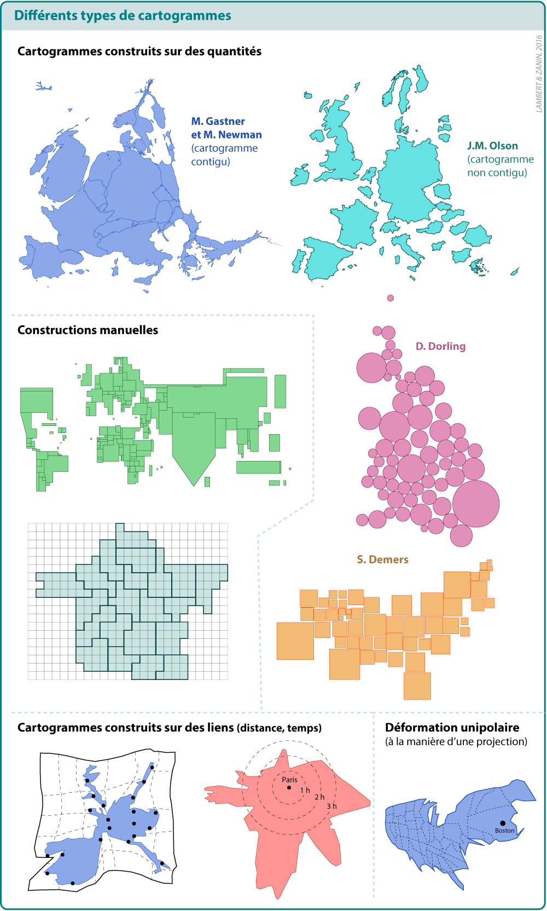
</div>
</div>

# Représenter des données quantitatives relatives

## Représenter des données quantitatives relatives


<p style="font-size:17pt;text-align:left;">**Pour représenter des données** <span style="color:#9c2005;">**quantitatives relatives**</span>, vous pouvez utiliser les variables visuelles <span style="color:#9c2005;">**VALEUR**</span>, <span style="color:#9c2005;">**COULEUR**</span> (intensité/dégradé), <span style="color:#9c2005;">**GRAIN**</span> ou <span style="color:#9c2005;">**TEXTURE-STRUCTURE**</span>.<br>
Elles permettent de retranscrire visuellement des **différences** et une <span style="color:#9c2005;">**hiérarchie**</span>.</p>


<div class="columns-2">
<div class="centered">


</div>
<div class="centered">


<br>
<p style="font-size:17pt;text-align:center;">**--> N'utilisez jamais la variable TAILLE**</p>
</div>
</div>
 

## Discrétiser des données quantitatives relatives

<div class="columns-2">
<div>

<p style="font-size:16pt;">Pour représenter des données quantitatives relatives, il est nécéssaire de <span style="color:#9c2005;">**discrétiser**</span> **la serie statistique en plusieurs classes**.</p>

<p style="font-size:16pt;">Il existe plusieurs <span style="color:#9c2005;">**méthodes de discrétisation**</span>.</p> 
<p style="font-size:16pt;">Le choix de la  méthode et du nombre de classe se fait **en fonction de** :</p>  
>- <p style="font-size:15pt;">La **forme de la distribution**</p>
>- <p style="font-size:15pt;">Des **valeurs centrales**</p>   
>- <p style="font-size:15pt;">Des **paramètres de dispersion**</p><br>         
<p style="font-size:15pt;">Ce choix à un **impact important** sur l'information représentée...</p>  
</div>
<div class="centered">

</div>
</div>

## Données quantitatives relatives - *implantation surfacique*

<div class="columns-2">
<div class="centered">

</div>
<div class="centered">
<br>
<br>
<br>
<br>
<br>
<p style="font-size:17pt;">Vous pouvez utiliser la<br>**variable visuelle** <span style="color:#9c2005;">**COULEUR**</span><br>(intensité/dégradé)<br>en <span style="color:#9c2005;">**implantation zonale**</span></p>
</div>
</div>

## Données quantitatives relatives - *implantation surfacique*

<div class="columns-2">
<div class="centered">

</div>
<div class="centered">
<br>
<br>
<br>
<br>
<br>
<p style="font-size:18pt;">Vous pouvez utiliser la<br>**variable visuelle** <span style="color:#9c2005;">**GRAIN**</span><br>en <span style="color:#9c2005;">**implantation zonale**</span></p>
</div>
</div>

## Données quantitatives relatives - *implantation ponctuelle*

<div class="columns-2">
<div class="centered">
<br>
<br>
<br>
<br>
<br>
<p style="font-size:18pt;">Vous pouvez utiliser **la variable visuelle**<br><span style="color:#9c2005;">**COULEUR**</span> (degradé/intensité)<br>en <span style="color:#9c2005;">**implantation ponctuelle**</span></p>
</div>

<div class="centered">
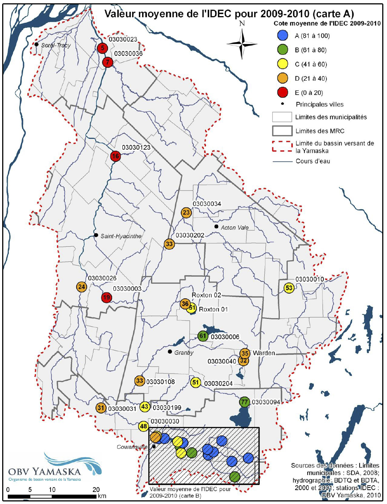
</div>
</div>

## Données quantitatives relatives - *implantation linéaire*

<div class="columns-2">
<div class="centered">
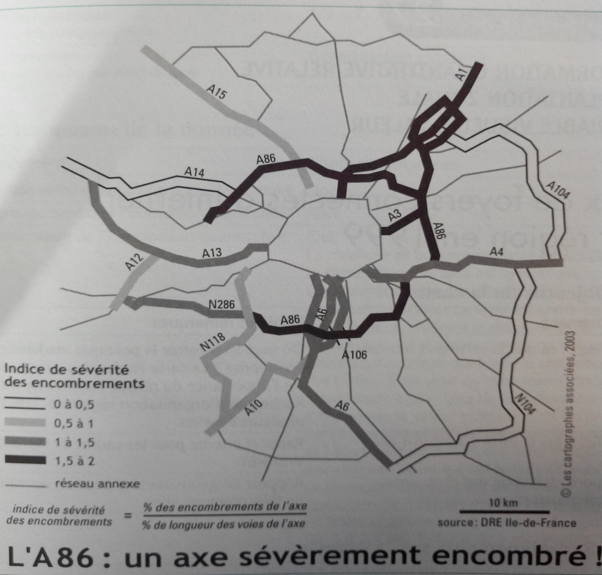
</div>
<div class="centered">
<br>
<br>
<br>
<br>
<br>
<p style="font-size:17pt;">Vous pouvez utiliser la<br>**variable visuelle** <span style="color:#9c2005;">**VALEUR**</span><br> en <span style="color:#9c2005;">**implantation linéaire**</span></p>
</div>
</div>

# Représenter des données qualitatives

## Représenter des données qualitatives


<div class="columns-2">
<div class="centered">
<p style="font-size:15pt;"><span style="color:#9c2005;font-size:17pt;">**Qualitative NOMINALE**</span></p>


<p style="font-size:14pt;"><span style="color:#9c2005;">**COULEUR**</span>, <span style="color:#9c2005;">**FORME**</span> et <span style="color:#9c2005;">**ORIENTATION**</span>.</p>

<p style="font-size:15pt;">Pour exprimer la <span style="color:#9c2005;">**différence**</span> entre les modalités</p>
</div>


<div class="centered">
<p style="font-size:15pt;"><span style="color:#9c2005;font-size:17pt;">**Qualitative ORDINALE**</span></p>
   
    
   
   


<p style="font-size:14pt;"><span style="color:#9c2005;">**VALEUR**</span>, <span style="color:#9c2005;">**COULEUR**</span>, <span style="color:#9c2005;">**TEXTURE-STRUCTURE**</span> et <span style="color:#9c2005;">**TAILLE**</span>.</p>

<p style="font-size:15pt;">Pour exprimer l'<span style="color:#9c2005;">**ordre**</span> entre les modalités</p>
</div>
</div>

## Donnée qualitative nominale - *implantation ponctuelle*

<div class="centered">

</div>

<p style="font-size:17pt;">Vous pouvez utiliser la **variable visuelle** <span style="color:#9c2005;">**COULEUR**</span> et ou <span style="color:#9c2005;">**FORME**</span> en <span style="color:#9c2005;">**implantation ponctuelle**</span></p>

## Donnée qualitative nominale - *implantation linéaire*

<div class="columns-2">
<div class="centered">
<br>
<br>
<br>
<br>
<br>
<p style="font-size:17pt;">Vous pouvez utiliser la<br>**variable visuelle** <span style="color:#9c2005;">**COULEUR**</span><br> en <span style="color:#9c2005;">**implantation linéaire**</span></p>
</div>
<div class="centered">

</div>
</div>

## Donnée qualitative nominale - *implantation surfacique*

<div class="centered">

</div>
<div class="centered">
<p style="font-size:17pt;">Vous pouvez utiliser la **variable visuelle** <span style="color:#9c2005;">**COULEUR**</span> en <span style="color:#9c2005;">**implantation zonale**</span></p>
</div>

## Donnée qualitative ordinale- *implantation ponctuelle*

<div class="columns-2">
<div class="centered">
<br>
<br>
<br>
<br>
<br>
<p style="font-size:17pt;">Vous pouvez utiliser la **variable**<br>**visuelle** <span style="color:#9c2005;">**COULEUR**</span>(dégradé)<br> en <span style="color:#9c2005;">**implantation ponctuelle**</span></p>
</div>
<div class="centered">

</div>
</div>

## Donnée qualitative ordinale - *implantation linéaire*

<div class="columns-2">
<div class="centered">

</div>
<div class="centered">
<br>
<br>
<br>
<br>
<br>
<p style="font-size:17pt;">Vous pouvez utiliser la<br>**variable visuelle** <span style="color:#9c2005;">**COULEUR**</span><br>(dégradé) en <span style="color:#9c2005;">**implantation linéaire**</span></p>
</div>


## Donnée qualitative ordinale - *implantation surfacique*

<div class="columns-2">
<div class="centered">
<br>
<br>
<br>
<br>
<br>
<p style="font-size:17pt;">Vous pouvez utiliser la<br>**variable visuelle** <span style="color:#9c2005;">**COULEUR**</span><br> en <span style="color:#9c2005;">**implantation zonale**</span></p>
</div>
<div class="centered">

</div>
</div>
 

## Données qualitatives
 
<div class="centered">

</div> 
 
 
# Map failed

## Cherchez l'erreur...

<div class="centered">

</div>

## Cherchez l'erreur...

<div class="columns-2">
<div class="centered">

</div>

<div class="centered">

</div>
</div>

## Cherchez l'erreur...

<div class="centered">

</div>

## Cherchez l'erreur...

<div class="centered">
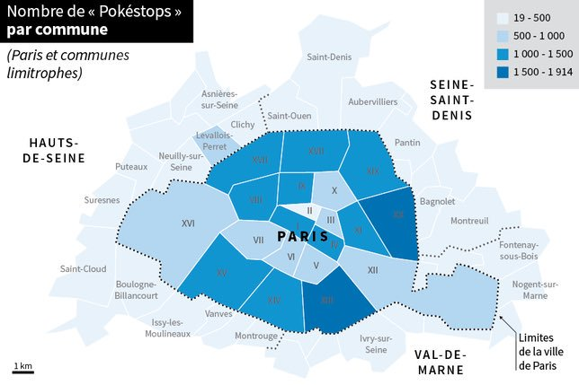
</div>

## Cherchez l'erreur...

<div class="centered">

</div>

## Cherchez l'erreur...

<div class="centered">

</div>

## Cherchez l'erreur...

<div class="centered">
>
</div>

## Cherchez l'erreur...

<div class="centered">

</div>

## Correction !

<div class="columns-2">
<div class="centered">

</div>
<div class="centered">

</div>
</div>

## Références

<div class="column">

</div>
<div class="column">

</div>
<div class="column">

</div>


