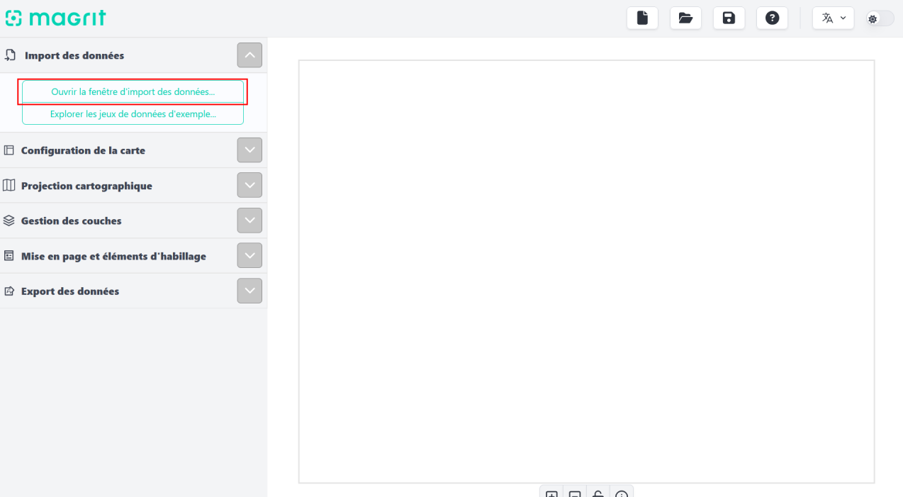
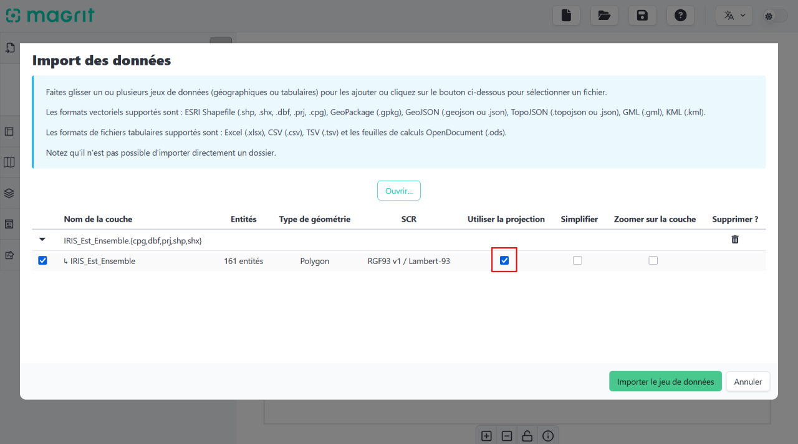
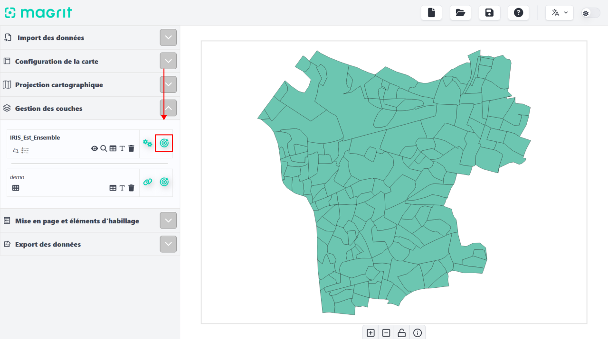
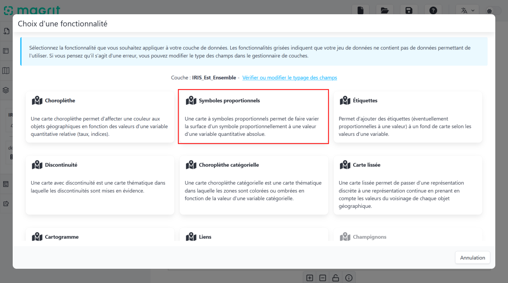
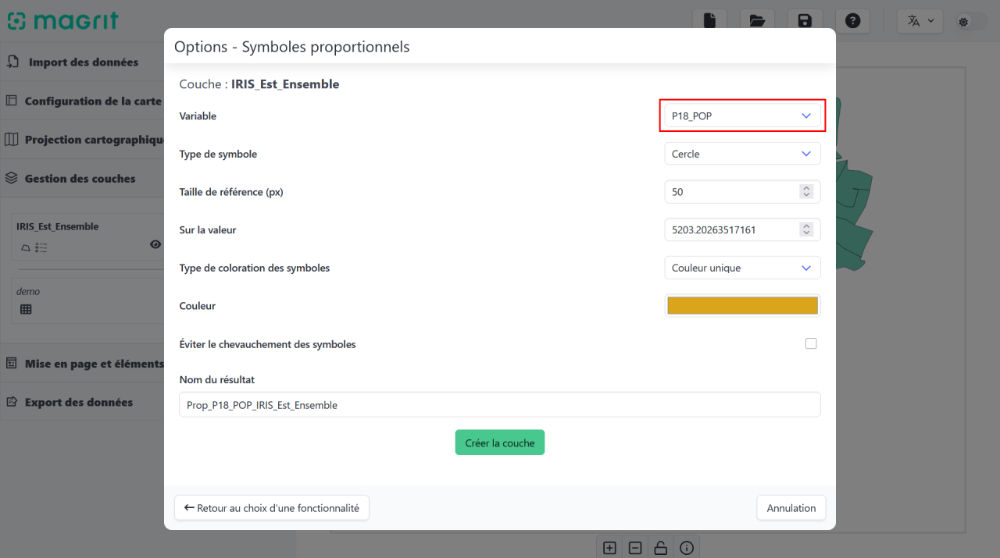
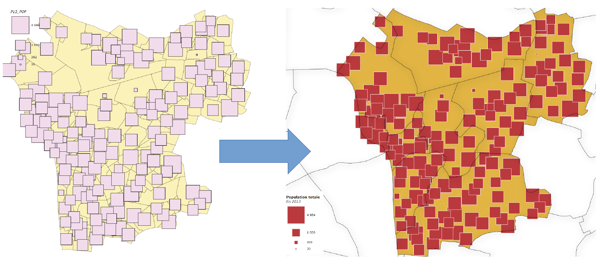
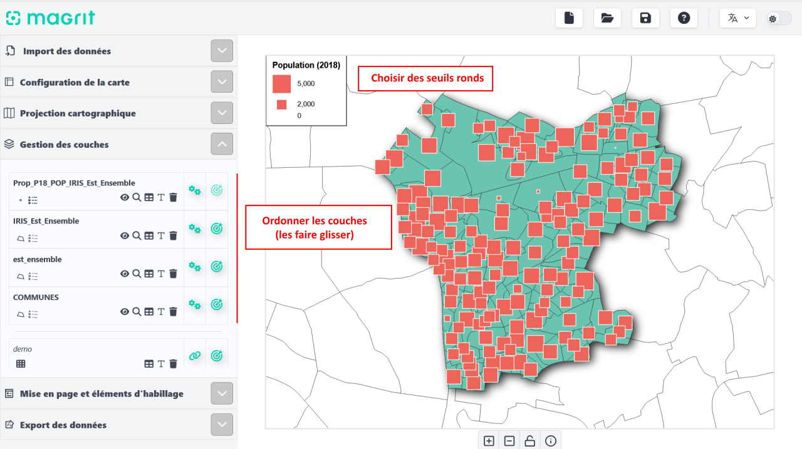
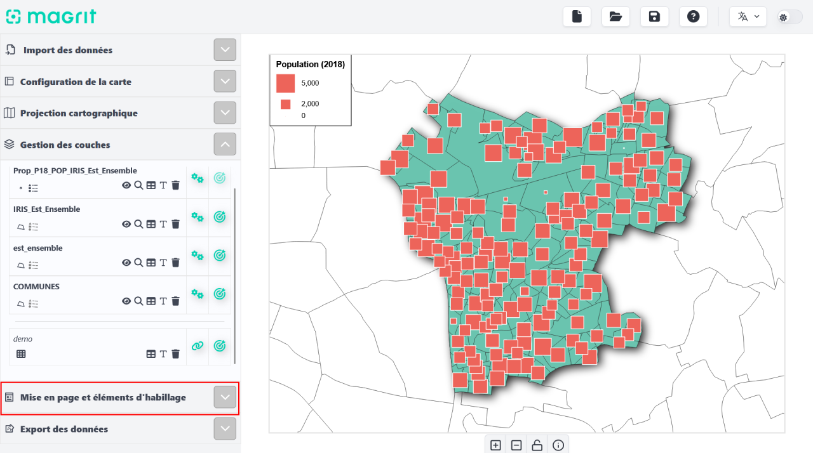
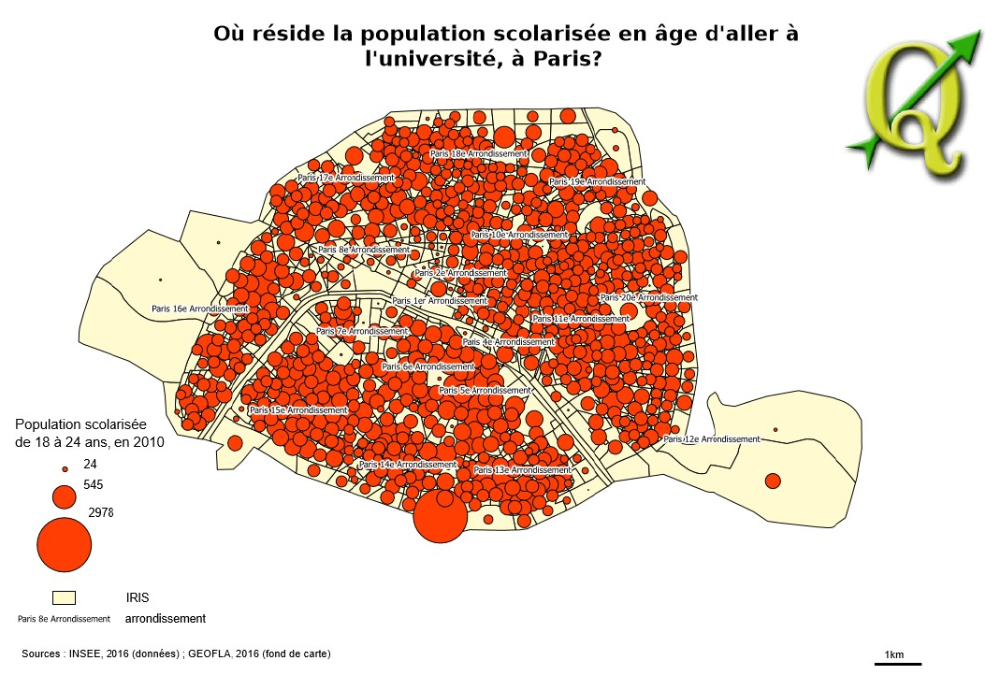

      
La cartographie avec Magrit

## Quels logiciels pour quelle cartographie ?

:::columns
:::column

**Logiciels de cartographie**

- Environnement logiciel complètement **dédié à la création cartographique**.

- **Cartographie de base** (réflexion poussée sur les choix statistiques)

- Variété des méthodes de représentation

- **Partage et diffusion** (« une belle carte »).

- Interface épurée.

*Des logiciels dédiés pour la création cartographique*

:::
:::column

**Systèmes d'information géographique**

- Gestion de **bases de données** géographiques.

- Visualisation et superposition des **couches** géographiques.

- **Géotraitements**.

- Cartographie de base (cartes choroplèthes, typologies, figurés proportionnels).]

*Réaliser une carte thématique de qualité est possible dans un environnement SIG, mais ce n’est pas l’objet premier de ce type de logiciels*
:::
:::

## Magrit

:::columns
:::column
[https://magrit.hypotheses.org/392](https://magrit.hypotheses.org/392)

Il est possible d'utiliser Magrit en ligne ou de l'installer sur son ordinateur.

:::
:::column

:::
:::

---

en ligne : [http://magrit.cnrs.fr](magrit.cnrs.fr)

---

     

**Objectif de la séance**

Faire une carte en utilisant des *données quantitatives de stock* sur votre espace d'étude

## Représenter les données quantitatives absolues

Les **6 étapes** de la réalisation de cartes de stock dans Magrit :

1. Préparation (géométries, données, métadonnées)
2. **Import** des géométries et des données, jointure
3. **Réalisation** de la carte de stocks
4. Amélioration de la lisibilité
5. **Mise en page**
6. Sauvegarde du projet et **export** de la carte

---

### 1) Préparation du travail cartographique

_Identifiez les couches d’information géographique dont vous aurez besoin_  
_Identifiez la variable que vous souhaitez cartographier_

:::columns
:::column

Les IRIS de notre espace d'étude

:::
:::column

Les données démographiques de nos IRIS

:::
:::

---

:::columns
:::{.column width="30%"}

#### Import des géométries

Sélectionner simultanément les fichiers `.shp`, `.dbf`, `.shx` et `.prj`.

:::
::: {.column width="70%"}

:::
:::

---

:::columns
:::{.column width="30%"}

#### Import des géométries

Sélectionner simultanément les fichiers `.shp`, `.dbf`, `.shx` et `.prj`.

:::
::: {.column width="70%"}

:::
:::

---

:::columns
:::{.column width="30%"}
#### La projection :

Vous pouvez appliquer la projection du fichier de géométries d'origine.

:::
:::{.column width="70%"}

:::
:::

---

:::columns
:::{.column width="30%"}

#### Import des données attributaires

Sélectionner le fichier `.csv`.

:::
::: {.column width="70%"}

:::
:::

---

:::columns
:::{.column width="30%"}
#### Le typage des données d'origine :

On détermine à quel type correspond chaque variable du tableau attributaire de la couche d'origine (fichier `.dbf`).

!! Faire de même avec les données issues de la table attributaire

:::
:::{.column width="70%"}

:::
:::

---

:::columns
:::{.column width="30%"}
#### Jointure :

Sur la couche de la table attributaire, la jointure est proposée par le petit pictogramme trombone.

:::
:::{.column width="70%"}

:::
:::

---

:::columns
:::{.column width="30%"}
#### Champ de jointure :

Comme sur QGIS, on sélectionne le champ à partir duquel faire la jointure, soit l'identifiant unique des unités géographiques (ici, `CODE_IRIS` et `IRIS`).

:::
:::{.column width="70%"}

:::
:::

---

:::columns
:::{.column width="30%"}
### 3) Réalisation de la carte de stocks

:::
:::{.column width="70%"}

:::
:::

---

:::columns
:::{.column width="30%"}
### 3) Réalisation de la carte de stocks

:::
:::{.column width="70%"}

:::
:::

---

:::columns
:::{.column width="30%"}
### 3) Réalisation de la carte de stocks

Sélectionnez le champ à cartographier, du type de symbole, de leur taille, couleur, etc

:::
:::{.column width="70%"}

:::
:::

---

:::columns
:::{.column width="30%"}
### 4) Améliorer la lisibilité

Pensez à ajuster :

- la taille des symboles proportionnels,

- la couleur des polygones du fond de carte,

- l'épaisseur et la couleur des bordures...

Vous pouvez ajouter des couches d'habillage (pour compléter le fond de carte).

:::
:::{.column width="70%"}
  

:::
:::

---

:::columns
:::{.column width="30%"}
Comme dans QGis, vous pouvez changer l'ordre de dessin des couches.

Il est également possible d'ajuster manuellement la position des symboles.

Vous pouvez aussi ajouter des ombrages, choisir le décalage entre les éléments de la légende... Amusez vous !

:::
:::{.column width="70%"}

:::
:::

---

:::columns
:::{.column width="30%"}
### 5) Mise en page

:::
:::{.column width="70%"}
La carte doit disposer obligatoirement de :

* Un titre
* Une échelle
* Une légende
* Une source
* La date des données

:::
:::

---

:::columns
:::{.column width="30%"}
Cliquer sur *Mise en page et éléments d'habillage*

:::
:::{.column width="70%"}

:::
:::

---

:::columns
:::{.column width="30%"}
Il faut veiller à ce que le titre soit

* clair et évocateur

* pas trop long

* pas redondant avec la légende

Vérifier que les sources et la légende sont exaustifs

:::
:::{.column width="70%"}

:::
:::

---

---

### 6) Pour finir...

 

:::columns
:::column
#### Sauvegarde du projet

**Sauvegarder le projet au format `.json`**

Il pourra être rouvert par la suite à votre prochaine connexion.

:::
:::column
#### Export de la carte

Choisissez le format qui vous semble le plus approprié :

* **matriciel** (ou *raster* : `.jpg`, `.png`...) : pour une publication, une vignette Web...

* **vectoriel** (`.svg`) : pour la retravailler (Inkscape, Illustrator...), un site Web...

:::
:::

---

## Avec un SIG

:::columns
:::column
Il est aussi possible de faire des cartes thématiques avec un SIG.

Mais leur mise en page nécessite plus de maîtrise.

:::
:::column

:::
:::

---

## Bilan. Ce qu'il faut se demander lors du processus de cartographie

:::columns
:::column
Répond-on à la **problématique** posée par le commanditaire ?

Qu'apporte le média cartographique par rapport à un autre type de présentation des données ? Comment cela permet-il de répondre aux hypothèses formulées au préalable ?

La **couverture spatiale** d'analyse est-elle satisfaisante ?

La maille territoriale convient-elle, le zoom est-il suffisant (ni excessif, ni trop petit), la zone géographique bien représentée ?

:::
:::column

L'**indicateur** représenté est-il pertinent ?

Correspond-il au thème, est-il assez récent ? Les sources de données utilisées sont-elles fiables ?

Les **configurations géographiques** qui apparaissent sur la carte permettent-elles d'apporter des éléments à l'analyse ?

Faut-il mieux cibler le phénomène représenté, mieux mettre en évidence les effets de (dis)continuité entre les territoires, changer les ordres de grandeur ?
:::
:::

